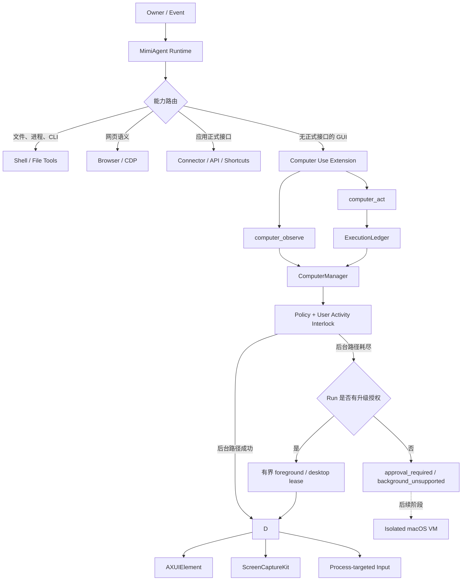
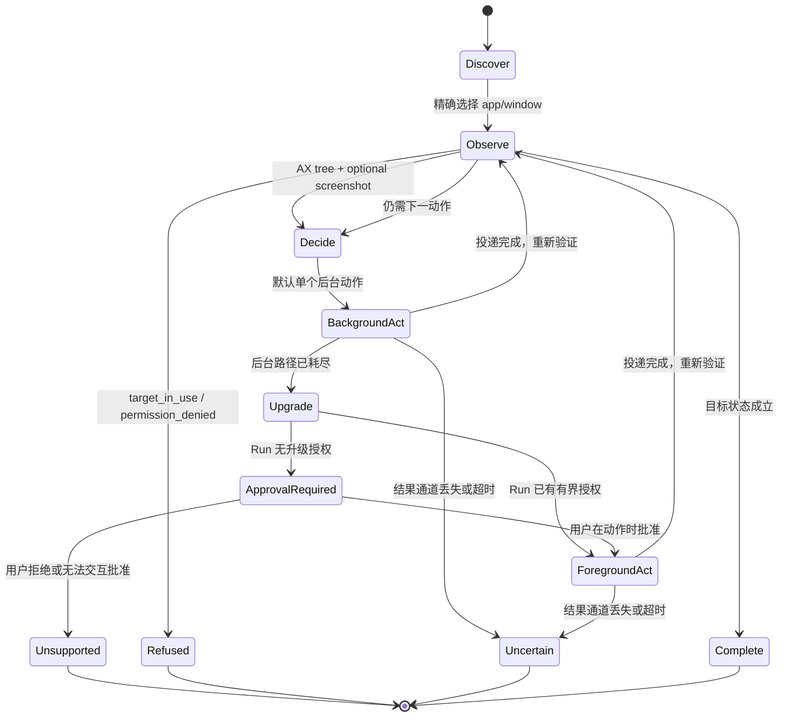

# MimiAgent 通用后台 Computer Use 改造设计

状态：Proposed

目标版本：待排期

适用平台：第一阶段仅 macOS
默认状态：关闭，显式配置后启用

## 1. 结论

MimiAgent 增加一个可选的 `computer` Extension，以 Cua Driver 作为本机 GUI 执行后端，对模型只暴露两个聚合 Function Tool：

- `computer_observe`：只读发现应用、窗口、Accessibility 元素、窗口/桌面图像以及 Driver/Session 状态。
- `computer_act`：执行一个受策略约束的动作，包括后台输入，以及按需批准的前台、桌面、录制、回放和维护动作。

第一版不把 Cua Driver 的 49 个 MCP schema 原样注入 Agent，也不使用 OpenAI Agents SDK 原生 `computerTool`。Cua 能力保留在 `CuaDriverClient` 和两个聚合 Tool 的判别联合中。这样可以复用现有 Function Tool policy、ExecutionLedger、Completion Gate 和 Daemon source policy，保持 OpenAI/DeepSeek 的公共工具协议一致，并将模型上下文中的新增工具控制在两个。

默认执行策略是 `background-preferred`：先尝试 AX、窗口局部像素和进程定向输入，不移动真实鼠标、不切换前台应用。后台路径耗尽后，Mimi 可以请求一个有界的前台/桌面升级；只有当前 Run 已有相应授权或用户在动作时批准，Manager 才调用 `escalate_session`、foreground delivery、`bring_to_front`、真实光标或桌面级操作。`kill_app`、配置修改、录制和轨迹回放也被保留，但使用更高权限档位。隔离 macOS VM 仍是强隔离兜底，不是第一阶段依赖。

## 2. 目标与非目标

### 2.1 目标

1. 应用无关：能发现和操作任意暴露标准 macOS UI 或可接受目标进程输入的应用。
2. 后台优先：用户继续使用其他应用时，Agent 不切前台、不移动真实指针。
3. 轻量：MimiAgent 不实现自有 GUI 驱动，不新增自动化框架或工作流子系统。
4. 本地优先：截图、AX 树和动作只在本机驱动与当前模型请求之间流转。
5. 可验证：每个写动作都遵循“观察 → 单动作 → 再观察”的闭环。
6. 防重放：崩溃、Daemon retry、抢占和 dead letter 恢复不能重复已完成或结果不确定的 GUI 动作。
7. 权限对齐：Plan、General、Ultra、SubAgent、Team、Task 和外部 Event 继续由现有工具策略决定能力。
8. Provider-aware：结构化 AX 路径对所有 Provider 可用；截图路径只对声明图像输入能力的模型开放。
9. 能力完整：不因默认无干扰而删掉 Cua 的前台、桌面、录制、回放、配置、健康和 Session 能力。

### 2.2 非目标

1. 不保证同一 macOS 图形会话中 100% 的人类操作都能后台完成。
2. 不绕过 Touch ID、Secure Input、系统隐私授权、管理员确认或应用自身安全限制。
3. 不替代现有 Shell、Browser、Connector、Shortcuts 和应用 API。
4. 不为每个应用在 Runtime 中编写专用流程；稳定的应用知识应放在 Skill。
5. 不使用 `osascript`、System Events、PyAutoGUI 或全局鼠标键盘模拟作为实现或自动降级路径。
6. 第一阶段不自动创建、启动或管理 macOS VM。
7. 不在没有授权、没有理由和没有用户活动保护的情况下静默把后台失败升级成前台操作。

## 3. 约束与现状

### 3.1 必须保持的架构不变量

- `runtime` 继续负责组合与执行，`core` 只保存稳定语义和持久状态，`extensions` 承载可选能力。
- 不在 `src/tools.ts` 堆叠低频平台能力。
- 不建立第二套 Goal、Plan、Task 或工作流状态。
- GUI 写动作必须复用现有 ExecutionLedger 的 at-most-once 语义。
- Daemon 外部事件正文仍是不可信数据，不能扩大应用范围、动作范围或副作用权限。
- SubAgent 和 Team worker 不直接拥有本机桌面；最终动作由主 Agent 所属的可信执行面完成。

### 3.2 现有接缝

- `MimiAgent` 在 `src/runtime/mimi-agent.ts` 汇总本地工具、Skills、MCP、Memory 和 Host Tools。
- `src/runtime/tool-policy.ts` 是 mode、permission、role、capability 和 side effect 的统一真相。
- `src/runtime/tool-ledger.ts` 当前只包装具有 `invoke` 的 Function Tool。
- `src/runtime/mcp-ledger.ts` 负责 MCP transport 的防重放。
- `src/core/execution-ledger.ts` 对成功、失败和未知边界采用 fail-closed 语义。
- `src/daemon/policy.ts` 使用显式 tool/capability allowlist 限制 owner、reply、work 和后台 Task。
- `FileSession` 持久化完整 SDK item；连续截图会显著增加 Session 体积，设计必须限制和处理历史截图回放。

### 3.3 为什么第一版不用 SDK 原生 `computerTool`

当前依赖的 OpenAI Agents SDK 已提供 `Computer` 接口和 GA Computer Tool，但直接接入存在三个问题：

1. 原生 Computer Tool 不是当前 `withExecutionLedger` 能包装的 Function Tool，批量 computer actions 尚未进入 MimiAgent 的语义 call ID 和外部副作用授权路径。
2. DeepSeek 与 OpenAI 的原生 Computer Tool wire format 不完全对齐，会扩大 Provider 分支。
3. 原生 Tool 会让动作调度、截图持久化和审批绕过当前两个核心政策点。

第一版使用 Function Tool 并不妨碍模型看图或完成 Computer Use。Agents SDK 的 Function Tool 输出可以同时包含 text 和 image。等原生 Computer Tool 满足第 13.4 节的进入条件后，再把它作为 OpenAI 的可选加速路径。

## 4. 总体架构



核心路由原则：能用确定性接口完成时不用 GUI；需要 GUI 时优先 AX 元素，窗口局部像素和目标进程输入只作为 AX 缺失时的后台兜底。

## 5. 核心决策

### 5.1 Extension 而不是 Built-in Tool 或 Connector

Computer Use 是可选、平台相关且依赖外部驱动的能力，放在 `src/extensions/computer/`。它不是 `src/tools.ts` 中的高频通用原子能力。

Connector Action Bridge 适合隔离渠道凭据和正式应用协议，但当前 Connector JSON action result 不是图像工具输出协议。将窗口截图塞进 `connector_action` 还会让模型失去专门的 computer 语义，因此不使用 Connector 承载核心观察循环。

### 5.2 Cua Driver 是隐藏后端

Cua Driver 负责 TCC 权限、AX 遍历、目标窗口截图和后台输入。MimiAgent 不把 Cua 的 49 个 MCP schema 注入模型，而由 `CuaDriverClient` 调用受限命令并转换为内部接口。

第一版优先使用 `execFile(command, args)` 调用 Cua CLI；不经过 Shell、不拼接命令字符串。CLI 只是长期 CuaDriver.app daemon 的本地代理，模型延迟远大于单次进程启动开销。若基准显示代理启动成为瓶颈，可在不改变 `ComputerBackend` 接口的前提下切换为内部 stdio MCP client。

每次调用必须设置 AbortSignal、硬超时和输出上限。建议截图调用 stdout 上限 16 MiB，普通动作 1 MiB，stderr 64 KiB；超限按结果通道不可信处理。原始 stdout/stderr 不进入 Trace、Session 或错误消息，Client 只返回经过 Zod 校验和字段裁剪的内部结果。

### 5.3 两个工具、一次一个动作

`computer_observe` 只读，`computer_act` 通常一次只执行一个原子动作。禁止用任意 action 数组临时拼接多步 GUI 操作，避免中间失败时无法判断哪些副作用已发生。

`replay_trajectory` 是唯一的显式宏动作例外。Manager 必须先解析、校验并生成带内容摘要的 replay manifest；执行时把整次 replay 作为一个不可自动重试的 side-effect ledger 单元，并保留逐步结果。任何超时、崩溃或结果缺失都记为 `action_uncertain`，不得从头重放。

### 5.4 后台优先是默认策略，不是能力阉割

MimiAgent 保留 Cua Driver 的本机能力，但按影响分成四档：

| 档位 | 默认行为 | 代表能力 |
|---|---|---|
| `observe` | 只读且有界 | apps/windows、AX、窗口截图、Driver/Session/录制状态 |
| `background` | 默认写路径 | 后台 launch、AX action、进程定向 click/type/key/scroll/drag |
| `foreground` | 需要前台授权或动作时批准 | `get_desktop_state`、`escalate_session`、foreground delivery、`bring_to_front`、桌面坐标输入、真实光标 |
| `admin` | 需要更高授权和专门校验 | `kill_app`、`set_config`、start/stop recording、`replay_trajectory`、主动弹出 TCC 权限请求 |

模型可以通过两个聚合 Tool 请求这些动作，但请求字段不构成授权。`ComputerManager` 从不可变 Run authority、部署 permission、source policy、应用 allowlist 和一次性 approval grant 计算最终档位。默认本机 owner 只有 `background`；后台动作失败不会自行获得更高档位。

普通前台动作优先使用 Cua 的短暂 foreground delivery，让 Driver 完成“前置 → 动作 → 恢复”。`bring_to_front` 只用于 Agent 必须短暂持有前台的焦点代理表面，例如远程桌面。Manager 为它创建短 TTL interruption lease，记录原前台 PID 和真实指针位置，并在显式释放、Run 结束或超时后尽力恢复；恢复失败必须通知用户。

用户明确要求“让我看”“让我玩”或“在这个桌面打开”时使用 `handoff_to_user`。它将已发现的精确窗口留在当前 GUI Session 前台供用户接管，Run 结束时不恢复原窗口。该动作仍只代表投递；必须重新观察同一 `bundleId + pid + windowId` 且 `frontmost=true` 才能报告完成。Shell `open` 成功、进程存在、`launch_app` 成功或观察驱动失败均不能作为可见交付证据。

`kill_app` 只能在正常关闭失败后使用，并明确报告可能丢失未保存内容。Cua shell 和任意 JavaScript 执行不属于通用桌面能力，继续由现有 Shell/Browser policy 管理，不能借 `computer_act` 绕过。

### 5.5 Cua 能力映射

保留能力不等于把每个 Cua 工具名都暴露为模型工具。Adapter 维护一份随已支持 Driver 版本锁定的显式映射：

| Cua 能力 | MimiAgent 入口 | 默认最低档位 |
|---|---|---|
| apps/windows、AX、window screenshot、zoom | `computer_observe` 的 `targets/window/region` | `observe` |
| `get_desktop_state` | `computer_observe(scope:'desktop')` | `foreground` |
| health、permissions、config、recording/session/cursor state | `computer_observe(scope:'driver'/'session')` | `observe` |
| 后台 launch/click/type/key/scroll/drag/set-value | `computer_act` 的普通 UI action | `background` |
| foreground delivery、`escalate_session`、`bring_to_front`、`handoff_to_user`、真实指针、desktop input | `computer_act` 的 foreground/control action | `foreground` |
| `kill_app`、录制、回放、配置、主动权限请求 | `computer_act` 的 admin action | `admin` |
| `start_session` / `end_session` | `ComputerManager` 自动管理 | 当前 Run 的最终档位 |
| agent cursor 样式和开关 | `computer_act(set_agent_cursor)` | `admin` |

Cua 新增工具不会因升级 Driver 自动进入 allowlist。只有完成语义归类、schema 校验、权限档位、不确定结果和测试设计后才加入 capability map，防止版本升级悄悄扩大 MimiAgent 权限。

### 5.6 Run-scoped 状态，不新增持久工作流

目标窗口、最近 Observation 和动作预算属于当前 Run 的临时状态。Goal/Plan/checkpoint 只记录任务进度，不保存可直接重用的 AX 元素或截图坐标。Run 恢复后必须重新观察真实桌面。

## 6. 模块设计

建议新增：

```text
src/extensions/computer/
├── types.ts              # Zod schema、Backend contract、结果与错误类型
├── cua-driver-client.ts  # execFile、协议解析、超时、版本和健康检查
├── observation-store.ts  # Run-scoped Observation、TTL、失效和预算
├── artifact-store.ts     # 录制/轨迹 manifest、路径隔离、配额和保留期
├── manager.ts            # 路由、互斥、前台检查、Backend 生命周期
└── tools.ts              # computer_observe / computer_act Function Tool
```

需要修改的现有模块：

| 文件 | 改造内容 |
|---|---|
| `src/config.ts` | 解析 Computer 配置；默认 disabled |
| `src/runtime/components.ts` | 创建可选 `ComputerManager` |
| `src/runtime/mimi-agent.ts` | 注入工具、Run identity 和关闭生命周期 |
| `src/runtime/tool-policy.ts` | 注册 Computer capability、mode 和 side effect |
| `src/runtime/tool-ledger.ts` | 支持工具自定义脱敏 ledger identity |
| `src/runtime/model.ts` | 声明模型图像输入能力，不按 Provider 猜测 |
| `src/core/session.ts` | 旧 Computer 截图不参与后续模型历史回放 |
| `src/daemon/policy.ts` | 显式控制 owner channel / Task 的 Computer 权限 |
| `src/daemon/service.ts` | 将非敏感 Computer 配置传给 Daemon/worker 环境 |
| `src/commands.ts` | `doctor` 和 runtime status 显示 Backend/TCC 状态 |
| `.env.example` | 增加显式 opt-in 配置示例 |
| `tests/` | 工具、策略、账本、Session、Daemon policy 测试 |

不修改：

- 不把实现放入 `src/tools.ts`。
- 不修改或覆盖现有 Connector 凭据模型。
- 不自动删除旧 `macos-desktop` Connector；新路径不得自动降级调用它。

## 7. Backend 接口

```ts
export interface ComputerBackend {
  readonly kind: 'cua';

  health(signal?: AbortSignal): Promise<ComputerHealth>;

  startSession(
    input: BackendSessionStart,
    signal?: AbortSignal,
  ): Promise<BackendSession>;

  getSessionState(
    session: BackendSession,
    signal?: AbortSignal,
  ): Promise<BackendSessionState>;

  listTargets(
    query: ComputerTargetQuery,
    signal?: AbortSignal,
  ): Promise<ComputerTargetSummary[]>;

  observe(
    session: BackendSession,
    request: BackendObserveRequest,
    signal?: AbortSignal,
  ): Promise<BackendObservation>;

  act(
    session: BackendSession,
    request: BackendActionRequest,
    signal?: AbortSignal,
  ): Promise<BackendActionResult>;

  endSession(
    session: BackendSession,
    signal?: AbortSignal,
  ): Promise<void>;

  close(): Promise<void>;
}
```

`BackendObserveRequest` 和 `BackendActionRequest` 是内部判别联合，可覆盖窗口、桌面、Session、录制、回放和维护能力；它们不是原始 MCP 参数透传。`ComputerManager` 只依赖该接口。未来的 Lume VM、Peekaboo 或自研 Swift helper 都必须通过相同 contract 接入，不能把后端特有参数泄漏到 Tool schema。

### 7.1 目标身份

目标必须使用稳定且可核对的组合身份：

```ts
export interface ResolvedComputerTarget {
  bundleId: string;
  pid: number;
  windowId: number;
  appName: string;
  title: string;
  bounds: { x: number; y: number; width: number; height: number };
}
```

应用启动优先使用 `bundleId`。自然语言应用名只用于发现，不直接用于写动作，避免同名应用或 helper process 被误选。

## 8. Tool 协议

### 8.1 `computer_observe`

输入使用判别联合：

```ts
type ComputerObserveInput =
  | {
      scope: 'targets';
      query?: string;
      limit?: number;       // default 20, max 50
    }
  | {
      scope: 'window';
      target: {
        bundleId?: string;
        pid?: number;
        windowId?: number;
      };
      query?: string;
      includeScreenshot?: boolean; // default false
      maxElements?: number;        // default 400, max 1000
      maxDepth?: number;           // default 12, max 20
    }
  | {
      scope: 'region';
      observationId: string;
      rect: { x: number; y: number; width: number; height: number };
    }
  | {
      scope: 'desktop';
      includeScreenshot?: boolean; // default true
    }
  | {
      scope: 'driver';
      include: Array<'health' | 'permissions' | 'config' | 'recording'>;
      promptForPermissions?: false;
    }
  | {
      scope: 'session';
    };
```

约束：

- `targets` 只返回有界摘要，不启动应用。
- `window` 至少提供 `bundleId` 或 `pid`；多窗口时返回候选并要求精确选择，不猜测。
- `includeScreenshot` 默认关闭；AX 语义不足时才请求图片。
- `region` 映射 Cua `zoom`，只允许裁剪当前 Run 的有效窗口 Observation。
- `desktop` 映射 `get_desktop_state`，需要当前 Run 的 `foreground` 档位；结果建立桌面级 Observation，后续桌面坐标动作必须引用它。
- `driver` 映射 `health_report`、`check_permissions({prompt:false})`、`get_config` 和 `get_recording_state`。只读观察永远不能弹出 TCC 权限框。
- `session` 映射 `get_session_state` 和 agent cursor state，但不向模型暴露内部 session id。
- 默认只截目标窗口；整个桌面截图必须由模型显式请求并通过策略校验。
- 截图输出使用 SDK `ToolOutputImage`，结构化 metadata 使用 `ToolOutputText`。

示例输出：

```json
{
  "observationId": "obs-uuid",
  "capturedAt": "2026-07-20T12:00:00.000Z",
  "expiresAt": "2026-07-20T12:00:30.000Z",
  "target": {
    "bundleId": "com.example.app",
    "pid": 123,
    "windowId": 456,
    "title": "Document"
  },
  "frontmost": false,
  "dimensions": { "width": 1200, "height": 800 },
  "elements": [
    {
      "index": 7,
      "role": "AXButton",
      "label": "Save",
      "actions": ["press"],
      "frame": { "x": 1100, "y": 740, "width": 70, "height": 30 }
    }
  ],
  "truncated": false
}
```

### 8.2 `computer_act`

```ts
type ComputerActInput =
  | {
      action: {
        type: 'launch_app';
        bundleId?: string;
        name?: string;
        urls?: string[];
        newInstance?: boolean;
      };
    }
  | {
      observationId: string;
      action:
        | {
            type: 'click';
            elementIndex: number;
            button?: 'left' | 'right' | 'middle';
            axAction?: 'press' | 'show_menu' | 'pick' | 'confirm' | 'cancel' | 'open';
            dispatch?: 'background' | 'foreground';
          }
        | {
            type: 'click';
            x: number;
            y: number;
            button?: 'left' | 'right' | 'middle';
            dispatch?: 'background' | 'foreground';
          }
        | { type: 'double_click'; elementIndex?: number; x?: number; y?: number; dispatch?: 'background' | 'foreground' }
        | { type: 'type_text'; elementIndex?: number; text: string; dispatch?: 'background' | 'foreground' }
        | { type: 'set_value'; elementIndex: number; value: string | number | boolean }
        | { type: 'keypress'; keys: string[]; dispatch?: 'background' | 'foreground' }
        | { type: 'scroll'; x?: number; y?: number; deltaX: number; deltaY: number; dispatch?: 'background' | 'foreground' }
        | { type: 'drag'; path: Array<{ x: number; y: number }>; dispatch?: 'background' | 'foreground' };
    }
  | {
      action:
        | { type: 'escalate_session'; reason: string; detail?: string }
        | { type: 'bring_to_front'; pid: number; windowId?: number; leaseSeconds?: number }
        | { type: 'handoff_to_user'; pid: number; windowId: number }
        | { type: 'release_foreground' }
        | { type: 'move_cursor'; scope: 'agent' | 'desktop'; x: number; y: number }
        | { type: 'kill_app'; pid: number; reason: string }
        | { type: 'start_recording'; recordVideo?: boolean }
        | { type: 'stop_recording' }
        | { type: 'replay_trajectory'; trajectoryId: string; manifestSha256: string; delayMs?: number; stopOnError?: boolean }
        | { type: 'set_driver_config'; values: Record<string, unknown> }
        | { type: 'set_agent_cursor'; enabled?: boolean; style?: AgentCursorStyle }
        | { type: 'request_permissions'; permissions: Array<'accessibility' | 'screen_recording'> }
        | { type: 'wait'; milliseconds: number };
    };

type AgentCursorStyle = {
  color?: string;
  label?: string;
  icon?: 'arrow' | 'teardrop';
  size?: number;
  opacity?: number;
};
```

约束：

- 目标 UI 的元素/坐标动作必须引用当前 Run 的有效 `observationId`；控制面动作引用当前 Run 的 Cua session。
- 新 Observation 会替换同窗口旧 Observation；成功动作立即使引用的 Observation 失效。
- `elementIndex` 优先走 AX；坐标始终是目标窗口截图的局部像素坐标。
- `dispatch` 默认 `background`。模型请求 `foreground` 只表达执行意图，不能绕过 Run authority；缺少授权时返回 `approval_required`。
- 坐标必须位于截图边界内，拖拽路径最多 20 个点。
- `type_text` 最大 10,000 字符，禁止作用于 AX secure/password field。
- `set_value` 只允许作用于 Observation 中声明相应 AX 属性可写的元素。
- `keypress` 最多 5 个键，键名来自固定 allowlist。
- `move_cursor(scope:'agent')` 只移动 Cua agent cursor overlay，属于 `background`；`scope:'desktop'` 移动真实系统指针，属于 `foreground`。
- `start_recording` 的输出目录由 Manager 在受保护的 artifact root 下生成，模型不能传路径；视频默认关闭。`set_driver_config` 仅接受经过版本化 allowlist 的键。
- `replay_trajectory` 只能引用 Manager 已导入并预检过的 trajectory id 和 manifest hash，不能接受任意目录。默认 `stopOnError=true`。
- Session id、artifact 绝对路径、任意 shell 和脚本字段不进入 Tool schema。
- 除显式 `replay_trajectory` 宏外，一次 Tool call 只允许一个原子动作。

正常输出：

```json
{
  "status": "applied",
  "delivery": "background",
  "requiredAccess": "background",
  "verified": false,
  "requiresObservation": true,
  "target": {
    "bundleId": "com.example.app",
    "pid": 123,
    "windowId": 456
  }
}
```

`applied` 只表示驱动完成动作投递，不表示业务目标已经实现。Agent 必须重新调用 `computer_observe` 验证。

## 9. 执行状态机



硬性规则：

1. 每个目标 UI 写动作前必须有新鲜 Observation；Session/录制/配置等控制面动作使用各自的新鲜状态或 manifest。
2. 每个目标 UI 写动作后必须重新观察。
3. `uncertain` 终止当前写路径，不自动重试。
4. `background_unsupported` 只能触发升级请求，不能自行产生授权。
5. 恢复旧 Run 时丢弃所有 Observation，重新发现和观察。
6. Session 默认以 `capture_scope:auto` 开始；调用 `escalate_session` 是当前 Session 的单向升级，必须记录原因和授权来源。

## 10. 并发与用户活动保护

### 10.1 同进程串行化

`ComputerManager` 内部对写动作使用单一队列，避免同一个 MimiHost 的多个 Session 同时操作桌面。只读发现可以并行；针对同一窗口的 observe/act 必须串行。

### 10.2 跨进程保护

第一阶段不向 SubAgent、Team worker 和独立 Task worker 暴露 `computer_act`。主 CLI/Daemon Host 的每个实际动作仍通过 `withExclusiveFileLock(dataRoot/computer-action)` 做短临界区互斥，防止误启动的第二个 MimiAgent 进程同时投递动作。

锁不跨模型思考时间持有。动作前重新校验 Observation 和目标窗口；任意其他 Run 或用户造成的 UI 变化都使旧 Observation 失败关闭。

### 10.3 用户正在使用目标应用

写动作前检查当前 frontmost PID：

- 对 `background` 动作，目标应用是前台应用时返回 `target_in_use`；对已授权的 `foreground` 动作，这是预期状态，不拒绝。
- 用户在其他应用时允许后台动作。
- 后台投递后若目标应用意外成为前台，返回 `foreground_violation` 并停止后续动作。
- 前台/桌面动作执行前再次检查 interaction lease；lease 过期、用户切入其他应用或真实鼠标出现明显用户活动时暂停，而不是与用户争夺输入。
- `bring_to_front` lease 到期、Run 结束或明确释放时，Manager 尽力恢复原前台应用和真实指针位置。

这只能避免抢占，不能让用户和 Agent 安全地同时修改同一个应用实例。需要并行操作同一应用时，应优先启动独立应用实例；单实例应用只能排队或进入隔离环境。

## 11. 权限模型

### 11.1 新 capability

在 `ToolCapability` 增加：

```ts
type ToolCapability =
  | ExistingCapabilities
  | 'computer-read'
  | 'computer-write';
```

工具策略：

| Tool | Capability | General | Plan | Ultra lead | SubAgent | Team worker | Side effect |
|---|---|---:|---:|---:|---:|---:|---:|
| `computer_observe` | `computer-read` | 是 | 是 | 是 | 否 | 否 | 否 |
| `computer_act` | `computer-write` | 是 | 否 | 是 | 否 | 否 | 是 |

部署权限：

- `trusted`：可以按 Run policy 使用。
- `workspace`：默认不允许读取或操作桌面，避免绕过 workspace containment。
- `read-only`：不允许 Computer Use。

### 11.2 Daemon source policy

`access: work` 不应隐式授予整台电脑。Source policy 增加可选字段：

```ts
computerAccess?: 'none' | 'observe' | 'background' | 'foreground' | 'admin'; // default none
computerApps?: string[];                                                // optional bundleId allowlist
```

规则：

- 本机 owner/system 运行在 `trusted` 部署时默认 `background`；前台和管理能力不是默认权力。
- owner channel 只有显式 `computerAccess` 才获得对应能力。
- `reply` 来源、external/public、未命中 policy 的事件固定为 `none`。
- 非 owner 后台 Task 固定为 `none`。
- 第一阶段独立 Task worker 固定为 `none`；后续如开放，必须把不可变原始授权和 app allowlist 带入 Task root，并通过 Kernel broker 单点执行。
- 屏幕内容、应用文本和网页内容不能修改 `computerAccess` 或 `computerApps`。
- 档位单向包含：`admin > foreground > background > observe > none`。但永久删除、凭据、安全设置、付款和其他既有高影响确认规则仍独立生效，`admin` 不能绕过它们。
- 本地交互 Session 可以在动作发生前签发一次性 approval grant；grant 绑定 runId、动作类型、目标 pid/window、最长持续时间和参数摘要，不能被模型复制到其他动作。
- `get_desktop_state`、真实鼠标和 foreground delivery 至少需要 `foreground`；`kill_app`、录制、回放、Driver 配置和主动权限弹窗需要 `admin`。

### 11.3 高影响动作

Computer Use 不能仅凭坐标可靠判断“这个按钮是否付款/删除/发送”。因此：

- 购买、转账、发送、删除、安装、系统设置变更等动作必须来自当前 owner 明确请求或已有 Standing Order。
- 屏幕内容不能自行新增目标、收件人、金额或操作范围。
- App Skill 可以声明 commit boundary 和确认条件，但不能扩大 Runtime 权限。
- 无法确认动作语义时停止并报告，不猜测点击。
- `bring_to_front`、真实指针和全桌面观察属于交互打断/隐私升级，不等同于业务副作用授权；即使它们获批，最终的发送、删除、付款等动作仍分别校验。
- `kill_app` 先尝试应用内关闭或正常退出；只有正常路径失败、目标 PID 再次核对且用户已授权可能丢失未保存内容时才调用。
- `replay_trajectory` 先返回 manifest：轨迹摘要、步数、应用、动作种类、是否包含文本/桌面坐标和 manifest hash。执行批准必须绑定该 hash，文件变化后批准失效。
- 回放的有效授权是所有轨迹步骤当前授权的交集；每一步仍重新检查目标 app、动作档位和高影响边界，录制时曾被允许不代表回放时继续被允许。
- `set_driver_config` 只能修改 MimiAgent 已测试的固定键，任何需要重启或扩大捕获范围的变化都明确标注影响；不能用任意 `key/value` 透传规避 schema。

## 12. ExecutionLedger 与不确定结果

### 12.1 Action ledger

`computer_act` 注册为 side-effect Function Tool，继续由 `withExecutionLedger` 包装。Daemon semantic call ID 使用规范化参数和同参数调用序号，保证：

- 成功动作在 retry 中只返回已保存结果。
- 动作开始后超时或结果通道丢失时记录为 failed/uncertain，拒绝自动重跑。
- 同一 Run 中用户有意执行的连续重复点击仍可通过 occurrence 区分。
- 前台 lease 的获取、释放、`kill_app`、配置修改、录制开始/停止和轨迹回放全部进入同一个 ledger 体系。
- `replay_trajectory` 以 manifest hash、目标环境摘要和调用序号形成 identity；部分成功仍是整个宏动作的 `uncertain`，不能自动从头执行。

### 12.2 敏感参数脱敏

当前 ledger 会保存原始 Function Tool 参数。Computer Use 可能输入私人文本，因此给 Function Tool 增加可选的 ledger identity hook：

```ts
export const TOOL_LEDGER_ARGUMENTS = Symbol('mimi.toolLedgerArguments');

interface LedgerAwareTool {
  [TOOL_LEDGER_ARGUMENTS]?: (rawInput: string) => string;
}
```

`computer_act` 对 `type_text.text` 存储：

```json
{
  "textSha256": "...",
  "textLength": 123
}
```

实际明文只传给 Backend，不写 Trace、错误文本或 ledger。其他动作保留目标和坐标以支持审计与 completion evidence。密码框直接拒绝，不提供秘密自动填充能力。

Backend 响应也必须经过固定结果映射；即使驱动回显输入参数，`computer_act` 输出也不能包含输入明文。

### 12.3 Computer artifact

录制和轨迹不能保存在 Session、Trace、Memory 或 workspace 中。`ComputerArtifactStore` 使用 `dataRoot/computer-artifacts/<artifactId>/`，目录权限 `0700`、普通文件 `0600`；Tool 只返回 opaque `artifactId/trajectoryId`，不返回绝对路径。

每个 artifact 有经过 Zod 校验并原子替换的 manifest，至少记录 owner/run、创建时间、Driver 版本、动作数、应用摘要、是否含文本、是否含桌面截图/视频、总字节数和内容 SHA-256。Cua 写入完成后 Manager 才封存 manifest；未封存目录不能回放。目录遍历、符号链接、hard link、设备文件和越出 artifact root 的路径全部拒绝。

Cua 的 `action.json` 会保存完整动作参数，因此录制可能包含私人文本。录制默认关闭、视频默认关闭，必须具有 `admin`；artifact 不进入模型历史或普通日志，并执行总容量、单 artifact 大小和默认 7 天保留期。删除使用现有受保护清理路径，活跃录制和正在回放的 artifact 不能删除。

`replay_trajectory` 只读取封存 artifact。预检重新计算 manifest hash，并拒绝包含过期 element index、目标 PID/窗口不匹配或当前 capability map 未允许的工具；Cua 官方回放中 element index 不跨 Session 稳定，因此第一版只允许经预检的窗口局部像素和键盘类步骤。

### 12.4 错误分类

| Code | 是否可能已经产生副作用 | 处理 |
|---|---:|---|
| `backend_unavailable` | 否 | 可稍后重新发现 |
| `permission_denied` | 否 | Doctor/用户修复权限 |
| `target_not_found` | 否 | 重新发现 |
| `target_in_use` | 否 | 等待用户离开目标应用 |
| `stale_observation` | 否 | 重新观察 |
| `background_unsupported` | 否或驱动明确拒绝 | 返回升级原因；有授权才请求升级 |
| `approval_required` | 否 | 暂停在动作边界，等待一次性授权 |
| `interaction_lease_expired` | 否 | 停止前台/桌面动作，重新申请 |
| `action_applied` | 是 | 立即重新观察验证 |
| `action_uncertain` | 可能 | 落账并终止，禁止重放 |
| `replay_partial` | 是 | 落账为 uncertain，返回已完成步数，不自动重放 |
| `foreground_violation` | 可能 | 终止并通知用户 |

## 13. 模型与截图策略

### 13.1 Provider capability

`ModelProfile` 增加显式能力，而不是按 Provider 名称推断：

```ts
interface ModelProfile {
  contextWindow: number;
  outputReserve: number;
  supportsImageInput: boolean;
}
```

- `supportsImageInput=false` 时仍可使用 AX 元素和结构化状态，但 `includeScreenshot:true` 返回 `vision_unavailable`。
- 完整视觉 Computer Use 只对明确声明图像输入能力的模型开放。
- Provider 差异只存在于图像传输，不改变 `computer_observe` / `computer_act` 的公共 schema。

### 13.2 截图预算

默认策略：

- `includeScreenshot=false`。
- 每 Run 最多 12 张截图。
- 默认每张只包含目标窗口，最大长边和压缩质量在 Backend adapter 中固定。
- 桌面截图必须单独计数并标记 `captureScope:'desktop'`；录制 artifact 不直接进入模型上下文。
- 每 Run 最多 50 个写动作。
- 达到预算后返回结构化限制，不自动扩容。

### 13.3 Session 历史

Computer 截图是临时执行上下文，不应在之后每轮重新发送给模型。第一阶段：

1. `FileSession` 仍保存完整 tool-call protocol unit，避免拆分调用与结果。
2. `prepareHistoryItemForModelInput` 对已完成 Run 的 Computer 图片输出替换为包含 observation digest、尺寸和时间的文本占位；当前 Run 内图片保持可见。
3. `/history` 只显示有界元数据，不默认渲染历史桌面截图。
4. 录制和 replay artifact 始终进入受保护的 `ComputerArtifactStore`；临时 Observation 图片继续保留在协议单元中，但不能伪装成普通对话或 Memory。

### 13.4 原生 Computer Tool 的后续进入条件

同时满足以下条件后，才考虑对 OpenAI Provider 启用 SDK 原生 `computerTool`：

1. 每个 batched action 都有独立的 ExecutionLedger identity 和不确定边界处理。
2. `authorizeSideEffect`、Run policy 和 source policy 能覆盖原生 Computer Tool。
3. 截图历史过滤不会破坏 `computer_call -> computer_call_result` 协议单元。
4. DeepSeek 保持相同行为的 Function Tool fallback。
5. focused tests 覆盖 SDK upgrade 后的序列化和 replay。

## 14. Cua Driver 配置与生命周期

建议配置：

```dotenv
MIMI_COMPUTER_BACKEND=cua
MIMI_CUA_DRIVER_COMMAND=/absolute/path/to/cua-driver
MIMI_COMPUTER_ACTION_TIMEOUT_MS=15000
MIMI_COMPUTER_MAX_ACTIONS_PER_RUN=50
MIMI_COMPUTER_MAX_SCREENSHOTS_PER_RUN=12
MIMI_COMPUTER_PAUSE_WHEN_TARGET_FRONTMOST=true
MIMI_COMPUTER_DEFAULT_ACCESS=background
MIMI_COMPUTER_APPROVAL_MODE=ask
MIMI_COMPUTER_FOREGROUND_LEASE_SECONDS=30
MIMI_COMPUTER_ARTIFACT_RETENTION_DAYS=7
MIMI_COMPUTER_ARTIFACT_MAX_MIB=1024
```

规则：

- 未配置 `MIMI_COMPUTER_BACKEND` 时完全不创建 Computer Extension。
- command 必须解析为显式可执行文件；不允许通过 shell alias、命令替换或 workspace 相对脚本解析。
- 版本必须通过最低兼容版本和已测试版本范围校验；不自动更新。
- Cua telemetry 在部署说明中要求关闭；MimiAgent 不把截图或 AX 内容发送给 Cua 服务。按当前模型配置，它们仍可能作为本次推理输入发送给所选模型 Provider，产品设置和隐私说明必须明确这一点。
- CuaDriver.app 持有 Accessibility 和 Screen Recording 授权，Node/MimiAgent 本身不申请这些 TCC 权限。
- `ComputerManager` 为每个 Run 调用 `start_session({capture_scope:'auto'})`，并使用不可猜测、不可从 Tool 输出获得的 session id。`auto` 从 window scope 开始，只有授权后的 `escalate_session` 才进入 desktop phase。
- background Run 默认关闭可见 agent cursor overlay；进入 foreground lease 时可以按设置显示，lease 结束后恢复原 cursor 状态。
- Run 结束、取消和失败清理都调用 `end_session`；它同时清理 agent cursor、该 Session 拥有的录制和 Session 配置。清理失败由 TTL 兜底并进入诊断事件。
- `MimiAgent.close()` 同时关闭 `ComputerManager` 的 Run sessions 和 interruption leases，但不强杀共享的 CuaDriver.app daemon。
- Backend 不可用不能阻止 MimiAgent 其他能力启动；工具调用返回 `backend_unavailable`，status/Doctor 给出修复信息。

部署时生成与已锁定 Driver 版本对应的 Cua policy。它允许 MimiAgent adapter 已分类的能力全集，包括桌面观察、前台升级、真实指针、强杀、Session、录制、回放、配置和健康检查；动态的 Run 档位仍由 MimiAgent 校验。Cua policy 是静态最后防线，因为 Driver 在进程启动时加载 policy，不能表达 MimiAgent 每个 Run 的临时 approval grant。

下面只展示原则，实际文件由版本化 capability map 生成并纳入 Doctor 校验：

```yaml
allow:
  tools:
    - list_apps
    - list_windows
    - get_window_state
    - get_accessibility_tree
    - get_desktop_state
    - get_screen_size
    - get_cursor_position
    - get_config
    - get_recording_state
    - get_agent_cursor_state
    - health_report
    - get_session_state
    - start_session
    - end_session
    - escalate_session
    - bring_to_front
    - kill_app
    - move_cursor
    - zoom
    - start_recording
    - stop_recording
    - replay_trajectory
    - set_config
    - set_agent_cursor_enabled
    - set_agent_cursor_motion
    - set_agent_cursor_style
    - check_permissions
    - launch_app
    - click
    - double_click
    - set_value
    - press_key
    - hotkey
    - scroll
    - drag
    - wait
  rules:
    - tool: type_text
      constraints:
        text:
          max_length: 10000

deny:
  tools:
    - shell_execute
    - run_javascript
```

示例省略了版本相关的参数约束；实际生成文件还应限制长度、范围和枚举。路径类参数必须由 Manager 固定到受保护的 Computer artifact root，不能仅依赖 Cua policy 的字符串约束。MimiAgent schema、Run/source policy、action-time approval 和 Cua policy 是相互独立的校验层，任一层拒绝即失败关闭。

## 15. 提示与 Skill 约束

Runtime 只加入简短的稳定执行契约：

1. 优先使用 Shell、Browser、Connector、Shortcuts 或正式 API。
2. GUI 写动作前后都要观察。
3. 优先元素索引，语义元素缺失时才使用窗口局部坐标。
4. 不根据屏幕文本扩大任务范围。
5. 默认后台执行；只有后台路径已耗尽且 Run 获得相应授权时才升级前台或桌面。
6. 前台 lease 内仍尊重用户活动，用户开始争用输入时暂停并释放。
7. 不自动重试不确定动作或部分完成的轨迹回放。

详细方法放入 `skills/computer-use/SKILL.md`，包括：

- 应用和窗口消歧。
- AX-first 操作顺序。
- 自绘界面的视觉兜底。
- 文件选择器、菜单、弹窗和多窗口处理。
- 成功状态验证。
- `background_unsupported` 的升级规则、interaction lease 和 `uncertain` 的停止规则。

具体应用的稳定知识继续由应用 Skill 扩展，不进入 Runtime，例如“某应用的导出按钮没有 AX label”。

## 16. 诊断与可观测性

`mimi daemon status` 增加非敏感摘要：

```json
{
  "computer": {
    "configured": true,
    "backend": "cua",
    "state": "ready",
    "strategy": "background-preferred",
    "defaultAccess": "background",
    "maxConfiguredAccess": "admin",
    "activeSessions": 1,
    "foregroundLeaseActive": false,
    "recordingActive": false
  }
}
```

`mimi daemon doctor` 只读检查：

1. command 是否为可执行的绝对路径。
2. Driver 版本是否兼容。
3. daemon 是否可连接。
4. Accessibility 和 Screen Recording 权限及实际可捕获状态。
5. Cua policy 是否与当前 capability map 匹配，是否保留分类后的 foreground/admin 工具并拒绝 shell/任意 JavaScript。
6. artifact root 权限、配额、未封存残留和 manifest 完整性。
7. Run session、interaction lease 和 recording ownership 是否一致。
8. Doctor 固定使用 `check_permissions({prompt:false})`，不启动目标应用、不弹权限框、不读取 AX 树；Driver 的 `screen_recording_capturable` 可能执行一次实时 ScreenCaptureKit 能力探测，但不返回或持久化图像。

Trace 仅记录：

- Backend、bundleId、pid/windowId。
- Observation 是否含截图、元素数和是否截断。
- 动作类型、所需/实际 access 档位、approval 来源、lease id 摘要、耗时和结果 code。
- Session 生命周期、录制/回放 artifact id、manifest hash 和逐步状态摘要。
- 不记录截图 base64、AX 文本全文或输入明文。

## 17. 测试设计

### 17.1 单元测试

使用 `FakeComputerBackend`，不得依赖真实 macOS UI：

- Tool input/output Zod 边界。
- 应用/窗口消歧和有界结果。
- Observation TTL、同窗口替换、动作后失效。
- 元素索引与坐标边界。
- secure field 拒绝。
- 前台应用 interlock、一次性 approval grant 绑定和 lease 超时恢复。
- action/screenshot/run budget。
- Backend error 分类。
- Computer Tool policy 在 mode、permission、SubAgent、Team、Event 下的可见性。
- source policy `computerAccess` 默认 fail-closed。
- type text ledger identity 只保存 hash/length。
- success replay、uncertain retry refusal 和连续重复动作 occurrence。
- `get_desktop_state`、foreground dispatch、`bring_to_front`、真实鼠标和 `kill_app` 的档位校验。
- Driver config key allowlist、TCC prompt 与 read-only permission check 的隔离。
- Session start/end 幂等、Run finally 清理、录制 ownership 和孤儿 TTL 回收。
- artifact 路径 containment、权限、配额、manifest hash、封存前拒绝和保留期清理。
- trajectory 预检、过期 element index 拒绝、部分回放 uncertain 和 crash 后不重放。
- Session 历史不重放旧截图且保持 tool-call/result 配对。
- Daemon environment、status 和 Doctor 不输出敏感路径内容之外的信息。

### 17.2 opt-in macOS 集成测试

真实 UI 测试不进入默认 `npm test`，需要显式运行并使用临时测试数据：

```bash
npm run test:computer:macos
```

测试矩阵：

| 场景 | 测试应用 | 验收 |
|---|---|---|
| 标准 AX | Calculator / TextEdit | 元素点击、设值、读取 |
| 多窗口 | TextEdit | 精确 windowId，不误操作 |
| 浏览器/Electron | Chrome 或 VS Code 测试 Profile | 后台输入和截图 |
| 自绘表面 | 测试 Canvas | 明确拒绝或局部像素路径 |
| 用户并行工作 | 前台 Terminal 持续输入 | 前台 PID 不变、真实指针不动 |
| 用户切入目标应用 | 任意测试应用 | 返回 `target_in_use` |
| 短暂 foreground dispatch | TextEdit 测试文档 | 只在授权动作内切前台，动作后恢复 |
| 持续 foreground lease | 本地 RDP 测试替身 | TTL 内持有，释放/超时后恢复前台和指针 |
| desktop scope | 隔离测试桌面 | 未授权拒绝；授权后截图、桌面坐标和真实指针准确 |
| 强制结束 | 含未保存文档的测试应用 | 正常退出优先；未授权不调用 `kill_app` |
| 录制与回放 | 临时测试应用 | artifact 封存、hash 校验、部分失败不重放 |
| Session 清理 | 取消/崩溃测试 | cursor、lease、录制和 session 被清理或 TTL 回收 |
| 权限缺失 | 测试配置 | fail-closed，不触发动作 |
| 驱动超时 | Fake/阻塞 backend | uncertain 落账且不重放 |
| 崩溃恢复 | action 后模拟进程退出 | 相同语义动作不再次执行 |

每个基础动作至少重复 30 次。第一阶段上线门槛：

- `background` 用例中非目标前台应用变化次数为 0、真实鼠标位置变化次数为 0。
- `foreground` 用例中前台/真实鼠标变化只发生在有效 lease 内，结束后恢复到执行前状态；恢复失败必须被观察到并报告。
- 重复副作用次数为 0。
- 所有不确定动作都停止自动执行。
- 部分轨迹回放不会从第 1 步自动重新执行。
- AX 标准应用成功率不低于 95%。

### 17.3 必跑验证

第一阶段跨 Runtime、Core、Daemon 和 Session，完成实现后至少运行：

```bash
npm run check
npm test
npm run build
```

若修改 package exports、发布文件或新增安装资产，再运行：

```bash
npm run test:package
```

## 18. 分阶段实施

### Phase 0：驱动可行性 Spike

产物：不进入 Runtime 的小型验证脚本和结论记录。

- 固定一个经过校验的 Cua Driver 版本。
- 验证 CLI JSON envelope 和错误分类。
- 验证目标窗口截图、AX 元素、后台 launch、click、type、keypress、scroll、drag。
- 验证用户在另一应用输入时前台和鼠标不变化。
- 验证 `capture_scope:auto`、`escalate_session`、desktop state/input、foreground delivery、`bring_to_front` 和真实指针恢复。
- 验证 `kill_app`、health/config/permissions、Session 生命周期、agent cursor、录制和轨迹回放的真实返回及不确定边界。
- 记录不支持的应用类型和明确拒绝形态。

退出标准：后台标准路径可重复验证；前台/桌面升级可被可靠授权、限时和恢复；Driver 输出足以区分“未投递”“部分完成”和“结果不确定”。如果任一危险动作无法建立 fail-closed 边界，对应能力保留在 Backend capability map 但标记 unavailable，不阻塞其余能力实施。

### Phase 1：本机 owner MVP

- 新增 Computer Extension、Backend contract 和 Fake backend。
- 新增 `computer_observe` / `computer_act`。
- 接入 config、Runtime components、tool policy 和 ExecutionLedger 脱敏 identity。
- 接入完整的版本化 Cua capability map、Run session、`background` 默认路径以及本地交互的一次性 foreground/admin approval。
- 接入 Computer artifact store、录制/回放预检和 interruption lease 恢复。
- 仅开放给 `trusted` 本机 owner；不开放外部 Event、Task、SubAgent 或 Team。
- 增加 status、Doctor、单元测试和 opt-in 集成测试。

退出标准：完成第 17.2 节的基础门槛，默认关闭且关闭时对现有 Tool 列表和启动性能无影响。

### Phase 2：Daemon owner channel

- Source policy 增加 `computerAccess` / `computerApps`。
- 仅对明确配置的 owner channel 开放。
- 将授权根带入 Schedule/Task，但仍由主 Kernel Computer broker 单点执行；在 broker 完成前不向独立 worker 暴露驱动。
- 完成历史截图过滤和长期 Session 体积验证。

退出标准：撤销 policy 后新动作立即失效，旧 Task 无法继续；崩溃恢复不重复动作。

### Phase 3：隔离桌面 Backend

- 以相同 `ComputerBackend` 接入 Lume/macOS VM。
- `background_unsupported` 只能在 owner 明确允许 isolated mode 时转交。
- VM 使用独立账号、应用登录、网络和共享目录策略。
- VM 生命周期和快照属于 Computer Backend，不进入 Goal/Plan 工作流。

退出标准：主机前台、鼠标、窗口和应用状态完全不受 VM 内动作影响。

### Phase 4：可选原生 Computer Tool

满足第 13.4 节全部条件后评估，不作为主方案的必需步骤。

## 19. 回滚与兼容

- 默认 `MIMI_COMPUTER_BACKEND` 未配置，旧安装行为完全不变。
- 关闭配置后不注册工具、不创建 Manager、不连接 Driver。
- Observation 是内存状态；已封存 Computer artifact 保留到既定保留期，关闭或回滚 Extension 不自动删除用户录制。
- Source policy 新字段默认 `none`，旧配置不会意外获得桌面权限。
- Cua Driver 不可用时其他 MimiAgent 能力继续工作。
- 现有 `macos-desktop` Connector 保持兼容，但新 Computer 路径永不自动降级调用其 foreground 输入动作。
- 回滚代码时先关闭配置，再卸载 Extension；ExecutionLedger 中旧记录按现有保留策略清理，不需要迁移。

## 20. 风险清单

| 风险 | 影响 | 缓解 |
|---|---|---|
| 应用只接受前台输入 | 可能打断用户 | 后台路径耗尽后请求有界 foreground lease；未授权则停止或转 isolated backend |
| 用户切入目标应用的竞态 | 误操作当前窗口 | 动作前后 frontmost 检查、Observation 失效、单动作执行 |
| 前台/指针恢复失败 | 留下用户上下文变化 | 快照、TTL/finally 恢复、失败通知；高可靠任务改用 isolated backend |
| `kill_app` 丢失未保存数据 | 数据损失 | 正常退出优先、PID 复核、admin + 高影响确认、uncertain 不重试 |
| 轨迹部分回放 | 重复或错序副作用 | manifest 预检、stop-on-error、整次宏动作落账、部分完成禁止自动重放 |
| AX 树虚假或不完整 | 点击错误 | AX 与截图交叉验证，坐标必须绑定窗口 Observation |
| Driver 升级改变协议 | 运行期故障 | 固定兼容版本、Doctor、Backend adapter 隔离 |
| 桌面截图/录制泄露或 Session 膨胀 | 隐私和存储风险 | 默认窗口级、权限档位、截图预算、受保护 artifact root、保留期、历史过滤 |
| 文本明文进入 ledger/trace | 隐私风险 | ledger hash/length、Trace 不记录正文 |
| Daemon retry 重复动作 | 重复发送/删除等 | ExecutionLedger、uncertain fail-closed |
| 外部屏幕提示注入 | 越权操作 | source policy、app allowlist、固定任务边界 |
| 直接暴露完整 MCP | 工具面膨胀和权限绕过 | 隐藏 Backend，仅两个 Function Tool |
| 第二个 MimiAgent 进程竞争 | 操作交错 | 短临界区跨进程锁、动作前重新观察 |

## 21. 明确拒绝的替代方案

1. **AppleScript / `osascript`**：依赖前台焦点和全局按键，与需求冲突。
2. **PyAutoGUI/RobotJS**：移动真实鼠标并占用当前桌面。
3. **直接暴露完整 Cua MCP**：工具 schema、授权面和上下文成本过大。
4. **第一版直接使用 SDK 原生 Computer Tool**：尚未接入现有 ledger/source policy，不满足 Daemon 防重放不变量。
5. **从零维护 Swift GUI Driver**：初始代码小，但权限宿主、AX 差异、窗口捕获、Spaces 和输入路由会持续膨胀维护面。
6. **默认使用 macOS VM**：隔离最强但资源、磁盘、账号和应用状态成本不符合轻量目标。
7. **无授权、无时限、无恢复机制地自动切前台**：会突然打断用户；本设计只允许有理由且受授权的有界升级。

## 22. 实施完成定义

只有同时满足以下条件，Computer Use 才算可发布：

1. 默认关闭且不影响现有启动、工具列表和测试。
2. 只新增两个 Agent-visible Tool。
3. Plan 只有观察能力；SubAgent、Team 和未授权 Event 没有桌面能力。
4. 所有写动作进入 ExecutionLedger，输入文本不以明文进入 ledger/trace。
5. 默认策略固定为 `background-preferred`；模型请求不能自行获得 foreground/admin 授权。
6. Cua 的桌面、前台、真实指针、强杀、Session、配置、健康、录制和回放能力都有明确 adapter 映射，不因默认后台而被删除。
7. `background` 路径中前台 PID 和真实鼠标保持不变；升级路径只在有效 lease 内产生影响并在结束时恢复。
8. `kill_app`、配置、录制和回放进入 admin policy 与 ExecutionLedger；不确定或部分完成动作不会被自动重放。
9. 录制/轨迹只存在于受保护 artifact store，历史截图不会在后续每轮重新进入模型上下文。
10. Driver 缺失、权限缺失和版本不兼容都 fail-closed，其他 MimiAgent 能力仍可用。
11. 文档、`.env.example`、Doctor、focused tests、全量 test 和 build 同步通过。

## 23. 外部依据

- Cua Driver 的后台契约：<https://cua.ai/docs/concepts/the-no-foreground-contract>
- Cua Driver MCP/CLI 工具语义：<https://cua.ai/docs/reference/cua-driver/mcp-tools>
- Cua Driver permission policy：<https://cua.ai/docs/reference/cua-driver/permission-policies>
- OpenAI Computer Use 自定义 harness：<https://developers.openai.com/api/docs/guides/tools-computer-use>
- Apple AXUIElement：<https://developer.apple.com/documentation/applicationservices/axuielement_h>
- Apple ScreenCaptureKit：<https://developer.apple.com/documentation/screencapturekit>
