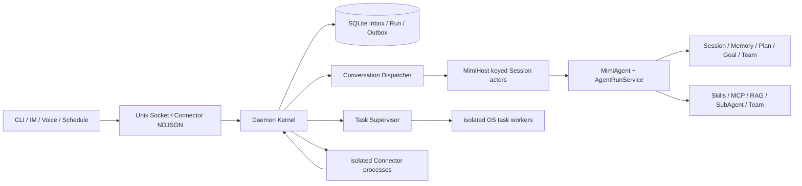

# MimiAgent 当前现状审计（2026-07-20）

## 结论

MimiAgent 已经具备完整的本地常驻 Agent 骨架：CLI 与 Daemon 共用同一 Host，Session actor 按会话串行、跨会话并发，后台 Task 使用独立进程，Event / Run / Outbox 使用 SQLite 事务，工具副作用另有执行账本。审计开始时的提交基线通过了类型检查、完整单测、构建和包烟测；审计中间态曾出现类型错误，随后已经修复并纳入最终门禁。

初始审计确认它还不适合被视为“长期无人值守且默认安全”的稳定版本，最高风险集中在主 Shell 环境、HTTP 内网边界、语义执行账本、Connector 入站确认和 Completion Gate。本轮随后针对这些根因完成了系统性修复；下文 F01～F10 保留发现时的证据，便于追溯，不代表最终工作树仍存在相同缺陷。

## 本轮修复闭环

- F01：Conversation 与 Task Shell 统一使用显式最小环境白名单，数据库 URL、遥测 DSN、Provider/Connector 密钥和控制面变量均不再进入模型 Shell。
- F02：HTTP Tool 拒绝 loopback、内网、link-local、metadata、IPv4-mapped IPv6 和混合 DNS 解析；每次重定向重新验证，禁止 HTTPS 降级和跨源写请求，跨源读取仅保留安全头，实际 socket DNS lookup 同样 fail closed。
- F03：副作用账本加入稳定逻辑调用序号；同一 attempt 的同参数调用分别执行，跨 attempt 的对应序号才回放。
- F04：Shell 在正常退出、取消和超时三条路径都回收完整进程组，文本规则只作为早期提示而不再承担所有权保证。
- F05：stdio 协议增加可协商的持久化 `event_ack`；HTTP cursor Connector 只在整批 ACK 后推进 cursor。
- F06：claim 遇到损坏 Event/Outbox 时在同一事务内隔离并继续下一条，避免 poison pill 阻塞队列。
- F07：纯回复/禁止工具请求不再因“测试”等词误启 Gate；copy/move/commit/push 纳入；artifact 只接受当前运行的结构化文件变更，Plan/Team 状态也参与验收。
- F08：Daemon status 携带包版本与构建内容/时间共同导出的 build identity；同协议但身份缺失或不一致时只在 idle 状态安全替换，busy 时明确拒绝中断。
- F09：Session 模型偏好同时持久化 provider；provider 不匹配或旧记录缺失 provider 时回退当前 provider 默认模型。
- F10：上下文压缩使用显式判别联合类型，并保持完整工具协议单元；最终门禁结果以文末最新验证为准。

此外，本轮还修复了 Event Session 不可变绑定、按 route 串行的 Outbox 并发、Completion 无进展持久判断、Goal/Contract/Team 所有权、普通 checkpoint 错领其他 Goal、并发同名工具 callId 配对、最长 8 步工具循环检测、恢复阶段 poison row、固定 Event 尝试上限，以及 QQ NapCat / 微信 OpenClaw 路由和最终投递去重。

## 审计范围与方法

- 静态范围：`src/core`、`src/runtime`、`src/extensions`、`src/daemon`、`src/tools.ts`、CLI、Connector 示例、对应测试与架构文档。
- 实际使用：当前用户 Daemon 的 `status`、`doctor`、`activity`、Connector 能力和日志；隔离目录中的初始化与 Doctor；两条无外部副作用的真实 CLI 对话。
- 验证：`npm run check`、`npm test`、`npm run build`、`npm run test:package`、生产依赖审计，以及 daemon/runtime/core 的聚焦测试。
- 边界：没有发送邮件/IM、修改日历、操作桌面、停止后台或清理死信；没有运行真实 Provider 评测集。

## 当前架构

这套运行模型与文档的大方向一致，尤其是 Session FIFO、跨 Session 有界并发、Event 完成与 Outbox 同事务、sending 租约过期不自动重放等关键设计。主要架构债务是实现层的依赖方向并未完全兑现：`runtime` 依赖 `extensions`，而 `extensions` 又依赖 `runtime` 的 model / mode / tool-policy；`core/context.ts` 也反向依赖 `extensions/rag.ts` 的类型。与此同时，Memory / Plan / Team 的持久 Store 直接创建 OpenAI Agents SDK Tool，使持久语义、工具协议和用户文案耦合在 core 层。

## 初始审计发现的 Top 10 问题

### F01 · P0 · 主 Conversation Shell 继承完整进程环境，可能泄露密钥

- 证据：`src/tools.ts:384-391,439-443` 默认使用 `process.env`；`src/runtime/mimi-agent.ts:349-356` 主运行时未注入隔离环境；后台 Task 反而在 `src/daemon/task-worker-entry.ts:84-89` 使用了显式隔离环境。
- 影响：`run_shell` 可读取 `OPENAI_API_KEY`、`DEEPSEEK_API_KEY`、代理与 Connector Token，并把它们带入模型 transcript、trace 或后续网络请求。仓库指导、网页内容或 system 事件造成的间接 prompt injection 会放大风险。
- 建议：主 Shell 与 Task Shell 统一使用最小环境 allowlist；默认剥离 `*_KEY`、`*_TOKEN`、`*_SECRET`、`*_PASSWORD` 和控制面凭据，需要秘密时走不可回显的按次 credential broker。
- 置信度：9/10。

### F02 · P0 · HTTP Tool 可访问 loopback、内网和重定向后的私有地址

- 证据：`src/tools.ts:357-380` 只校验 `http:` / `https:`，使用默认自动跟随重定向的 `fetch`；`src/daemon/policy.ts:44-96` 会把网络读取能力暴露给 read/work Task 和受委托来源。
- 影响：不可信网页或外部事件可诱导 Agent 探测本机服务、RFC1918、link-local、云 metadata，并可能把结果经外部事务带出。
- 建议：解析 DNS 后拒绝 loopback/private/link-local/multicast/metadata；每次 redirect 重新校验并限制次数；将公网读取和显式内网读取拆成不同 capability。
- 置信度：9/10。

### F03 · P0 · 语义执行账本把同一 Run 的合法重复调用误当重试

- 证据：`src/runtime/tool-ledger.ts:61-78` 在 `semanticCallIds=true` 时仅以 tool name + arguments 生成 ID；Daemon 路径在 `src/runtime/mimi-agent.ts:602-605`、`src/daemon/dispatcher.ts:504-516` 启用该模式。
- 触发：同一任务先运行 `npm test`，修改代码后再次运行完全相同的 `npm test`，第二次直接回放第一次结果。
- 影响：验证可能根本没有重跑；同参数的文件、Connector 或状态操作也会被吞掉，Completion Gate 可引用陈旧回执宣称完成。
- 建议：去重键加入稳定的逻辑调用序号/步骤 ID；同一 attempt 内不同 SDK callId 分别执行，仅在跨 attempt 恢复时映射并回放原逻辑调用。
- 置信度：10/10。

### F04 · P0 · Shell 的后台进程禁令可被普通 job-control 语法绕过

- 证据：`src/tools.ts:393-400` 用命令文本正则拦截 `&` / `nohup` / `disown` / `setsid`；`src/tools.ts:439-515` 只在 abort/timeout 时清理进程组，Shell 正常退出后不检查 descendants。
- 实际验证：`sleep 600 >/dev/null 2>&1 & echo done` 不命中现有正则；Shell 会立即成功返回而后台子进程继续运行。
- 影响：任务完成、取消或超时后仍可能留下持续占用 CPU/端口或继续执行副作用的进程，绕过 `delegate_background_task` 的持久追踪和 Supervisor 所有权。
- 建议：不要依赖 Shell 文本黑名单；始终管理完整进程组，并在父 Shell 正常退出时终止或确认没有剩余 descendants；或改为 argv 执行并显式禁用 job control。
- 置信度：10/10。

### F05 · P0 · Connector 入站没有持久化 ACK，cursor 可能越过未落库事件

- 证据：`src/daemon/connectors.ts:336-353,372-395` 对入站事件入库失败只写 stderr，成功后也不回 ACK；`examples/connectors/http-action-connector.mjs:229-235` 发出 event 后立即推进 `pollCursor`。
- 触发：`store.enqueueEvent` 因 `SQLITE_BUSY`、磁盘错误或损坏行短暂失败，而 Connector 已收到带新 cursor 的响应。
- 影响：该批事件至少在 Connector 重启前不会再请求，可能永久丢失，破坏常驻 Agent 最重要的“先持久化再执行”可靠性承诺。
- 建议：协议增加 `event_ack{id,ok}`，Connector 只在全部 ACK 后推进 cursor；更稳妥的是由 Kernel 在同一事务中持久化 Event 与 cursor。
- 置信度：9/10。

### F06 · P1 · 单条损坏 Event / Outbox 可成为队列 poison pill

- 证据：`src/daemon/store.ts:57-60` 直接 `JSON.parse`，没有 Zod 校验或隔离；`src/daemon/store.ts:665-683` 先选最高优先级记录再解析，异常导致 claim 事务回滚，下轮仍选择同一行。
- 影响：一个损坏的高优先级 queued Event 会无限阻塞其后的正常工作；Outbox JSON 损坏存在同类风险。现有 Doctor 未做逐行 decode/integrity 检查。
- 建议：持久边界验证 schema；claim 解析失败时原子 quarantine/dead-letter 并写 audit，然后继续下一条；Doctor 增加 SQLite quick/integrity 与 row decode 检查。
- 置信度：9/10。

### F07 · P1 · Completion Gate 的启用与证据模型不可靠

- 证据：`src/core/completion.ts:231-235` 用自然语言动词正则决定是否启用；artifact 只验证某次文件写/读 Tool 成功而不验证产物的新旧与内容，test 只验证某个 Shell exitCode=0；`src/runtime/mimi-agent.ts:1182-1230` 不读取 TeamTaskStore 的 unfinished/failed 状态。
- 实际复现：`这是MimiAgent审计链路测试。不要调用任何工具，仅回复：MIMI_AUDIT_OK` 被“测试”命中，连续 3 次模型 Run 后死信，22.6 秒失败；去掉“测试”后相同固定回复 2.7 秒成功。反向漏检中，`Move ...`、`Copy ...`、`Commit and push ...` 可被判断为无需 Contract。
- 影响：纯回答被误拦截并产生重试成本；真实副作用可能无 Gate；弱文件/测试回执或外层 `run_team` 成功调用可让 Gate 通过，即使产物不是本轮生成或 worker 已失败。
- 建议：以首次实际调用的 side-effect capability 决定 Gate，而非输入关键词；artifact/test 使用 Host 结构化回执；把未完成/失败 Team task 纳入确定性 unmet 条件；不可修复的 Contract 缺失不要盲目重复模型调用。
- 置信度：10/10。

### F08 · P1 · 同协议版本的旧 Daemon 会被无限复用，代码升级不生效

- 证据：`src/daemon/types.ts:188-220` 的 status 只有 `protocolVersion`，没有 build/package/commit identity；`src/daemon/service.ts:1400-1420` 在协议、权限和 supervisor 一致时直接复用已有进程。
- 实际证据：当前 Daemon PID 812 启动于 09:58:30，HEAD commit 时间为 10:03:27，`dist/index.js` 构建于 10:08:41；10:12 的 CLI 仍连接 09:58 的旧进程。协议仍为 5，所以客户端没有重启它。
- 影响：用户看到的是新 CLI/新文件，实际运行的却是旧 runtime 和旧 Connector 逻辑；修复上线、复现判断和事故恢复都会失真。
- 建议：status 携带 package version + build identity；CLI 检测不一致后仅在 idle 时安全滚动重启，busy 时明确提示待升级，不能静默复用。
- 置信度：10/10。

### F09 · P1 · Provider 切换后会恢复上一 Provider 的模型名

- 证据：`src/core/session.ts:48` 偏好只保存 model、不保存 provider；`src/runtime/mimi-agent.ts:746` 无条件恢复 `preferences.model`；`src/runtime/model.ts:73` 只按当前 provider 创建 client，不校验模型归属。
- 触发：DeepSeek Session 保存 `deepseek-v4-pro` 后把配置切到 OpenAI，恢复时会向 OpenAI endpoint 请求该模型；反向同理。
- 影响：已有 Session 在切换 Provider 后真实运行失败，Session 恢复与 Provider 对齐承诺不成立。
- 建议：持久化 `{provider, model}`；provider 不匹配时回退当前 provider 默认模型或执行显式迁移。
- 置信度：10/10。

### F10 · P1 · 审计中间态曾无法通过严格 TypeScript 检查

- 证据：最终复跑 `npm run check` 在 `src/core/context.ts:267-298` 报 6 个错误；新增 `flatMap` 回调被推断为只允许 `key: 'content'`，与 `key: 'output'` 分支冲突，后续 `candidate` 退化为 `unknown`。
- 背景：这批修改在审计过程中并发出现，不是本审计产生；初始 HEAD 基线的 `npm run check` 和 549 项测试均通过。最终复核以当前工作树为准，因此此刻不能声称可构建或测试全绿。
- 影响：CI、构建和发布均会失败；同时意味着针对上下文协议完整性的修复尚未形成可验证闭环。
- 建议：为待压缩字段定义显式判别联合类型并修复 `flatMap` 推断，随后重新运行 `npm run check && npm test && npm run build && npm run test:package`。
- 置信度：10/10。

## 实际运行现状

审计时当前 Daemon 在线，conversation/task 活跃数均为 0，14 个启用 Connector 进程均存活；最近多条 QQ conversation Run 能正常完成，最小普通 CLI 固定回复也在 2.7 秒内成功。这说明主链路并非不可用。

长期运行健康度则不理想：状态中有 30 个 Event dead letter、12 个 Outbox dead letter、1 个 blocked task、483 条 pending digest。历史 Event 失败主要包括余额/限流、Completion Gate、Provider schema 兼容和旧 runtime control receipt；近期 Outbox 失败主要为 QQ “已提交但未得到可靠确认”和一个 OpenClaw Weixin loopback 连接失败。`mimi.err.log` 已增长到约 2.8MB，并持续出现 Mail poll 被 SIGKILL、Calendar poll 25 秒超时、QQ 重复 upstream 被拒绝、MCP 初始化 ECONNREFUSED；但 Doctor 只把 Connector 进程视为 online，Mail/Calendar readiness 仍为 unknown，未把连续 poll failure 变成健康告警。

另一个明显体验噪音是所有实际运行命令和多个 Connector 子进程都会输出 Node `ExperimentalWarning: SQLite is an experimental feature`。默认 `tools` 输出等级还会完整展示 DeepSeek reasoning；这符合当前等级的累积定义，但对于日常用户可能过于嘈杂，尤其在 one-shot CLI 中。

## 验证结果

- 初始提交基线 `npm run check`：通过。
- 初始提交基线 `npm test`：通过，549 tests，0 failed。
- 初始提交基线 `npm run build`：通过。
- 初始提交基线 `npm run test:package`：通过。
- daemon focused tests：138/138 通过。
- runtime/core/tools focused tests：75/75 通过。
- Session/Mode/Team/Core focused tests：99/99 通过。
- `npm audit --omit=dev --registry=https://registry.npmjs.org`：0 个已知生产依赖漏洞。默认镜像 `npmmirror` 不实现 npm audit endpoint，因此使用官方 npm registry 复核。
- 隔离初始化与 Doctor：成功；创建 17 个 Connector 配置，其中 11 个 macOS Connector 默认启用；无 API Key 时正确报告未就绪。
- 真实 CLI：普通固定回复成功；包含“测试”的等价固定回复按 F07 稳定失败并死信。
- 修复后 `npm run ci`：通过；568 tests、0 failed，覆盖率 lines 89.71%、branches 80.93%、functions 86.95%，严格类型检查、构建和 packed-package smoke test 均通过。

## 初始建议修复顺序（本轮已按此闭环）

1. 立即处理 F01、F02：先切断秘密与内网暴露面。
2. 随后处理 F03、F05、F06：恢复副作用去重与事件持久化的可信语义。
3. 同一批重做 F07：否则修复、测试与 Completion Gate 本身都可能给出假绿或产生重试放大。
4. 处理 F04、F08、F09：收回游离进程，并确保线上代码版本和 Provider 恢复都可验证。
5. 先修复 F10 恢复绿色门禁；再收敛前述分层反向依赖，并以不变量和测试为界拆分 store/service/agent 等热点大文件。

## 做得较好的部分

- `MimiHost` keyed FIFO + 全局 semaphore 与测试一致，同 Session 隔离和跨 Session 并发设计清晰。
- Event 完成 + Outbox、dead-letter + fallback、Schedule occurrence + 推进均使用 SQLite immediate transaction；sending 租约过期按 uncertain dead-letter 处理，没有冒充 exactly-once。
- Session runId/owner CAS、路径 realpath/symlink 防护、ExecutionLedger 对 uncertain/failed 的默认失败关闭，以及 Team builder 路径重叠检查都有聚焦测试。
