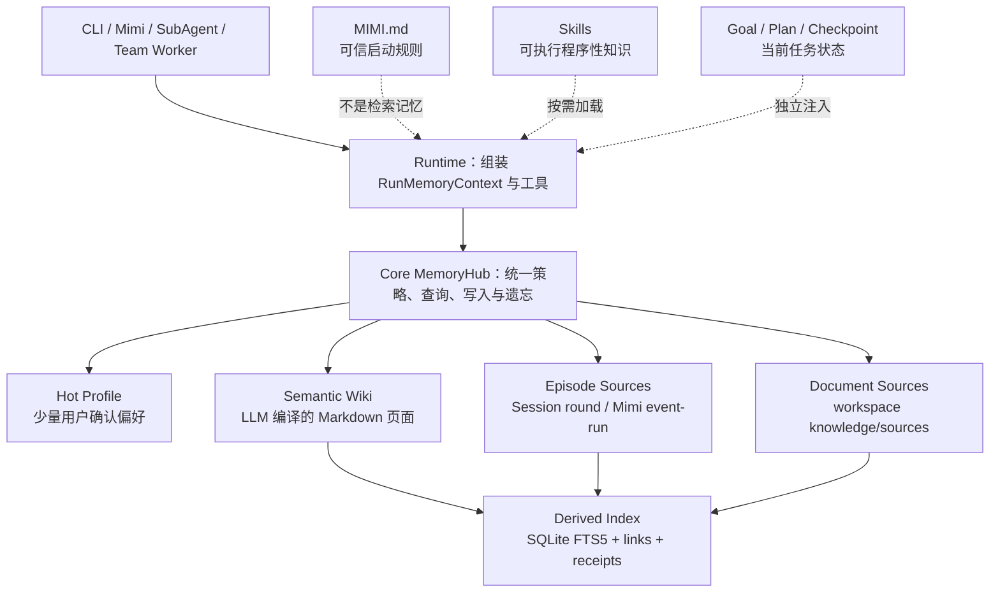
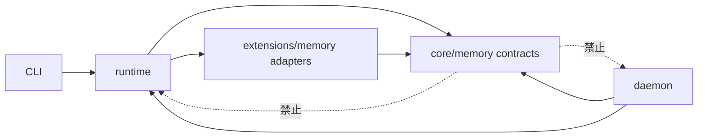
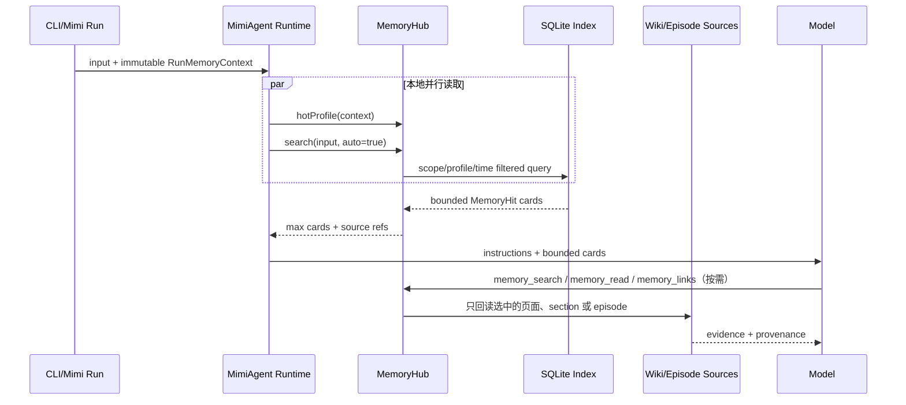
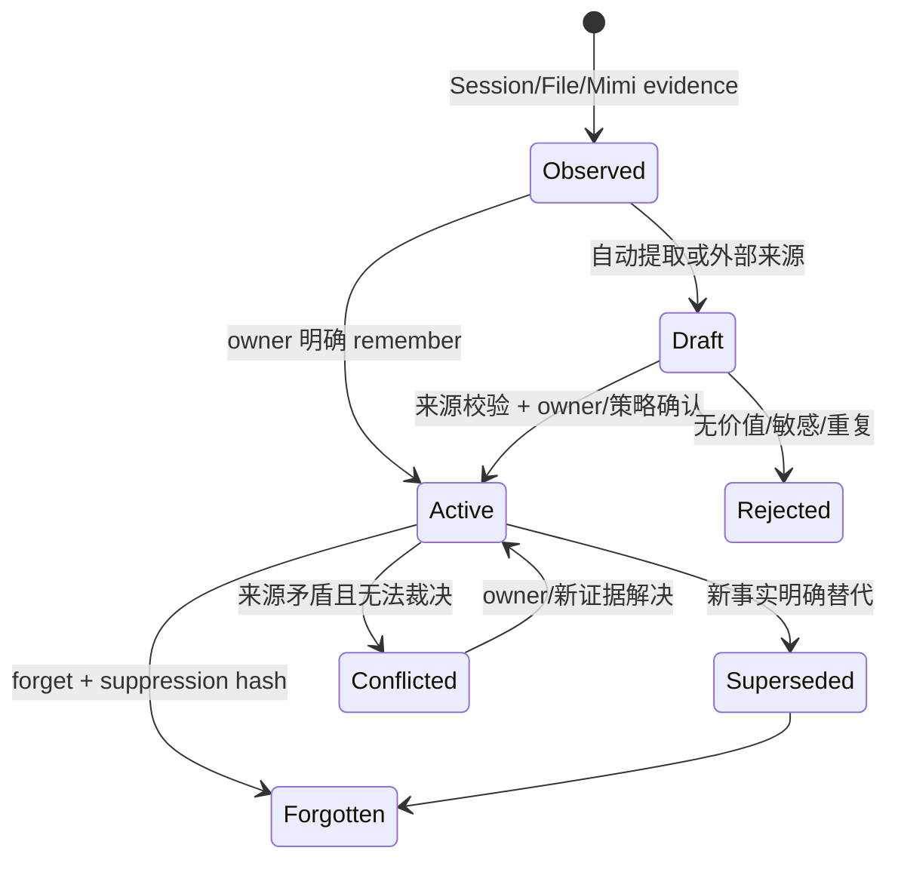
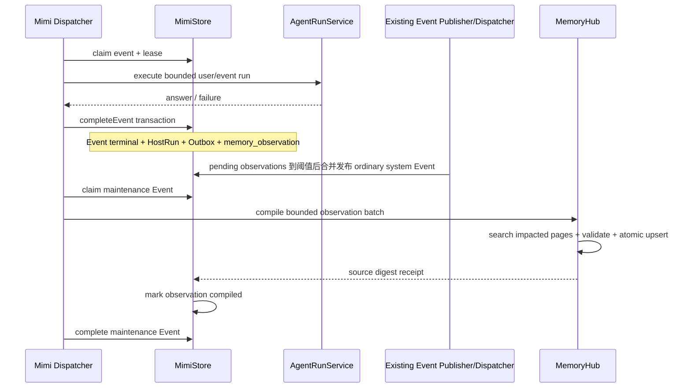

# MimiAgent 统一 Memory Hub 设计与实施计划

日期：2026-07-15

状态：草稿（内部 Review 通过，待用户审核；未实施）
关联调研：`docs/research/20260715-MimiAgent统一MemoryHub-调研.md`

## 任务目标

以 LLMWiki 为 MimiAgent 的统一 Memory Hub，保留 Session、Episode、Semantic Wiki、Skill、Goal/Plan/Checkpoint 的物理分层，让 CLI 和全天候 Mimi 共享一套检索、读取、沉淀、冲突处理和遗忘语义。

设计目标：

- 轻量：只使用 Markdown、项目已有的 YAML/Zod/Atomic Store 和 Node 内置 SQLite，不增加外部服务或数据库依赖；
- 高效：普通查询只做本地增量索引与检索，不调用 LLM，不默认请求 Embedding；
- 有用：支持跨 Session、时间更新、来源回读、冲突、拒答和经验复用；
- 可靠：Mimi 自动巩固可恢复、可重试、幂等，不阻塞事件热路径；
- 清晰：遵守 `runtime → core + extensions` 与 `daemon → runtime` 的现有依赖方向；
- 可迁移：现有 `memories.json`、`rag-index.json`、`remember/recall/search_knowledge` 在迁移期保持可用。

## 非目标

- 不实现通用知识图数据库或图推理引擎；
- 不引入向量数据库、消息队列、Redis 或新的工作流框架；
- 不把 Session transcript 搬进 Wiki 后删除原始会话；
- 不用 Memory 取代 Goal、Plan、Checkpoint、Team 或 Schedule；
- 不把 Skill 的可执行内容复制成 Wiki 页面；
- 不允许外部事件自动提升为可信项目知识；
- 本阶段不设计图形 UI，仅调整 CLI 文本命令与状态展示。

## 一句话架构

> Memory Hub 是统一门面；Session/Mimi Event 是 episode 真相，LLMWiki 是持续编译的 semantic memory，MIMI.md/Skills 是 procedural memory，SQLite 是可重建索引而不是知识真相。

## 1. 总体分层



### 五类状态的最终归属

| 层 | 负责内容 | 真相载体 | 是否进入统一搜索 | 是否自动注入 |
|---|---|---|---|---|
| Working | 当前 Session、ContextArchive、Checkpoint | Session JSON | 当前 Session 由原有路径读取 | 是，按现有上下文预算 |
| Episodic | 已完成的跨 Session 交互、Mimi 事件与结果 | Session/Mimi DB | 受限；只在 owner 明确访问历史或 maintenance 时检索完整 round | 否 |
| Semantic | 偏好、事实、概念、实体、决策、经验、gotcha | LLMWiki Markdown | 是，统一检索主层 | Hot Profile + 少量相关 Memory Card |
| Procedural | 安全规则、行为规则、可执行流程 | MIMI.md / Skills | Wiki 可有引用，但不复制执行本体 | NANO 常驻、Skill 按需 |
| Task state | 当前目标、计划、恢复点、团队任务 | Goal/Plan/Checkpoint/Team | 否 | 由现有状态路径注入 |

### “统一”的准确含义

统一以下内容：

- 一个 `MemoryHub` API；
- 一套 scope/profile/provenance 规则；
- 一组 search/read/link/write/forget 操作；
- 一种 `MemoryRef` 和 `SourceRef`；
- 一条从观察、候选、验证、巩固到召回和纠错的生命周期。

不统一以下物理真相：

- transcript 不改写为 Wiki；
- Mimi 事件不搬出可靠 Inbox/Run 数据库；
- Plan 不转换成长期 todo；
- MIMI.md 不作为普通检索页面；
- Skill 不被扁平化成知识片段。

## 2. 模块边界

### 目录规划

```text
src/core/memory/
├── types.ts             MemoryRef、SourceRef、Page、Hit、Context 等稳定语义
├── policy.ts            scope、profile、trust、确认、晋级与遗忘规则
├── hub.ts               统一 search/read/links/remember/forget 门面
└── ranking.ts           确定性合并、时间过滤与置信度排序

src/extensions/memory/
├── wiki-vault.ts        Markdown frontmatter、原子单页提交、锁与 lint
├── sqlite-catalog.ts    FTS5/links 派生索引 + receipts/tombstones 持久账本
├── document-source.ts   knowledge/sources 与旧 knowledge/*.md 适配
├── episode-source.ts    FileSession 完整 round 的增量索引与回读
└── tools.ts             Runtime/worker 可见的窄工具集合

src/core/memory.ts        迁移期兼容导出与旧 MemoryStore adapter
src/extensions/rag.ts     迁移期 RagStore adapter；完成切换后再删除

src/daemon/memory.ts      Mimi observation 适配、maintenance host tools
src/daemon/store.ts       observation 表及与 Event 终态一致的事务写入
src/daemon/dispatcher.ts  合并发布并调度普通 maintenance Event，不增加第二个 loop

src/runtime/components.ts 组合 MemoryHub 与 adapters
src/runtime/mimi-agent.ts 组装不可变 RunMemoryContext、检索和注入
src/runtime/tool-policy.ts Memory 工具能力与 Plan/SubAgent/Team 边界
```

### 依赖规则



- `core` 只定义稳定语义、策略与门面，不导入 Runtime、CLI 或 Daemon。
- Markdown、SQLite FTS、文件扫描属于 `extensions` 实现细节。
- Mimi 只暴露 observation source/receipt，不把事件可靠性塞进 MemoryHub。
- Runtime 是唯一 composition root，CLI 与 Daemon 继续共用 `AgentRunService`。

### 核心接口草案

```ts
export interface RunMemoryContext {
  profileId: string;
  workspaceRoot: string;
  sessionId: string;
  runId: string;
  cause?: { eventId: string; trust: RunTrust; source: string };
}

export interface MemoryHub {
  hotProfile(context: RunMemoryContext): Promise<MemoryCard[]>;
  search(query: string, context: RunMemoryContext, options?: MemorySearchOptions): Promise<MemoryHit[]>;
  read(ref: MemoryRef, context: RunMemoryContext): Promise<MemoryDocument>;
  links(ref: MemoryRef, context: RunMemoryContext): Promise<MemoryLink[]>;
  remember(input: RememberInput, context: RunMemoryContext): Promise<MemoryPage>;
  approve(ref: MemoryRef, context: RunMemoryContext): Promise<MemoryPage>;
  reject(ref: MemoryRef, reason: string, context: RunMemoryContext): Promise<MemoryReceipt>;
  forget(ref: MemoryRef, context: RunMemoryContext): Promise<ForgetReceipt>;
}
```

`RunMemoryContext` 在一轮开始时捕获，和 Session 的 immutable run ownership 一样，不允许 Session 切换或陈旧 Run 把结果写入新的 scope。

## 3. 物理存储

### Vault 划分

```text
<workspace>/knowledge/
├── sources/                    项目原始来源，用户维护
├── wiki/                       项目共享 Wiki，允许 Git 管理
│   ├── concepts/
│   ├── entities/
│   ├── decisions/
│   ├── lessons/
│   ├── _index.md               生成的人类目录，不是机器真相
│   ├── _log.md                 append-only 维护日志
│   └── _error-book.md          重复编译/检索错误及修正规则
└── *.md                        迁移期兼容的旧知识来源

<dataRoot>/memory/
├── profiles/<profileId>/
│   ├── wiki/                   私有语义 Wiki，0700/0600
│   └── memory.db               该 profile 的私有 catalog
├── workspaces/<workspaceId>/
│   └── memory.db               当前 workspace 的共享 catalog
├── locks/                      vault/page 锁
└── quarantine/                 无法解析或损坏的私有页面
```

约束：

- 项目 Wiki 是团队可读、可提交的共享知识；禁止写入私人记忆和 Mimi 外部事件原文。
- 私有 Wiki 位于受保护的 `dataRoot`，普通文件、Shell、RAG 工具继续无法读取；只能经 Memory API 访问。
- `profileId` 是私有隔离边界。每个 profile 使用独立 Wiki 目录和 SQLite 文件，不能只依赖 SQL 的 `WHERE profile_id = ?` 防泄漏。CLI 默认 `owner`；Mimi 必须把 Event 的 `profileId` 加入 `RunCause`，不能只按 SessionKey 推断。
- Mimi 的 `profileId` 只能来自本机 Connector 配置或本机控制面，不能从外部 payload 学习；Webhook 继续固定映射到 owner profile。内部 Session ID 必须绑定 `profileId + sessionKey`，避免两个 profile 显式复用同一个 `sessionKey` 时共享 transcript。
- 磁盘目录不直接拼接外部字符串：profile/workspace 目录名由经校验的 ID 或 canonical workspace path 的 SHA-256 派生；所有 Vault 读写继续做 lexical path + realpath containment，并拒绝跟随跨根符号链接。
- 私有记忆默认仍跟随当前 `dataRoot`，保持现有“同一部署/工作区内跨 Session”语义；需要跨工作区共享时由用户显式把 `AGENT_DATA_DIR` 指向同一可信目录，不隐式扩大可见范围。
- 工作区 Wiki 被人工或通用文件工具直接修改时，只有 schema 校验通过的页面才进入 active 索引；无效页面进入 lint 结果，不污染查询。
- 原始文档保持原位。索引只保存可重建文本和定位信息，不把索引文件提交到 Git。

MemoryHub 自己提交页面后立即更新对应 catalog 的派生索引。工作区被外部编辑时，在 Runtime 启动、显式 `/index` 和 Mimi maintenance 前做增量 digest 扫描；普通 `memory_search` 不阻塞等待全目录扫描。运行中的 CLI 若由通用文件工具或人工直接修改 Wiki，需要调用 `/index` 才保证立即可见。

### Markdown 页面 schema

每个页面表达一个稳定主题；偏好、时间敏感事实和决策应保持窄粒度，概念/实体页可以包含多个带来源标记的 claim。

```yaml
---
schemaVersion: 1
id: mem_<uuid>
title: MimiAgent 的 Session 所有权
kind: concept # profile | fact | concept | entity | decision | lesson | procedure-ref
scope: workspace # private | workspace
profileId: null
status: active # draft | active | conflicted | superseded
confidence: source-grounded # user-confirmed | source-grounded | inferred
aliases: [session ownership, run owner]
tags: [runtime, session]
sourceRefs:
  - type: file
    id: docs/ARCHITECTURE.md
    digest: sha256:...
    occurredAt: 2026-07-15T00:00:00.000Z
validFrom: null
validUntil: null
supersedes: []
createdAt: 2026-07-15T00:00:00.000Z
updatedAt: 2026-07-15T00:00:00.000Z
---
```

正文约定：

```markdown
# MimiAgent 的 Session 所有权

## 摘要

每轮运行捕获不可变 Session、runId 和 owner。

## 当前结论

- 陈旧运行不得覆盖当前 Session 状态。[source:file:docs/ARCHITECTURE.md]

## 关系

- [[Run Checkpoint]]
- [[Mimi Event Lease]]

## 历史与冲突

- 无。
```

保持 YAML 与 Markdown 可直接阅读，不为每个句子建立图数据库三元组。`[[wikilink]]` 只解析成一跳 links 表。

### SourceRef

统一支持：

- `file:<workspace-relative-path>#<digest>`；
- `session:<sessionId>@<runId>#<digest>`；
- `mimi:event:<eventId>/run:<hostRunId>#<digest>`；
- `user:explicit@<sessionId>/<runId>`。

SourceRef 至少包含类型、稳定 ID、内容摘要、发生时间和 provenance/trust。Mimi Run 在送入 Agent 前由 Host 添加不可伪造的本机锚点 `eventId + hostRunId + profileId`；锚点随该轮输入进入 Session，后续从锚点读到下一 user round，并按 Tool Call/Result 完整单元净化。查询结果默认只返回引用和安全摘要；需要细节时再 `memory_read` 或回读原始 episode。

### SQLite Catalog：派生索引与持久控制账本

两个 scope 的 `memory.db` 使用同一 schema，但物理独立。MemoryHub 在查询时并行搜索当前 profile catalog 和当前 workspace catalog，再合并排名。

可删除重建的派生表：

- `documents`：page/source/episode 元数据、digest、scope、profile、有效时间；
- `documents_fts`：title、aliases、tags、body 的 FTS5 索引；
- `links`：解析后的 Wiki 双向链接；
- `schema_meta`：索引版本和最后完整校验时间。

不可随 reindex 删除的控制表：

- `source_receipts`：某个 source digest 的 `applied/rejected` 回执及 compiler version；
- `suppressions`：forget 后的不可逆内容摘要，防止从旧 transcript 自动学回来；
- `review_events`：owner approve/reject/forget 的最小审计记录，不保存正文。

Markdown/Session/Mimi DB 是内容真相；`source_receipts/suppressions/review_events` 是幂等、隐私和审核语义的控制真相。`/index` 只重建派生表，绝不清空控制表。Catalog 使用 WAL、schema version、迁移前备份和严格校验；控制表损坏时 Memory 写入与自动 maintenance 必须失败关闭，不能像普通派生索引那样从空状态继续。

确定性 lint 的即时结果可以放在派生表；只有重复发生、会影响编译或检索质量的问题才写入 Vault 的 `_error-book.md`。维护 Run 最多读取 20 条未解决规则，修复后标记 resolved，避免 Error Book 本身无限进入上下文。`_log.md` 只记录页面 ID、操作、source digest 和时间，不复制私有正文。

### 为什么不默认使用 Embedding

- 当前规模预计是数百到低万页面，FTS5 足够作为轻量主索引；
- 运行时检索必须在 DeepSeek-only 和离线环境可用；
- JSON 向量会快速膨胀，且每次查询可能触发网络；
- LLMWiki 的价值来自结构化页面、别名、链接和预先综合，不只来自向量相似度。

初版候选生成：

1. 标题/别名精确与前缀命中；
2. FTS5 trigram/BM25；
3. 少于 3 个汉字的查询使用有上限的 `LIKE` 回退；
4. 时间表达式转换为 `validFrom/validUntil/occurredAt` 过滤；
5. 用 Reciprocal Rank Fusion 合并，不手写不可解释的大量权重；
6. 仅在工具明确请求时做一跳 link expansion。

Embedding 作为后续可选 adapter，只有在 eval 显示本地词法检索达不到门槛时启用。

Catalog 初始化时先做 FTS5 capability probe。官方 Node 构建缺少 FTS5 或 FTS 表迁移失败时，回退到 `documents` 表上的现有轻量 `textScore + bounded LIKE`，并在 `/memory status` 报告 degraded；不能因为可选全文索引缺失让 MimiAgent 无法启动。

## 4. 读取路径



### 三段式渐进披露

1. **Hot Profile**：最多 8 条、约 600 tokens，只允许 `user-confirmed + active + private profile` 的语言、格式和稳定偏好。
2. **Auto Memory Cards**：每轮一次本地检索，最多 5 条、约 1200 tokens；搜索 active Semantic Wiki，并可返回不含断言正文的 `conflicted/stale` 警告卡；不塞整页，也不自动跨 Session 读取 episode。
3. **Tool deepening**：Agent 需要时调用 `memory_search → memory_read → memory_links`，每次都有条数、深度和 token 上限。

检索到的 Memory 永远标记为“有来源的数据”，不能作为 system instructions。外部 provenance 的内容即使进入 draft，也不能改变工具权限或覆盖 MIMI.md。

### 搜索范围

主 Agent 的普通默认顺序：

1. 当前 profile 的 active private Wiki；
2. 当前 workspace 的 active Wiki；
3. workspace 原始文档来源。

相关 `conflicted/stale` 页面作为警告卡参与结果，要求 Agent 深读来源或明确拒答；draft 不进入普通查询，superseded 只在时间查询或显式 history 过滤时返回。

工具可用 `scope`、`kind`、`from/to`、`includeEvidence` 过滤。`includeEvidence` 涉及跨 Session episode 时，普通 Run 必须同时满足 owner provenance 和明确的历史访问意图；system maintenance 通过专用 host tool 访问其 observation 指向的 round。SubAgent/Team worker 默认只有 workspace Wiki 和 workspace document source 的 read-only 视图，不直接读取 private Wiki 或 episode；主 Agent 需要时只传递当前任务所需的有界 Memory Card。任何角色都不得看到别的 profile。

### Episode 粒度

按完整 user round 建索引：一条用户输入、关联 Tool Call/Result 的安全摘要、最终回答和时间。原始 Tool Call/Result 留在 Session，索引不复制隐藏推理或大段输出。

这比只抽取单条事实更保真，又比把整个 Session 当一个 chunk 更容易检索。Mimi 的 eventId/runId 作为额外来源元数据，不再重复索引一份相同正文。

## 5. 写入与巩固生命周期

### 状态机



### 写入规则

| 来源 | 默认结果 | 是否自动 active | 可写 scope |
|---|---|---|---|
| owner 明确说“记住” | 直接校验并写入 | 是 | private；workspace 必须明确指定 |
| owner 普通对话 | 成为可检索 episode；维护时才形成 draft | 否 | private |
| workspace 文件，内容摘要匹配 | source-grounded draft | 通过 lint 后可按显式 ingest 激活 | workspace |
| trusted/system Mimi 事件 | draft | 否 | private profile |
| external/public Mimi 事件 | untrusted draft | 永不自动 active | private profile，禁止 workspace |
| Agent 推断 | inferred draft | 否 | private 或 workspace draft |

任何密码、token、凭证、完整联系人隐私字段和明确要求不保存的内容都在 candidate 形成前被拒绝。

`remember` 不能只检查输入字符串里是否出现“记住”。直接写 active memory 必须同时满足：本轮是 owner provenance、原始 owner 输入具有肯定写入意图、RunMemoryContext 的 session/profile ownership 仍有效。非 owner Event 只获得 memory read tools；它的经验由终态 observation 进入受限 maintenance 流程，不能直接调用 public `remember/forget`。

CLI 普通会话不在热路径额外生成 candidate 表。完成的完整 round 进入 episode 增量索引；只有 owner 显式 `/memory maintain`、显式 ingest，或由 Mimi 的周期维护扫描到该 episode 时，才调用模型把它编译成 Wiki draft。用户明确 `remember` 仍立即写 active private memory。

Draft 不是死胡同：owner 可通过 CLI list/approve/reject 审核。Approve 把页面切换为 active 并记录确认时间；Reject 删除 draft、写入不含正文的 candidate/source receipt，避免同一 source digest 反复生成。Maintenance 可以读取 draft 做去重和关系维护，但普通查询、Hot Profile 和自动注入只使用 active 页面。

### 单页提交协议

为了保持轻量，不实现复杂的跨文件事务：

1. 搜索受影响页面，生成一个页面级 upsert；
2. 校验 frontmatter、scope、SourceRef、路径、链接和页面大小；
3. 获取 vault 锁并重读页面，检查 `expectedDigest`；
4. 写 PID+UUID 临时文件并 atomic rename；
5. 页面落盘后更新 SQLite 派生索引；索引失败则标记 dirty，下一次查询前增量修复；
6. 多页编译逐页提交，全部成功后写 `source_receipt`；
7. 进程中途退出时，重试会根据 source digest 和页面 SourceRef 跳过已完成页面。

因此，Markdown 永远先于索引提交；不会出现索引宣称存在但页面不存在的权威状态。

### 冲突与时间

- 用户明确纠正旧事实时，旧页/旧 claim 标记 `superseded` 并设置 `validUntil`；新内容引用旧 ID。
- 两个非 owner 来源冲突时不静默覆盖，页面进入 `conflicted` 或创建 conflict section。
- 时间敏感查询优先返回在查询时间有效的内容；未给时间时返回 current claim，并附历史变化提示。
- Source digest 改变而页面未重新编译时，查询结果标记 `stale`，不能伪装为最新事实。

### 遗忘语义

`forget` 完成三件事：

1. 删除/失活编译后的私有页面、对应 quarantine 副本和派生索引；
2. 写入只包含 hash、scope、时间的 suppression tombstone，防止维护任务从旧 Session 再次学习；
3. 清理相关 Hot Profile cache。

它不隐式删除原始 Session。若用户要求删除原始对话，继续使用 Session clear/delete 语义。自动维护不能越过 suppression；如果 owner 以后明确要求重新记住同一内容，可在再次确认后移除对应 suppression 并创建新版本。项目 Wiki 可能存在 Git 历史，因此禁止把私人记忆提升到 workspace；删除共享页面时必须明确提示版本历史边界。

## 6. Mimi 24/7 接入

### 核心原则

- 事件回复热路径不做第二次 LLM 总结；
- 不在 Hook 中 fire-and-forget 写 Memory；
- 不新增 Memory Dispatcher、独立 lease loop 或新工作流引擎；
- 使用现有 Mimi SQLite 事务登记来源；Dispatcher 像处理 Schedule/Briefing 一样做一次确定性检查，只在有待处理来源时发布普通 maintenance Event；
- maintenance Event 由同一个 Dispatcher 和 AgentRunService 处理，因此仍只有一个 Session owner；
- 跨 Mimi DB、Markdown 和 Memory index 的一致性通过 source digest 幂等回执解决，不伪造分布式事务。

### 数据流



### `memory_observations` 不是第二个任务系统

Mimi DB 增加一个窄的 append-mostly 来源登记表：来源行只新增，后续只单调填写编译时间与 receipt，不回写原始事件内容。

```text
source_key UNIQUE
event_id
host_run_id
session_id
profile_id
outcome            completed | dead_letter
trust
content_digest
observed_at
compiled_at
receipt_id
```

它不包含 lease、worker、任意 DAG、用户 Todo 或执行动作。真正的租约、重试和 dead-letter 仍属于普通 maintenance Event。

写入时机：

- 成功 Agent Run：在 `completeEvent()` 的现有事务中登记；
- 最终 dead-letter：可登记为 failure observation，用于重复 gotcha，但普通重试不重复登记；
- ignored、digested、notify-only、连接器噪声默认不登记；
- `system:memory-maintenance`、`attention:briefing` 及纯内部汇总 Run 永不登记，防止维护结果再次触发维护；
- 同一 `eventId + hostRunId + compilerVersion` 唯一，重试不产生重复记忆。

Dispatcher 先创建 HostRun，再把本机生成的锚点和 Attention 决策的正文组装成最终输入。observation 通过 hostRunId 找到唯一锚点；即使同一 Event 重试多次，也能定位每次尝试的独立 round。Session 后续删除孤立 Tool Call 不会让锚点失效。CLI 普通 Session 则继续按 user round 边界增量解析。

### Maintenance Event

不创建每 30 分钟一次的空 Schedule。`MimiDispatcher.processOnce()` 在现有 `emitDueBriefings()` / `emitDueSchedules()` 附近调用一个同步、确定性的 `emitDueMemoryMaintenance()`：

- 没有 observation 时不创建 Event、也不调用模型；
- 某个 profile 待处理达到 10 条，或最老 observation 等待超过 10 分钟时，才发布一个 Event；
- 同一 profile 已有 queued/running maintenance Event 时不重复发布；
- 独立的每小时/每日 maintenance run budget 超限时不发布，等时间窗口自然恢复；
- Event 使用 `kind: schedule`、`priority: 0`、真实 `trust: system`、来源 `system:memory-maintenance` 和固定 maintenance Session；
- 普通用户/高优先级 Event 始终因 priority 更高而先处理。

`AttentionEngine` 对已经发布的 maintenance Event 增加一个窄的确定性 `run` 分支，不能伪装成 owner，也不进入用户 Digest。事件执行、lease、retry 和 dead-letter 仍完全使用普通 Event 语义。若最终 dead-letter，observation 保持未编译；后续窗口或 owner 手动 `/memory maintain` 可重新合并发布。

为避免长期高流量让 `priority: 0` 永久饥饿，Dispatcher 增加一个小计数器：连续处理 20 个非 maintenance Event 后，若没有 owner 或 urgent Event 排队且 maintenance budget 仍有余量，优先 claim 一个已排队 maintenance Event。它复用现有单 Dispatcher，不增加并发；owner/urgent 工作仍具有绝对优先级。

有待处理内容时：

- 固定 Session：`mimi-system-memory-<profileId>`；
- 固定严格 RunPolicy：只开放 `memory-read`、受限 `memory-write` 和 observation host tools；
- 禁止 Shell、文件通用写入、MCP、Connector action、Schedule 写入和网络；
- maintenance Event 的可信输入只包含本机生成的维护目标和 batch/profile ID，不拼接外部 payload；模型必须通过只读 host tool 获取有界 observation cards，工具结果明确标记为不可信来源数据；
- 仅 maintenance Run 可见 `list_memory_observations`、`upsert_memory_draft`、`complete_memory_observations` 三个内部工具；它们都受 event execution ledger、source digest 和 side-effect allowlist 约束，不进入普通 Agent 工具列表；
- `complete_memory_observations` 只接受已有 `applied/rejected` Memory receipt 的 source key；未处理或部分失败的 observation 保持 pending，模型不能用一次批量调用伪造完成；
- 一轮最多 20 observations、5 个页面 upsert、8k 输入证据；
- 默认每日最多 12 次有模型调用的 maintenance run；超限留到下一窗口；
- 用户交互/高优先级 Event 优先，maintenance 使用低优先级普通 Event；
- 自动产物默认 `draft`，不可信来源永不自动 active。

这些预算先作为代码常量，验证稳定后再决定是否暴露到 `assistant.json`，避免一开始增加过多配置。

### 长期运行的背压与保留

- pending observation 永不因保留策略静默删除；超过预算只延后，并在 `/memory status` 报警；
- observation 已有 applied/rejected receipt 且 `compiled_at` 超过 30 天后，可按每轮最多 100 条增量清理；原 Event/HostRun 和 Memory receipt 仍保留来源链；
- episode 派生索引默认保留最近 10,000 个完整 round，以及所有被 active/conflicted Wiki 页面引用的 round；被淘汰的旧 episode 仍在原 Session/Mimi DB，可按 SourceRef 深读；
- 自动 draft 达到每 profile 500 页后，maintenance 只允许合并/更新已有页面，不再创建新页，直到 owner review 或清理；
- `_log.md` 按年份分段，Error Book 只给维护 Run 注入最多 20 条未解决项；
- 所有清理只作用于派生索引、已确认回执后的 observation 和无正文审计元数据，不删除原始 Session、Event 或 active Wiki。

### 崩溃与重试

关键崩溃点及恢复：

| 崩溃点 | 恢复行为 |
|---|---|
| Event 完成前 | 现有 lease 恢复；语义工具账本防止外部动作重复 |
| Event 完成后、observation 前 | 不会发生，两者同事务 |
| 页面 rename 前 | maintenance Event 重试，无可见页面 |
| 页面 rename 后、index 更新前 | 页面为真相；增量 reindex 修复 |
| 页面已写、Mimi observation 未标记 | `source_receipt` 命中，返回原 receipt，再标记 compiled |
| maintenance Event 最终失败 | 进入现有 dead-letter；observation 仍未 compiled，可由后续窗口或手动维护重新合并发布 |

## 7. Runtime 与工具面

### Runtime 变化

每轮开始：

1. 捕获 `RunMemoryContext`；
2. 并行读取 Session/Plan/Goal/Team/Guidance、Hot Profile 和本地 Memory Cards；
3. 把 Memory Cards 作为带来源的数据段注入，不放进 MIMI.md；
4. 模型需要更多证据时使用工具；
5. 当前 Run 的工具写入始终校验 runId、sessionId、profileId 和 cause trust。

`ContextManager` 应从具体 `Memory`/`RagMatch` 类型解耦为统一 `MemoryCard[]`，但 Session summary、Plan 和 Goal 仍保持独立字段。

### 工具集合

最终只向模型暴露六个窄工具：

| 工具 | 能力 | 说明 |
|---|---|---|
| `memory_search` | `memory-read` | 默认跨 active Wiki/source 检索；episode 受 owner 历史访问门禁 |
| `memory_read` | `memory-read` | 读取一个 ref 的页面、section 或原始证据 |
| `memory_links` | `memory-read` | 一跳入链/出链，不递归遍历 |
| `remember` | `memory-write` | 保留现有用户明确确认语义 |
| `forget` | `memory-write` | 删除编译记忆并写 suppression |
| `index_knowledge` | side effect | 迁移期保留命令名，内部改为增量 ingest/reindex |

兼容策略：

- 第一阶段保留 `recall`、`list_memories`、`search_knowledge` 的现有外观，内部委托 MemoryHub；
- canonical tools 稳定后再从模型工具列表移除重复别名，CLI `/index` 不受影响；
- SubAgent/Team worker 的 `search_knowledge` 先映射到 read-only `memory_search`；
- Plan 模式只开放 read tools；所有写工具仍由 capability 与 side-effect policy 限制；
- 工具别名不长期同时暴露，避免增加 tool schema token。

## 8. MIMI.md、Skill 和 Plan 的分工

### MIMI.md 保留但瘦身

`MIMI.md` 只保留：

- 可信行为与安全不变量；
- runtime/core/extensions/daemon 的核心边界；
- Memory scope、来源和自动晋级规则；
- “事实进 Wiki、流程进 Skill、当前任务进 Plan”的路由规则。

迁出：项目历史、具体事实、研究资料、个人偏好、教程和长说明。它们进入对应 Wiki scope。

### Skill

稳定、可重复执行、带脚本或检查清单的经验升级为 Skill。Wiki lesson 页面可以链接 Skill 名称并解释适用场景，但不能复制一份可漂移的执行步骤。

### Plan/Goal/Checkpoint

现有 `MemoryType.todo` 不进入新 schema。迁移时：

- preference/fact/decision 可迁入 private Wiki；
- todo 默认留在 legacy store 且不自动迁移；
- 只有用户确认仍有效时才转换为当前 Session 的 Plan/Goal；
- 新 Memory API 不再接受 todo。

## 9. 迁移方案

### Phase 0：基线与失败用例

涉及：`evals/`、`src/eval.ts`、相关 tests。

- 固化当前 Memory/RAG 行为和延迟基线；
- 增加跨 Session、时间更新、冲突、拒答、中文短查询、forget 防复活、Mimi retry 用例；
- 当前实现作为 A 组，不先删除任何数据。

验收：基线可重复，失败项明确，测试不访问真实用户数据或公网。

### Phase 1：MemoryHub 门面，不改变外部行为

涉及：`src/core/memory/*`、`src/core/memory.ts`、`src/runtime/components.ts`、tests。

- 定义 Context/Ref/Source/Hit/Policy；
- 用 legacy MemoryStore/RagStore adapters 实现统一 search/remember/forget；
- Runtime 改为依赖 Hub，工具名与数据文件暂不变。

验收：全部旧测试通过；`npm run check`；行为无回归。

### Phase 2：Wiki Vault 与 SQLite 派生索引

涉及：`src/extensions/memory/*`、`src/config.ts`、tests、evals。

- Markdown schema、路径隔离、原子单页提交、quarantine；
- FTS5/links/receipts/suppressions；
- 项目 Wiki、私有 profile Wiki 和旧 knowledge 文件增量索引；
- search/read/links 与确定性 lint。

验收：派生表可截断重建且控制账本不变；损坏/无效页面不污染 active 查询；控制表损坏失败关闭；FTS5 缺失可降级；并发和中文短查询通过。

### Phase 3：Runtime 检索与工具统一

涉及：`src/runtime/mimi-agent.ts`、`src/core/context.ts`、`src/runtime/tool-policy.ts`、SubAgent/Team adapters、README。

- Hot Profile + Auto Memory Cards + 按需深读；
- immutable RunMemoryContext 与 profile scope；
- canonical read tools；
- Memory 内容按来源数据处理，不提升 instruction trust。

验收：上下文 token 有界；Plan/SubAgent/Team 工具边界不变；private scope 无泄漏。

### Phase 4：Legacy 数据迁移

涉及：migration module、CLI 命令、tests。

- 只迁移 `confirmedAt` 存在的 preference/fact/decision；
- 生成稳定 source key，重复运行幂等；
- `todo` 不自动迁移；
- `rag-index.json` 不迁移向量，只从原始文件重建；
- 迁移完成后 legacy 文件先保留只读一版，支持回滚。

验收：确认记忆零丢失、零重复；未确认记忆不提升；旧索引可删除重建。

### Phase 5：Mimi observation 与维护事件

涉及：`src/daemon/types.ts`、`store.ts`、`dispatcher.ts`、`memory.ts`、`attention.ts`、daemon tests。

- DB migration 增加 observation；
- Mimi Run 输入增加稳定 eventId/hostRunId/profileId 锚点，旧 Session 保持可读；
- Event 终态同事务登记；
- Dispatcher 只在 observation 到阈值时合并产生普通 maintenance Event，不生成空 Schedule；
- 受限 RunPolicy、批量预算、source receipt 幂等；
- terminal failure gotcha 作为 draft 候选。

验收：lease 恢复、重试、dead-letter、跨 DB 崩溃点、重复 Event、预算、长期背压和外部 provenance 全部覆盖。

### Phase 6：收尾与弃用

涉及：README、ARCHITECTURE、SECURITY、CHANGELOG、package smoke、evals。

- 更新 MIMI.md 分工说明；
- 在至少一个发布周期后移除模型可见的重复工具别名；
- 达到质量门槛后停止写 `memories.json/rag-index.json`；
- 保留显式导入/回滚命令，不自动删除用户旧数据。

验收：`npm run check && npm test && npm run eval && npm run build && npm run test:package`；发布前尽可能运行 `npm run ci`。

## 10. 质量与性能门槛

### Retrieval eval

至少覆盖：

- 用户偏好 recall；
- 跨 2～6 个 Session 的组合问题；
- “上周/之前/现在”的时间更新；
- 旧事实被新事实 supersede；
- 来源冲突与正确拒答；
- 项目多文档概念关系；
- 成功工作流和失败 gotcha；
- 中文 2 字、3 字、英文别名与混合查询；
- Wiki 命中后回读原始 episode；
- private/workspace/profile 隔离。

比较 A/B/C：

- A：当前 Memory + flat RAG；
- B：Wiki-only；
- C：Wiki + episode/source fallback。

预期 C 在正确率和证据完整性上最好；若 B 在来源局部问题上退化，保留 fallback，不为了“纯 Wiki”牺牲答案。

### 强制安全门槛

- private profile 泄漏：0；
- 未确认/外部内容自动 active：0；
- 未经 owner 明确历史访问而跨 Session 注入 episode：0；
- Mimi retry 重复页面/重复 source receipt：0；
- stale run 写入错误 Session/profile：0；
- forget 后从旧 Session 自动复活：0；
- 无效 schema 页面进入 active index：0；
- Tool Call/Result 拆对：0；
- 项目 Wiki 出现凭证或受保护数据：0。

### 性能预算

- 1,000 页面本地索引下 `memory_search` P95 目标小于 50ms；
- 10,000 页面 P95 目标小于 150ms；
- 普通查询 0 次额外 LLM 调用、0 次网络调用；
- auto cards 最多 5 条/1200 tokens，Hot Profile 最多 600 tokens；
- 增量 reindex 只处理 digest 变化文件；
- Mimi 原事件完成延迟不因自动巩固增加模型调用；
- 没有 observation 时不创建 maintenance Event；非空批次受每日预算限制。

性能目标以 CI/开发机稳定基准为准，不把单次本机偶然结果写成硬编码业务逻辑。

## 11. CLI/UI 变动检测

涉及 UI 变动：是，只有 CLI 文本，无图形界面。

建议最终命令：

- `/memory search <query>`；
- `/memory read <ref>`；
- `/memory list [scope]`；
- `/memory drafts [limit]`；
- `/memory approve <ref>`；
- `/memory reject <ref> [reason]`；
- `/memory forget <ref>`；
- `/memory status`：页面、draft、stale、conflict、待维护 observation 数；
- `/memory maintain`：owner 手动触发一次有界维护；
- `/index [path]` 保留为兼容入口。

CLI 只展示摘要和 ref；私有原始来源需要显式 read，不在列表中泄露正文。

## 12. 内部架构 Review

Review 维度：架构边界、可靠性、并发/幂等、安全隐私、检索质量、长期运维、迁移兼容和实现复杂度。

### Review 发现与修订

| 严重度 | 初稿问题 | 风险 | 方案修订 | 结论 |
|---|---|---|---|---|
| P1 | 把 Wiki 当唯一存储 | transcript 细节丢失、无法审计和重建 | 明确 Session/Event/Document 是原始证据，Wiki 只做 semantic compile | 已解决 |
| P1 | 在 `run_end` Hook 后台总结 | 崩溃丢失、并发切 Session、无重试 | Mimi 同事务登记 observation，Dispatcher 合并产生普通 Event | 已解决 |
| P1 | private/workspace 或多个 profile 混用一个索引 | 私人信息进入 Git，或过滤缺陷导致跨 profile 泄漏 | 双 Vault；每个 profile 独立 index，workspace 独立 index；项目 Wiki 禁止 private provenance | 已解决 |
| P1 | Markdown 与 Mimi DB 无法同事务 | 崩溃后重复或漏标记 | source digest、单页幂等 upsert、Memory receipt，再确认 observation | 已解决 |
| P1 | forget 后自动维护再次学回 | 违反用户遗忘意图 | 删除编译页并写无正文 suppression hash；Session 删除仍独立 | 已解决 |
| P1 | 把 suppression/拒绝回执当可重建索引 | Catalog 重建后遗忘内容复活、被拒候选反复出现 | `memory.db` 区分派生表与持久控制表；reindex 不删控制账本，损坏时写入和自动维护失败关闭 | 已解决 |
| P1 | Auto Memory Cards 混入 episode | 未确认的历史对话被静默跨 Session 注入 | 自动路径只查 active Wiki；episode 仅 owner 明确历史访问或专用 maintenance 可读 | 已解决 |
| P1 | 外部事件可直接写 active memory | 提示注入长期固化 | external/public 只能形成 untrusted draft，maintenance RunPolicy 无外部写能力 | 已解决 |
| P1 | `remember` 只靠输入文本识别确认 | 外部 payload 中的“请记住”可能被误当 owner 授权 | 同时校验 owner provenance、原始意图和 immutable session/profile ownership；非 owner Run 不暴露写工具 | 已解决 |
| P1 | 显式 Mimi `sessionKey` 未绑定 profile | 两个 profile 可能共用 transcript，进而污染 episode 与 Wiki | 内部 Session ID 按 `profileId + sessionKey` 命名空间化；profile 只取本机可信配置 | 已解决 |
| P1 | 把 todo 和运行状态写入 Wiki | 与 Goal/Plan/Checkpoint 冲突、状态陈旧 | 新 schema 删除 todo；旧 todo 不自动迁移 | 已解决 |
| P1 | maintenance Run 也登记 observation | 维护事件自我学习，形成无限事件/页面放大 | 明确排除 maintenance、briefing 和纯内部汇总来源 | 已解决 |
| P1 | Mimi observation 无稳定 transcript 边界 | 失败经验无法回读真实 Tool trajectory，数字 offset 又会因 Session repair 漂移 | HostRun 输入写入 eventId/hostRunId/profileId 锚点，按锚点和完整 user round 回读 | 已解决 |
| P2 | FTS5 trigram 无法命中两字中文 | 中文短查询召回率差 | 精确别名 + 有界 LIKE 回退，并加入 eval | 已解决 |
| P2 | 多页 Markdown 无真正原子事务 | 部分编译可见 | 单页原子提交、全部成功后 receipt、失败可幂等补齐；不维护强一致手写 index | 可接受 |
| P2 | MIMI.md 全部迁入 Wiki | 安全规则降为普通数据、启动无策略 | MIMI.md 保留并瘦身为可信宪法 | 已解决 |
| P2 | 默认启用 Embedding | 网络依赖、成本与 Provider 不一致 | FTS5 默认；Embedding 由 eval 驱动、作为可选 adapter | 已解决 |
| P2 | 假设所有 Node SQLite 都启用 FTS5 | 非官方构建可能启动失败 | 启动 capability probe；缺失时回退 bounded lexical/LIKE 并报告 degraded | 已解决 |
| P2 | 工作区 Wiki 可被通用文件工具改坏 | schema 绕过 | 每次增量索引先校验；无效页面从 active index 排除并产生 lint，但不影响其他有效页面 | 已解决 |
| P2 | system maintenance 走普通 Attention 或固定空 Schedule | 事件可能被 digest，或 24/7 积累空事件 | 仅在 observation 到阈值且预算允许时发布；保持 `trust: system`，增加窄分类且不进入用户 Digest | 已解决 |
| P2 | maintenance 永久保持最低 priority | 持续外部流量下 observation 永远不巩固 | 连续 20 个普通 Event 后提供一个有界公平槽，owner/urgent 仍绝对优先 | 已解决 |
| P2 | observation/episode/draft 无限增长 | 24/7 运行导致索引、DB 和审核队列失控 | receipt 后清理、episode 窗口+引用保留、draft 上限与状态告警；pending/原始证据不丢 | 已解决 |

### Review 后仍存在的可控风险

1. **LLM 编译质量漂移**：自动内容默认 draft，使用 schema/lint/sourceRef/冲突门禁，并以 eval 决定是否扩大自动激活。
2. **Node `node:sqlite` 稳定性**：项目已经在 Mimi 使用相同模块；语义正文仍在 Markdown/Session，控制表采用迁移备份与失败关闭，派生表可重建。
3. **页面增长与重复概念**：标题/别名命中、新页与更新规则、orphan/duplicate lint 必须在 Phase 2 一并实现。
4. **跨进程人工编辑竞争**：vault lock + expected digest 防静默覆盖；冲突返回用户/维护事件重新合并。
5. **旧数据退出周期**：至少保留一个只读兼容周期，不自动删除 `memories.json` 或 `rag-index.json`。

### Review 结论

当前方案没有未解决的 P0/P1 架构阻断项，满足 MimiAgent 的主要不变量：

- 保持一个主 Agent、一个 user-facing Session owner；
- 不破坏 Session transcript、ContextArchive 和 Tool Pair；
- 不创建第二套 Goal/Plan/Todo 或 Mimi Dispatcher；
- 持久状态有 schema、锁、原子替换/SQLite 事务和幂等恢复；
- 外部事件保持不可信数据身份；
- Memory 写入按 immutable RunMemoryContext 限定 Session/profile/scope；
- OpenAI/DeepSeek 的基础检索行为一致；
- 无新增基础设施依赖。

建议按 Phase 0 → Phase 5 的顺序实施，不应从 Mimi 自动巩固直接开工。先建立统一门面、Wiki schema、索引和 eval，再接入全天候维护路径。

## 13. 待用户确认的设计决策

本方案默认采用以下决定：

1. LLMWiki 是统一 Memory Hub 和 semantic memory，不是唯一物理存储；
2. 私有 Wiki 位于 `<dataRoot>/memory/profiles/<profileId>/wiki/`，项目 Wiki 位于 `<workspace>/knowledge/wiki/`；
3. SQLite FTS5 为默认检索，Embedding 延后；
4. Mimi 自动产物默认 draft，owner 明确 remember 才直接 active；
5. 新 Memory 不再支持 todo；
6. MIMI.md 保留并瘦身；
7. 先兼容旧工具和数据，再按发布周期弃用；
8. Mimi 维护使用现有 Event/Dispatcher；只在 observation 到阈值时合并发布，不新建 Schedule 空转或后台 worker。

计划审核通过后，再进入代码实施阶段。
