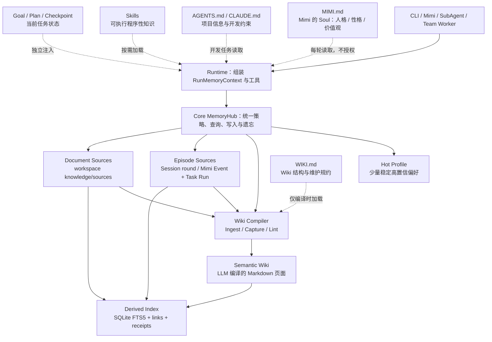
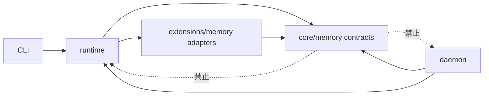
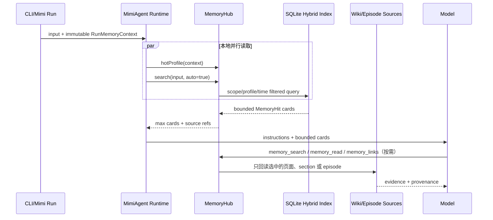
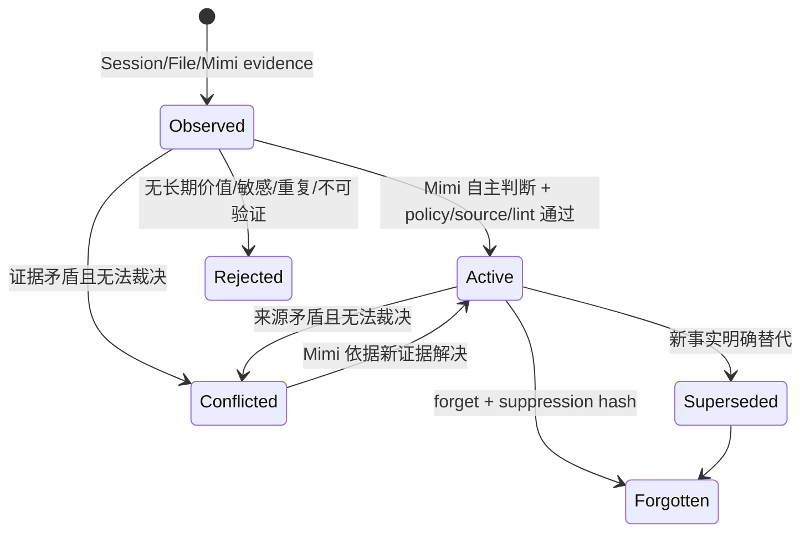
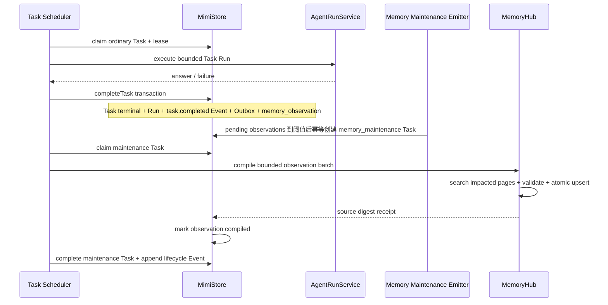

# MimiAgent 统一 Memory Hub 设计与实施计划

日期：2026-07-15

状态：通过（2026-07-20 按 Karpathy LLMWiki 原文复核修订；未实施）
关联调研：`docs/research/20260715-MimiAgent统一MemoryHub-调研.md`
Event/Task 前置设计：`docs/plans/20260720-MimiAgent-Event-Task分层设计.md`

## 任务目标

以 LLMWiki 为 MimiAgent 的统一 Memory Hub，保留 Session、Episode、Semantic Wiki、Skill、Goal/Plan/Checkpoint 的物理分层，让 CLI 和全天候 Mimi 共享一套检索、读取、沉淀、冲突处理和遗忘语义。

设计目标：

- 轻量：只使用 Markdown、项目已有的 YAML/Zod/Atomic Store 和 Node 内置 SQLite，不增加外部服务或数据库依赖；
- 高效：普通查询不调用生成式 LLM；SQLite FTS5/BM25 始终可用，已配置 Embedding Provider 时自动启用向量语义通道，失败时无损回退词法检索；
- 有用：支持跨 Session、时间更新、来源回读、冲突、拒答和经验复用；
- 可靠：Mimi 自动巩固可恢复、可重试、幂等，不阻塞事件热路径；
- 清晰：遵守 `runtime → core + extensions` 与 `daemon → runtime` 的现有依赖方向；
- 一次性切换：同一个变更集完成新 MemoryHub、数据转换和旧路径移除，不实现双写、双读、旧工具别名或按发布周期迁移。

## 非目标

- 不实现通用知识图数据库或图推理引擎；
- 不引入向量数据库、消息队列、Redis 或新的工作流框架；
- 不把 Session transcript 搬进 Wiki 后删除原始会话；
- 不用 Memory 取代 Goal、Plan、Checkpoint、Team 或 Schedule；
- 不把 Skill 的可执行内容复制成 Wiki 页面；
- 不允许外部事件自动提升为可信项目知识；
- 不为旧 `MemoryStore/RagStore` 保留运行时兼容层；切换前只做一次性备份与数据转换；
- 本阶段不设计图形 UI，仅调整 CLI 文本命令与状态展示。

## 一句话架构

> Memory Hub 是统一门面；Session、Mimi Event、Task Run 和原始文档是证据真相，LLMWiki 是按 `WIKI.md` 持续编译的 semantic memory，`MIMI.md` 是 Mimi 的 Soul，`AGENTS.md/CLAUDE.md` 是项目开发规约，Skills 是 procedural memory，SQLite 是索引和控制账本而不是知识正文。

## 1. 总体分层



### 七类上下文的最终归属

| 层 | 负责内容 | 真相载体 | 是否进入统一搜索 | 是否自动注入 |
|---|---|---|---|---|
| Working | 当前 Session、ContextArchive、Checkpoint | Session JSON | 当前 Session 由原有路径读取 | 是，按现有上下文预算 |
| Episodic | 已完成的跨 Session 交互、Mimi Event 与 Task Run | Session/Mimi DB | 受限；只在 owner 明确访问历史或 maintenance 时检索完整 round | 否 |
| Semantic | 偏好、事实、概念、实体、决策、经验、gotcha | LLMWiki Markdown | 是，统一检索主层 | Hot Profile + 少量相关 Memory Card |
| Identity | Mimi 的名字、自我定位、人格、性格、价值观、表达风格 | `MIMI.md` | 否 | 是，作为身份/人格上下文 |
| Project guidance | 项目使命、架构、命令、目录、编码和验证约束 | `AGENTS.md` / `CLAUDE.md` | 否 | 仅开发任务按目录层级加载 |
| Procedural | 硬安全/权限规则、可执行流程 | Runtime policy / Skills | Wiki 可有引用，但不复制执行本体 | 代码 policy 常驻、Skill 按需 |
| Task state | 当前目标、计划、恢复点、团队任务 | Goal/Plan/Checkpoint/Team | 否 | 由现有状态路径注入 |

### “统一”的准确含义

统一以下内容：

- 一个 `MemoryHub` API；
- 一套 scope/profile/provenance 规则；
- 一组 search/read/link/write/forget 操作；
- 一种 `MemoryRef` 和 `SourceRef`；
- 一条从观察、候选、验证、巩固到召回和纠错的生命周期。

不统一以下物理真相：

- transcript 不改写为 Wiki；
- Mimi Event 继续作为不可变证据保存在 Event Store；待执行工作、Run 和重试状态迁入独立 Task 层；
- Plan 不转换成长期 todo；
- MIMI.md 不作为普通检索页面，也不承载项目架构与权限规则；
- AGENTS.md/CLAUDE.md 不转换成 Wiki，它们是开发任务的显式项目合约；
- Skill 不被扁平化成知识片段。

## 2. 模块边界

### 目录规划

```text
src/core/memory/
├── types.ts             MemoryRef、SourceRef、Page、Hit、Context 等稳定语义
├── policy.ts            scope、profile、trust、自主沉淀、冲突与遗忘规则
├── hub.ts               统一 search/read/links/remember/forget 门面
├── compiler.ts          Ingest/Capture/Lint 合约、CompilationPlan 与完成语义
└── ranking.ts           确定性合并、时间过滤与置信度排序

src/extensions/memory/
├── wiki-vault.ts        Markdown frontmatter、原子单页提交、锁与 lint
├── wiki-schema.ts       加载 WIKI.md，合并内置硬约束与本地软规约
├── wiki-compiler.ts     受影响页发现、编译计划、write-set 校验与回执
├── wiki-lint.ts         确定性健康检查与有界语义 Lint 输入
├── sqlite-catalog.ts    FTS5/links 派生索引 + receipts/tombstones 持久账本
├── document-source.ts   knowledge/sources 与旧 knowledge/*.md 适配
├── episode-source.ts    FileSession 完整 round 的增量索引与回读
└── tools.ts             Runtime/worker 可见的窄工具集合

src/core/memory.ts        一次性切换后只保留 MemoryHub 导出，不保留旧 adapter
src/extensions/rag.ts     其混合检索与 Embedding 能力并入 memory retriever 后删除

src/daemon/memory.ts         Mimi observation 适配、maintenance host tools
src/daemon/event-store.ts    只保存不可变 Event 证据
src/daemon/task-store.ts     Task queue/lease/retry/control
src/daemon/task-scheduler.ts 合并发布并调度 memory_maintenance Task

src/runtime/components.ts 组合 MemoryHub 与 adapters
src/runtime/mimi-agent.ts 组装不可变 RunMemoryContext、检索和注入
src/runtime/tool-policy.ts Memory 工具能力与 Plan/SubAgent/Team 边界
```

### 依赖规则



- `core` 只定义稳定语义、策略与门面，不导入 Runtime、CLI 或 Daemon。
- Markdown、SQLite FTS、文件扫描属于 `extensions` 实现细节。
- Mimi 只暴露 observation source/receipt，不把 Task 调度可靠性塞进 MemoryHub。
- Runtime 是唯一 composition root，CLI 与 Daemon 继续共用 `AgentRunService`。

### 核心接口草案

```ts
export interface RunMemoryContext {
  profileId: string;
  workspaceRoot: string;
  sessionId: string;
  runId: string;
  cause?: { eventId?: string; taskId?: string; trust: RunTrust; source: string };
}

export interface MemoryHub {
  hotProfile(context: RunMemoryContext): Promise<MemoryCard[]>;
  search(query: string, context: RunMemoryContext, options?: MemorySearchOptions): Promise<MemoryHit[]>;
  read(ref: MemoryRef, context: RunMemoryContext): Promise<MemoryDocument>;
  links(ref: MemoryRef, context: RunMemoryContext): Promise<MemoryLink[]>;
  remember(input: RememberInput, context: RunMemoryContext): Promise<MemoryPage>;
  forget(ref: MemoryRef, context: RunMemoryContext): Promise<ForgetReceipt>;
}

export interface WikiCompiler {
  ingest(source: SourceRef, context: RunMemoryContext): Promise<CompilationReceipt>;
  capture(input: CaptureInput, context: RunMemoryContext): Promise<CompilationReceipt>;
  lint(context: RunMemoryContext, options?: WikiLintOptions): Promise<WikiLintReport>;
}
```

`RunMemoryContext` 在一轮开始时捕获，和 Session 的 immutable run ownership 一样，不允许 Session 切换或陈旧 Run 把结果写入新的 scope。

`WikiCompiler` 是 MemoryHub 的内部维护能力，不新增一组常驻模型工具。CLI 显式操作和 Mimi `memory_maintenance` Task 通过 Host 调用它；编译仍由现有 `AgentRunService` 执行，不引入第二个 Agent host 或工作流引擎。

## 3. 物理存储

### Vault 划分

```text
<workspace>/knowledge/
├── WIKI.md                     项目 Wiki 结构与 Ingest/Query/Lint 规约
├── sources/                    项目原始来源，用户添加、Agent 只读
├── wiki/                       项目共享 Wiki，允许 Git 管理
│   ├── concepts/
│   ├── entities/
│   ├── decisions/
│   ├── lessons/
│   ├── _index.md               生成的人类目录，不是机器真相
│   ├── _log.md                 append-only 维护日志
│   └── _error-book.md          重复编译/检索错误及修正规则
└── *.md                        可变项目文档来源（非 Raw Sources）

<dataRoot>/memory/
├── profiles/<profileId>/
│   ├── WIKI.md                私有 Wiki 规约，由内置模板初始化
│   ├── wiki/                   私有语义 Wiki，0700/0600
│   └── memory.db               该 profile 的私有 catalog
├── workspaces/<workspaceId>/
│   └── memory.db               当前 workspace 的共享 catalog
├── locks/                      vault/page 锁
└── quarantine/                 无法解析或损坏的私有页面
```

约束：

- 项目 Wiki 是团队可读、可提交的共享知识；禁止写入私人记忆和 Mimi 外部事件原文。
- `knowledge/sources/` 是策展过的不可变 Raw Sources：MemoryHub、maintenance、Wiki 维护和通用文件工具都不修改、删除或覆盖其中已导入文件。用户要求更正或更新来源时，Agent 创建新文件/新版本，用 `supersedes + digest` 关联旧版，不就地改写证据。
- `knowledge/*.md` 和其他项目文档是可变 document source，不冒充不可变 Raw Sources；其 digest 改变时已编译页面立即标记 `stale`。
- 私有 Wiki 位于受保护的 `dataRoot`，普通文件、Shell、RAG 工具继续无法读取；只能经 Memory API 访问。
- `profileId` 是私有隔离边界。每个 profile 使用独立 Wiki 目录和 SQLite 文件，不能只依赖 SQL 的 `WHERE profile_id = ?` 防泄漏。CLI 默认 `owner`；Mimi 必须从 Task 和其 authority Event 的本机可信映射捕获 `profileId` 到 `RunCause`，不能只按 SessionKey 或外部 payload 推断。
- Mimi 的 `profileId` 只能来自本机 Connector 配置或本机控制面，不能从外部 payload 学习；Webhook 继续固定映射到 owner profile。内部 Session ID 必须绑定 `profileId + sessionKey`，避免两个 profile 显式复用同一个 `sessionKey` 时共享 transcript。
- 磁盘目录不直接拼接外部字符串：profile/workspace 目录名由经校验的 ID 或 canonical workspace path 的 SHA-256 派生；所有 Vault 读写继续做 lexical path + realpath containment，并拒绝跟随跨根符号链接。
- 私有记忆默认仍跟随当前 `dataRoot`，保持现有“同一部署/工作区内跨 Session”语义；需要跨工作区共享时由用户显式把 `AGENT_DATA_DIR` 指向同一可信目录，不隐式扩大可见范围。
- Wiki 的 canonical writer 是 MemoryHub/WikiCompiler；人工或通用文件工具直接修改属于可容忍的外部 override，只有硬 schema 和来源校验通过的页面才进入 active 索引；无效页面进入 lint 结果，不污染查询。
- 原始文档保持原位。索引只保存可重建文本和定位信息，不把索引文件提交到 Git。

MemoryHub 自己提交页面后立即更新对应 catalog 的派生索引。工作区被外部编辑时，在 Runtime 启动、显式 `/memory reindex` 和 Mimi maintenance 前做增量 digest 扫描；普通 `memory_search` 不阻塞等待全目录扫描。运行中的 CLI 若由通用文件工具或人工直接修改 Wiki，需要调用 `/memory reindex` 才保证立即可见。

### Wiki 维护规约 `WIKI.md`

Karpathy LLMWiki 中的 schema 不只是 YAML 字段，还是让 Agent 成为纪律化 Wiki maintainer 的操作合约。每个 Vault 的 `WIKI.md` 至少定义：

- 页面类型、命名、别名、粒度、目录与链接约定；
- 何时新建页面，何时更新或合并旧页面；
- Ingest、Query Capture 和 Lint 的步骤、预算与完成条件；
- SourceRef、逐项引用、矛盾、替代、时间效力和置信度规则；
- `_index.md`、`_log.md`、`_error-book.md` 的维护格式；
- 哪些问答、比较、决策或新联系具有长期价值，可以编译回 Wiki。

`WIKI.md` 只在显式 ingest/capture/lint 或 maintenance Run 中按需加载，不每轮常驻。内置 Zod/policy 是不可放宽的硬边界；`WIKI.md` 只能收紧安全规则或定制分类和维护偏好，不能扩大 scope、提升 trust 或开放工具权限。用户与 LLM 可以共同演进该文件，但对规约的修改必须由 owner 明确确认，不得由外部 Event 或自动 maintenance 静默改写。

### Markdown 页面 schema

每个页面表达一个稳定主题；偏好、时间敏感事实和决策应保持窄粒度，概念/实体页可以包含多个带来源标记的 claim。

```yaml
---
schemaVersion: 1
id: mem_<uuid>
title: MimiAgent 的 Session 所有权
kind: concept # profile | fact | concept | entity | decision | lesson | source-summary | synthesis | procedure-ref
scope: workspace # private | workspace
profileId: null
status: active # active | conflicted | superseded
confidence: source-grounded # user-confirmed | source-grounded | inferred
aliases: [session ownership, run owner]
tags: [runtime, session]
sourceRefs:
  - type: file
    id: docs/ARCHITECTURE.md
    digest: sha256:...
    occurredAt: 2026-07-15T00:00:00.000Z
validFrom: null
validUntil: null
supersedes: []
createdAt: 2026-07-15T00:00:00.000Z
updatedAt: 2026-07-15T00:00:00.000Z
---
```

正文约定：

```markdown
# MimiAgent 的 Session 所有权

## 摘要

每轮运行捕获不可变 Session、runId 和 owner。

## 当前结论

- 陈旧运行不得覆盖当前 Session 状态。[source:file:docs/ARCHITECTURE.md]

## 关系

- [[Run Checkpoint]]
- [[Mimi Task Lease]]

## 历史与冲突

- 无。
```

保持 YAML 与 Markdown 可直接阅读，不为每个句子建立图数据库三元组。`[[wikilink]]` 只解析成一跳 links 表。

### SourceRef

统一支持：

- `file:<workspace-relative-path>#<digest>`；
- `session:<sessionId>@<runId>#<digest>`；
- `mimi:event:<eventId>/task:<taskId>/run:<runId>#<digest>`；
- `user:explicit@<sessionId>/<runId>`。

SourceRef 至少包含类型、稳定 ID、内容摘要、发生时间和 provenance/trust。Mimi Run 在送入 Agent 前由 Host 添加不可伪造的本机锚点 `triggerEventId + taskId + runId + profileId`；没有触发 Event 的本机 Task 仍必须有 taskId/runId 和独立 authority Event。锚点随该轮输入进入 Session，后续从锚点读到下一 user round，并按 Tool Call/Result 完整单元净化。查询结果默认只返回引用和安全摘要；需要细节时再 `memory_read` 或回读原始 episode。

### SQLite Catalog：派生索引与持久控制账本

两个 scope 的 `memory.db` 使用同一 schema，但物理独立。MemoryHub 在查询时并行搜索当前 profile catalog 和当前 workspace catalog，再合并排名。

可删除重建的派生表：

- `documents`：page/source/episode 元数据、digest、scope、profile、有效时间；
- `documents_fts`：title、aliases、tags、body 的 FTS5 索引；
- `document_embeddings`：document digest、provider/model/dimensions 和 Float32 vector BLOB；只有已配置 Embedding Provider 时生成；
- `links`：解析后的 Wiki 双向链接；
- `schema_meta`：索引版本和最后完整校验时间。

不可随 reindex 删除的控制表：

- `source_receipts`：某个 source/query digest 的 `pending/applied/rejected` 回执、operation、compiler version 和有界 write-set 进度；
- `suppressions`：forget 后的不可逆内容摘要，防止从旧 transcript 自动学回来；
- `decision_events`：Mimi 自主编译/不沉淀的理由代码，以及 owner correct/forget 的最小审计记录，不保存正文。

Markdown/Session/Mimi DB 是内容真相；`source_receipts/suppressions/decision_events` 是幂等、隐私和审计语义的控制真相。`/memory reindex` 只重建派生表，绝不清空控制表。Catalog 使用 WAL、schema version、一次性切换前备份和严格校验；控制表损坏时 Memory 写入与自动 maintenance 必须失败关闭，不能像普通派生索引那样从空状态继续。

确定性 lint 的即时结果可以放在派生表；只有重复发生、会影响编译或检索质量的问题才写入 Vault 的 `_error-book.md`。维护 Run 最多读取 20 条未解决规则，修复后标记 resolved，避免 Error Book 本身无限进入上下文。`_index.md` 在一次编译成功后由确定性生成器更新，列出页面链接、一行摘要、类型、日期和来源数。`_log.md` 使用可解析的 `ingest | capture | lint` 前缀，只记录页面 ID、操作、source/query digest、compiler version 和时间，不复制私有正文。二者都是可重建导航产物，不是知识真相。

### 混合检索：BM25 始终可用，Embedding 自动增强

第一版就实现 hybrid retrieval，不延后 Embedding，但也不引入向量数据库：

1. **结构命中**：标题/别名精确、前缀命中、tags/kind 过滤；
2. **词法通道**：SQLite FTS5 trigram + `bm25()`；少于 3 个汉字的查询使用有上限的精确别名/`LIKE` 回退；
3. **语义通道**：存在 Embedding Provider 时，页面或有界 section 按 digest 增量生成 vector，查询时生成一个 query vector；
4. **合并**：用 Reciprocal Rank Fusion 合并结构、BM25 和 vector 排名，不混用不同量纲的原始分数；
5. **时间与链接**：用 `validFrom/validUntil/occurredAt` 过滤，仅在工具明确请求时做一跳 link expansion。

`retrievalMode` 默认为 `auto`：配置了 Embedding Provider 且当前索引的 provider/model/dimensions 一致时走混合检索；未配置、离线、超时或调用失败时立即回退 BM25，不让 Mimi 启动或查询失败。DeepSeek 作为对话 Provider 时可继续使用当前已有的独立 OpenAI Embedding 凭证边界；没有该凭证则保持完整 BM25 能力。

数百到低万个向量时，SQLite BLOB + 进程内有界 cosine/dot-product 扫描足够，无需 Qdrant、Milvus、pgvector 或新的 native 扩展。以 10,000 个向量计算，512 维 Float32 约 20 MB，1536 维约 60 MB；最终 dimensions 由 retrieval eval 在中文、英文和代码混合集上选择。

金额不是主要成本。按 2026-07-20 OpenAI `text-embedding-3-small` 公开价格 $0.02/1M input tokens，假设 10,000 个索引单元平均 500 tokens，全量重建约 $0.10；日常是 digest 增量更新。真正的代价是每个新查询可能多一次网络往返、需要把待嵌入文本发送给 Provider，以及维护 model/dimensions 变更后的重建语义。用户可设 `retrievalMode: lexical` 保持纯本地。价格来源：[OpenAI text-embedding-3-small](https://developers.openai.com/api/docs/models/text-embedding-3-small)。

Catalog 初始化时先做 FTS5 capability probe。官方 Node 构建缺少 FTS5 或 FTS 表切换失败时，回退到 `documents` 表上的现有轻量 `textScore + bounded LIKE`，并在 `/memory status` 报告 degraded；不能因为全文或向量索引缺失让 Mimi 无法启动。

## 4. 读取路径



### 三段式渐进披露

1. **Hot Profile**：最多 8 条、约 600 tokens，只允许 `active + private profile` 中稳定、高置信且有来源的语言、格式和长期偏好；用户明确表达的偏好排序高于 Mimi 推断。
2. **Auto Memory Cards**：每轮一次本地检索，最多 5 条、约 1200 tokens；搜索 active Semantic Wiki，并可返回不含断言正文的 `conflicted/stale` 警告卡；不塞整页，也不自动跨 Session 读取 episode。
3. **Tool deepening**：Agent 需要时调用 `memory_search → memory_read → memory_links`，每次都有条数、深度和 token 上限。

检索到的 Memory 永远标记为“有来源的数据”，不能作为 system instructions。外部 provenance 的内容即使被 Mimi 自主编译为 active 记忆，也不能改变工具权限、硬 policy、`AGENTS.md/CLAUDE.md` 项目约束或 `MIMI.md` 人格定义。

### Wiki-first 搜索范围

主 Agent 的普通查询分两阶段，不把 Wiki 与 Raw Sources 放在同一轮平级竞争：

1. **Wiki 快速路径**：并行检索当前 profile 的 active private Wiki 和当前 workspace 的 active Wiki，合并后先读最相关页面及一跳链接。
2. **证据回退路径**：只有 Wiki 命中不足、命中页面为 `stale/conflicted`、问题要求原始证据，或工具显式设置 `includeEvidence` 时，才检索 workspace document source 并按 SourceRef 回读。

只有证据回退也不足时，Agent 才说明 Wiki 的知识空洞或拒答；不得因为原始切片召回更多就忽略已编译 Wiki 的当前结论。相关 `conflicted/stale` 页面作为警告卡参与结果，superseded 只在时间查询或显式 history 过滤时返回。

工具可用 `scope`、`kind`、`from/to`、`includeEvidence` 过滤。`includeEvidence` 涉及跨 Session episode 时，普通 Run 必须同时满足 owner provenance 和明确的历史访问意图；system maintenance 通过专用 host tool 访问其 observation 指向的 round。SubAgent/Team worker 默认只有 workspace Wiki 和 workspace document source 的 read-only 视图，不直接读取 private Wiki 或 episode；主 Agent 需要时只传递当前任务所需的有界 Memory Card。任何角色都不得看到别的 profile。

### Episode 粒度

按完整 user round 建索引：一条用户输入、关联 Tool Call/Result 的安全摘要、最终回答和时间。原始 Tool Call/Result 留在 Session，索引不复制隐藏推理或大段输出。

这比只抽取单条事实更保真，又比把整个 Session 当一个 chunk 更容易检索。Mimi 的 eventId/runId 作为额外来源元数据，不再重复索引一份相同正文。

## 5. 写入与巩固生命周期

### Wiki Compiler 的三类操作

Wiki Compiler 将 LLMWiki 的知识“编译一次、持续更新”固化为三类有界操作：

1. **Ingest**：读取一个明确 SourceRef，根据 `WIKI.md` 搜索相关摘要、概念、实体、决策和经验页，生成受影响页清单，再新建、更新、建链、标记矛盾/替代，最后更新 index/log 并完成回执。默认一次处理一个来源，手动 ingest 最多允许 15 个页面变更。
2. **Capture**：Mimi 自主判断问答中是否存在有长期复用价值的比较、分析、决策、新联系和稳定结论；通过 scope、隐私、来源、去重、冲突和 Lint 门禁后，直接建立/更新 active `synthesis/decision/lesson` 页面，无需 owner 逐条确认。一次性回答、纯格式转换和无新结论问答不沉淀。
3. **Lint**：每次提交都运行确定性检查（schema、断链、孤页、重复标题/别名、缺少来源、过时 digest）；显式 `/memory lint` 或有变更的 maintenance Task 再做有界语义检查（跨页矛盾、陈旧综述、缺失概念/交叉引用、知识空洞）。可安全、可回溯的修复由 Mimi 直接提交；无法裁决的矛盾标记 `conflicted`；只建议待调研问题，不自动访网或导入新来源。

每次操作先持久化一个紧凑 `CompilationPlan`：`operation + source/query digest + compilerVersion + plannedPageRefs + appliedPageRefs`。只有计划内的页面全部 `applied/rejected`、确定性 Lint 通过、index/log 更新完成后，回执才转为终态。这不是新工作流系统；计划作为 `source_receipts` 的有界 JSON 字段保存，只服务于崩溃恢复和多页编译完整性。

### 状态机



### 写入规则

| 来源 | Mimi 自主决策 | 可写 scope | 硬门禁 |
|---|---|---|---|
| owner 明确说“记住”或保存本轮结论 | 立即校验并 active | private；workspace 须明确指定 | 尊重“不记住”、隐私和 scope |
| owner 普通对话 | 完整 round 先成为 episode；Mimi 在维护时判断有未来价值则直接 active | private | 有来源、可复用、非短期状态 |
| 策展过的 workspace Raw Source/项目文档 | ingest 后自主更新 active Wiki | workspace | 路径、schema、引用、冲突和敏感数据门禁 |
| trusted/system Mimi 事件 | 有稳定经验价值则自主 active | private profile | 不能把运行指令当事实 |
| external/public Mimi 事件 | 原始断言只作 episode；经本机 Tool 结果、独立来源或重复观察验证后，Mimi 可自主 active | private profile，禁止 workspace | 永远保留 untrusted provenance，不能变成指令 |
| Mimi 推断的新关系/综合 | 证据足够则以 `confidence: inferred` active；矛盾时 conflicted；证据不足则不沉淀 | private 或 workspace | 必须引用推断所依据页面/来源 |

任何密码、token、凭证、完整联系人隐私字段和明确要求不保存的内容都在 candidate 形成前被拒绝。

Mimi 可按“未来复用价值”主动调用 `remember`，不要求用户逐条确认，这与当前 `docs/ARCHITECTURE.md` 的语义一致。Host 仍确定性校验 `RunMemoryContext` 的 session/profile/scope ownership，并在本轮原始输入明确要求“不记住”时拒绝写入。非 owner Event 不直接获得 public `remember/forget`；它的经验由终态 observation 进入受限 maintenance，但最终是否沉淀由 Mimi 依据上述硬门禁自主决定。

CLI 普通会话不在热路径额外生成 candidate 表或等待人工审批的 draft 队列。完成的完整 round 进入 episode 增量索引；用户明确 `remember/capture`、显式 ingest 或 Mimi maintenance 都调用同一 Wiki Compiler。编译通过门禁就直接 active，矛盾则 `conflicted`，无价值/敏感/不可验证则写最小 rejected receipt 后不生成页面。用户通过查询、纠正和 `forget` 保留最终控制，但不成为 Mimi 日常学习的审批瓶颈。

### 单页提交协议

为了保持轻量，不实现复杂的跨文件事务：

1. 加载硬 policy 和当前 Vault 的 `WIKI.md`，校验 source/query digest 与 operation；
2. 搜索受影响页面，持久化有界 `CompilationPlan` 和 `pending source_receipt`；
3. 对计划中每个页面生成 upsert，校验 frontmatter、scope、SourceRef、路径、链接和页面大小；
4. 获取 vault 锁并重读页面，检查 `expectedDigest`；
5. 写 PID+UUID 临时文件并 atomic rename；
6. 页面落盘后更新 SQLite 派生索引；索引失败则标记 dirty，下一次查询前增量修复；
7. 多页编译逐页提交；全部页面完成后运行确定性 Lint，重建 `_index.md`，追加 `_log.md`，再将回执转为终态；
8. 进程中途退出或达到单轮页面预算时，回执保持 `pending`，下一轮根据 digest、`plannedPageRefs` 和页面 SourceRef 续做，不重复生成已完成页面。

因此，Markdown 永远先于索引提交；不会出现索引宣称存在但页面不存在的权威状态。

### 冲突与时间

- 用户明确纠正旧事实时，旧页/旧 claim 标记 `superseded` 并设置 `validUntil`；新内容引用旧 ID。
- 两个非 owner 来源冲突时不静默覆盖，页面进入 `conflicted` 或创建 conflict section。
- 时间敏感查询优先返回在查询时间有效的内容；未给时间时返回 current claim，并附历史变化提示。
- Source digest 改变而页面未重新编译时，查询结果标记 `stale`，不能伪装为最新事实。

### 遗忘语义

`forget` 完成三件事：

1. 删除/失活编译后的私有页面、对应 quarantine 副本和派生索引；
2. 写入只包含 hash、scope、时间的 suppression tombstone，防止维护任务从旧 Session 再次学习；
3. 清理相关 Hot Profile cache。

它不隐式删除原始 Session。若用户要求删除原始对话，继续使用 Session clear/delete 语义。自动维护不能越过 suppression；如果 owner 以后明确要求重新记住同一内容，该新指令本身即可移除对应 suppression 并创建新版本，不再要求第二次确认。项目 Wiki 可能存在 Git 历史，因此禁止把私人记忆提升到 workspace；删除共享页面时必须明确提示版本历史边界。

## 6. Mimi 24/7 接入

### 术语说明

- **Event（事件）**：已经发生的信息事实，例如外来 QQ/微信/大象消息、系统通知、来源变化、Schedule 到期、Task 状态变化或 Mimi 自己产生的观察。Event 正文不可变，只供实时查看、路由、审计和后续记忆取证；它不排队、不执行、不重试。
- **Task（任务）**：需要 Mimi 接下来完成的工作，例如回复消息、执行定时事项、后台研究或整理 Memory。只有 Task 拥有 `queued/running/paused/blocked/completed/dead_letter`、priority、lease、retry、result 和 error。
- **Task Scheduler（任务调度器）**：从 Task Queue 领取可运行 Task，选择 Session actor 或隔离 worker 执行，并负责续租、重试和终态收敛。
- **Schedule（定时规则）**：到指定时间产生一次 `schedule.due` Event 和对应 scheduled Task 的闹钟规则；它不是执行器。
- **background worker（后台 worker）**：执行隔离 Task 的现有 OS 子进程；Memory 不再增加一套专用 worker 或循环。

完整边界见 `docs/plans/20260720-MimiAgent-Event-Task分层设计.md`。本节的白话结论是：**Event 给 Mimi 看“发生了什么”，Task 负责“接下来做什么”。记忆整理是一条低优先级 `memory_maintenance` Task，不是可执行 Event；没有待整理内容就不创建 Task、不调模型。**

### 核心原则

- 事件回复热路径不做第二次 LLM 总结；
- 不在 Hook 中 fire-and-forget 写 Memory；
- Event Store 只保存不可变事实，绝不增加 lease/retry/status 字段；
- 不新增 Memory Scheduler、独立 lease loop 或新工作流引擎；
- 使用现有 Mimi SQLite 事务登记来源；Task Scheduler 只在有待处理来源时创建 `memory_maintenance` Task；
- maintenance Task 由统一 Task Scheduler 和现有 `AgentRunService` 处理，因此仍只有一个 Task Session owner；
- 跨 Mimi DB、Markdown 和 Memory index 的一致性通过 source digest 幂等回执解决，不伪造分布式事务。

### 数据流



### `memory_observations` 不是第二个任务系统

Mimi DB 增加一个窄的 append-mostly 来源登记表：来源行只新增，后续只单调填写编译时间与 receipt，不回写原始 Event、Task 或 Run。

```text
source_key UNIQUE
event_id
task_id
run_id
session_id
profile_id
outcome            completed | dead_letter
trust
content_digest
observed_at
compiled_at
receipt_id
```

它不包含 lease、worker、任意 DAG、用户 Todo 或执行动作。真正的租约、重试和 dead-letter 属于 `memory_maintenance` Task。

写入时机：

- 成功 Task Run：在 `completeTask()` 的事务中，与 `task.completed` Event 一起登记；
- 最终 dead-letter：可登记为 failure observation，用于重复 gotcha，但普通重试不重复登记；
- EventRouter 判定为 observe-only/digest 的外来噪声默认不登记；
- `memory_maintenance`、briefing 及纯内部汇总 Task 永不登记，防止维护结果再次触发维护；
- 同一 `eventId + taskId + runId + compilerVersion` 唯一，Task 重试不会产生重复记忆。

Task Scheduler 先创建 Run，再把不可变 `triggerEventId + taskId + runId + profileId` 锚点和 Attention 决策的正文组装成最终输入。observation 通过 taskId/runId 找到唯一执行 round；外来 Event 永不因 Task 重试而改变。Session 后续删除孤立 Tool Call 不会让锚点失效。CLI 普通 Session 则继续按 user round 边界增量解析。

### Memory maintenance Task

不创建每 30 分钟一次的空 Schedule。Task Scheduler 在现有 due-work 检查附近调用同步、确定性的 `emitDueMemoryMaintenanceTask()`：

- 没有 observation 时不创建 Task、也不调用模型；
- 某个 profile 待处理达到 10 条，或最老 observation 等待超过 10 分钟时，才创建一个 Task；
- 某个 Vault 自上次 semantic lint 后有 50 个页面变更，或有变更且 7 天未 lint 时，把一次有界 lint 合并进下一个 maintenance Task；无变更时不创建空 Task；
- 同一 profile 已有 queued/running maintenance Task 时不重复创建，使用 profile + batch digest 幂等；
- 独立的每小时/每日 maintenance run budget 超限时不发布，等时间窗口自然恢复；
- Task 使用 `type: memory_maintenance`、`priority: 0`、固定 maintenance Session；授权来自本机 system authority Event，不伪装成用户任务或普通 Schedule；
- 普通用户/高优先级 Task 始终优先。

Memory maintenance 不再经过 Event Attention 分类。Task 执行、lease、retry 和 dead-letter 使用统一 Task 语义；若最终 dead-letter，observation 保持未编译，后续窗口或 owner 手动 `/memory maintain` 可重新创建 Task。Task 状态变化仍追加不可变 lifecycle Event 供 Mimi 查看，但这些 Event 默认 observe-only，不触发新 maintenance。

为避免长期高流量让 `priority: 0` 永久饥饿，Task Scheduler 增加一个小计数器：连续处理 20 个非 maintenance Task 后，若没有 owner 或 urgent Task 排队且 maintenance budget 仍有余量，优先 claim 一个已排队 maintenance Task。它复用统一 Task Queue，不增加 Memory 专用并发；owner/urgent 工作仍具有绝对优先级。

有待处理内容时：

- 固定 Session：`mimi-system-memory-<profileId>`；
- 固定严格 RunPolicy：只开放 `memory-read`、受限 `memory-write` 和 observation host tools；
- 禁止 Shell、文件通用写入、MCP、Connector action、Schedule 写入和网络；
- maintenance Task 的可信输入只包含本机生成的维护目标和 batch/profile ID，不拼接外部 Event payload；模型必须通过只读 host tool 获取有界 observation cards，工具结果明确标记为不可信来源数据；
- 仅 maintenance Run 可见 `list_memory_observations`、`upsert_memory_page`、`complete_memory_observations` 三个内部工具；它们都受 Task execution ledger、source digest 和 side-effect allowlist 约束，不进入普通 Agent 工具列表；
- `complete_memory_observations` 只接受已有 `applied/rejected` Memory receipt 的 source key；未处理或部分失败的 observation 保持 pending，模型不能用一次批量调用伪造完成；
- 一轮最多 20 observations、5 个页面 upsert、8k 输入证据；编译计划超过 5 页时保持 `pending` 并由后续 maintenance 续做，不得提前完成 observation；
- 默认每日最多 12 次有模型调用的 maintenance run；超限留到下一窗口；
- 用户交互/高优先级 Task 优先，maintenance 使用低优先级 Task；
- Mimi 自主完成去重、来源、隐私、冲突和 Lint 判断；通过门禁的产物直接 active，无法裁决的页面标记 `conflicted`，不建立等待人工批准的常驻 draft 队列。

这些预算先作为代码常量，验证稳定后再决定是否暴露到 `assistant.json`，避免一开始增加过多配置。

### 长期运行的背压与保留

- pending observation 永不因保留策略静默删除；超过预算只延后，并在 `/memory status` 报警；
- observation 已有 applied/rejected receipt 且 `compiled_at` 超过 30 天后，可按每轮最多 100 条增量清理；原 Event/Task/Run 和 Memory receipt 仍保留来源链；
- episode 派生索引默认保留最近 10,000 个完整 round，以及所有被 active/conflicted Wiki 页面引用的 round；被淘汰的旧 episode 仍在原 Session/Mimi DB，可按 SourceRef 深读；
- active Wiki 达到每 Vault 10,000 页的安全上限后，maintenance 优先合并重复页和更新已有页，拒绝低价值新页并在 `/memory status` 报警；用户明确 remember/ingest 仍可执行；
- `_log.md` 按年份分段，Error Book 只给维护 Run 注入最多 20 条未解决项；
- 所有清理只作用于派生索引、已完成回执的 observation 和无正文审计元数据，不删除原始 Session、Event 或 active Wiki。

### 崩溃与重试

关键崩溃点及恢复：

| 崩溃点 | 恢复行为 |
|---|---|
| Task 完成前 | Task lease 恢复；语义工具账本防止外部动作重复 |
| Task 完成后、observation 前 | 不会发生；Task 终态、lifecycle Event 和 observation 同事务 |
| 页面 rename 前 | maintenance Task 重试，无可见页面 |
| 页面 rename 后、index 更新前 | 页面为真相；增量 reindex 修复 |
| 页面已写、Mimi observation 未标记 | `source_receipt` 命中，返回原 receipt，再标记 compiled |
| maintenance Task 最终失败 | Task 进入 dead-letter；observation 仍未 compiled，可由后续窗口或手动维护重新创建 Task |

## 7. Runtime 与工具面

### Runtime 变化

每轮开始：

1. 捕获 `RunMemoryContext`；
2. 并行读取 Session/Plan/Goal/Team、MIMI Soul、开发任务所需的 Project Guidance、Hot Profile 和本地 Memory Cards；
3. 把 Memory Cards 作为带来源的数据段注入，不混入 MIMI Soul 或项目指令；
4. 模型需要更多证据时使用工具；
5. 当前 Run 的工具写入始终校验 runId、sessionId、profileId 和 cause trust。

`ContextManager` 应从具体 `Memory`/`RagMatch` 类型解耦为统一 `MemoryCard[]`，同时把 `identity`、`projectGuidance`、Session summary、Plan 和 Goal 保持为不同字段，不通过拼接成一份“持久指令”来模糊信任层。

### 工具集合

最终只向模型暴露六个窄工具：

| 工具 | 能力 | 说明 |
|---|---|---|
| `memory_search` | `memory-read` | 默认 Wiki-first；只在证据不足/过时/冲突或显式要求时回退 source，episode 受 owner 历史访问门禁 |
| `memory_read` | `memory-read` | 读取一个 ref 的页面、section 或原始证据 |
| `memory_links` | `memory-read` | 一跳入链/出链，不递归遍历 |
| `remember` | `memory-write` | Mimi 可按未来价值主动写入；用户明确记住仍是强信号 |
| `forget` | `memory-write` | 删除编译记忆并写 suppression |
| `memory_ingest` | side effect | 导入一个 Raw/Document Source 并触发有界 Wiki 编译 |

一次性切换策略：

- 同一次变更中移除 `recall`、`list_memories`、`search_knowledge`、`index_knowledge` 的模型可见 schema，不保留 adapter 或别名；
- SubAgent/Team worker 直接获得 read-only `memory_search`，不经过旧工具映射；
- Plan 模式只开放 read tools；所有写工具仍由 capability 与 side-effect policy 限制；
- CLI 也直接切换到 `/memory ...`，不保留 `/index` 兼容入口。

## 8. MIMI Soul、项目指令、Wiki、Skill 和 Plan 的分工

### `MIMI.md` = Mimi 的 Soul

`MIMI.md` 不再对标 `AGENTS.md/CLAUDE.md`，而是类似 OpenClaw `SOUL.md` 的身份文件。它只定义：

- Mimi 的名字、身份、自我定位与存在方式；
- 人格、性格、价值观、品味、好恶与表达风格；
- 与 owner 相处的基本方式和长期稳定的自我约定。

`MIMI.md` 不放项目架构、开发命令、安全/权限规则、Memory 晋级策略、Wiki schema、用户事实或当前任务。这些内容分别归属代码 policy、`AGENTS.md/CLAUDE.md`、`WIKI.md`、private Wiki 和 Plan/Goal。

用户级 `~/.mimi-agent/MIMI.md` 是 owner 可编辑的 canonical Soul，包内 `MIMI.md` 只提供初始模板/fallback。不再读取 `<workspace>/MIMI.md` 作为项目指令，避免 Mimi 的人格随当前目录改变。Soul 可以影响语气和选择偏好，但永远不能扩大工具、文件、网络或外部交易权限。

### `AGENTS.md` / `CLAUDE.md` = 项目开发合约

进入开发项目时，`ProjectGuidanceLoader` 按 workspace root 到当前目录的层级读取：

1. `AGENTS.md` 是 canonical 跨 Agent 项目合约，优先于同目录的其他开发说明；
2. `CLAUDE.md` 作为兼容和补充；若与同目录 `AGENTS.md` 冲突，以 `AGENTS.md` 为准；
3. 更深目录的指令只在其作用域内收紧或具体化上层指令；不能放宽 Runtime 硬 policy。

若项目中两者都不存在，Mimi 在首次进入“可写开发任务”时先快速扫描项目，再自动创建最小 `AGENTS.md`，记录项目使命、技术栈、核心目录、常用命令、架构/编码约束和验证方法。只读 workspace 不自动创建文件；Mimi 使用本轮扫描结果并说明未持久化。

Mimi 可在项目事实发生稳定变化时更新 `AGENTS.md`，但必须是当前 owner 授权的 workspace 写操作，变更 Git 可见、不写私人记忆或密钥。这使 Codex、Claude Code 和 Mimi 共享同一份项目信息，而不复制到各自专用文件。

### 其他边界

- 安全、权限、scope、trust 和工具能力是 Runtime 代码 policy，不依赖 Soul 或项目 Markdown 执行。
- `WIKI.md` 只定义 Wiki 的页面结构与 Ingest/Capture/Lint 规约，编译时按需读取。
- 稳定、可重复执行、带脚本或检查清单的经验升级为 Skill。Wiki lesson 可链接 Skill 但不复制可漂移步骤。
- 当前任务只进 Plan/Goal/Checkpoint/Team；新 Memory schema 不支持 todo。一次性切换时旧 todo 不迁入 Wiki，只在当前仍活跃时转为 Plan/Goal。

## 9. 一次性实施与原子切换

不做分版发布、双栈兼容或迁移期。为了便于开发与验证，实现仍按下列 work package 排列，但它们必须在同一个变更集中一次性交付；中间状态不作为可运行产品交付。

### Work package A：基线、安全备份与切换门禁

- 先固化 Memory/RAG、自主 remember、混合检索、当前 Event/Task lane、Daemon retry 和指令加载基线；
- 测试使用临时数据，切换工具在修改用户数据前对 Mimi SQLite/WAL/SHM、`memories.json`、`rag-index.json` 和旧 MIMI guidance 生成带时间戳的本地备份；
- 新 Runtime 只在 Wiki schema、Catalog、Soul/Project Guidance 切分、数据转换和全量检查全部成功后写入一个切换完成 marker；失败则终止且不替换旧数据。

### Work package B：Event / Task 正式分层

- 按关联设计把 `events` 收敛成不可变事实流，增加唯一 `tasks` 队列、route receipts 和 Task attempts；
- 把 status/priority/lease/retry/control/result/error 从 Event 迁入 Task，`runs/outbox` 改为引用 Task；
- EventRouter 从 Event 幂等产生 0～N 个 Task，Task 生命周期变化追加 observe-only Event，禁止递归任务风暴；
- `MimiDispatcher` 的执行职责改为 Task Scheduler；Session actor 与隔离 worker 继续消费同一 Task Queue，不建立第二套 Goal/Plan/Todo。

### Work package C：新 MemoryHub 全量实现

- 一次完成 Core contracts/policy/ranking/compiler、Wiki Vault/Schema/Compiler/Lint、SQLite BM25 + vector hybrid catalog 和 Raw/Episode/Document sources；
- 完成 Hot Profile、Wiki-first + evidence fallback、Ingest/Capture/Lint、SourceRef、冲突/时间/遗忘、幂等 CompilationPlan 和评测；
- 不实现 legacy MemoryStore/RagStore adapter，不产生双写分支。

### Work package D：Runtime、Soul/Project Guidance 与 Mimi 24/7 接入

- Runtime 直接依赖 MemoryHub，直接暴露 canonical memory tools；
- 拆分现有 `GuidanceLoader`：`SoulLoader` 只读用户级/packaged `MIMI.md`，`ProjectGuidanceLoader` 读取层级化 `AGENTS.md/CLAUDE.md` 并在必要时创建最小 `AGENTS.md`；
- 一次接入 Mimi observation、自主编译、memory_maintenance Task、背压、幂等恢复和 semantic lint；
- 同步修改 CLI、README、ARCHITECTURE、SECURITY、CHANGELOG、配置示例和 package files。

### Work package E：一次性数据转换与旧路径删除

- 按 Event/Task 设计一次性转换 Mimi SQLite：conversation Event 保留为事实并生成对应 Task，旧 task-lane Event 转为 Task，Run/Outbox/authority 引用和状态计数必须完全一致；
- `memories.json` 中当前语义上可用的记忆（`recordedAt` 或旧 `confirmedAt`）全部幂等转换为 private Wiki；旧无标记隔离项和 todo 不进 Wiki，输出转换报告；
- 不迁移 `rag-index.json` 的切片和向量；从原始文件重新编译/建索引，有 Embedding Provider 时按 digest 重建 vector；
- 若项目存在旧 `<workspace>/MIMI.md` 但不存在 `AGENTS.md/CLAUDE.md`，将旧项目指令转为最小 `AGENTS.md`；若已有 `AGENTS.md`，它直接为准，旧 project MIMI 只进备份不再加载；
- 用户级旧 `~/.mimi-agent/MIMI.md` 在备份后按 Soul 模板转换；可识别的用户事实进 private Wiki，安全/项目规则不保留在 Soul；
- 同一变更中删除 Runtime 对 `memories.json`、`rag-index.json`、project `MIMI.md` 和旧 Memory/RAG 工具名的读写路径。备份文件只用于人工数据恢复，不被新 Runtime 读取；回滚需恢复备份并运行旧二进制，不在新代码中保留兼容开关。

### 一次性验收

- Event 表不存在 status/lease/retry/result，所有可执行工作只存在于 Task Queue；
- 外来消息、Schedule occurrence、Task 状态变化和 Mimi 内部观察都能作为不可变 Event 实时查看，且生命周期 Event 不形成递归 Task；
- 旧 Event/Task lane 到新 Event/Task/Run/Outbox 的转换计数和引用零丢失；
- 新旧记忆转换零丢失、零重复，跳过项有明确报告；
- Runtime 不存在 legacy adapter、双写、双读、旧工具别名或按版本切换分支；
- MIMI Soul 不包含项目/安全规则，开发任务能读取现有 `AGENTS.md/CLAUDE.md`，缺失时在可写项目创建 `AGENTS.md`；
- `npm run check && npm test && npm run eval && npm run build && npm run test:package`；交付前尽可能运行 `npm run ci`。

## 10. 质量与性能门槛

### Retrieval eval

至少覆盖：

- 用户偏好 recall；
- 跨 2～6 个 Session 的组合问题；
- “上周/之前/现在”的时间更新；
- 旧事实被新事实 supersede；
- 来源冲突与正确拒答；
- 项目多文档概念关系；
- 成功工作流和失败 gotcha；
- 中文 2 字、3 字、英文别名与混合查询；
- 不同词表达同一语义的改写查询、中英跨语言查询与代码/自然语言混合查询；
- Wiki 命中后回读原始 episode；
- Wiki 足够时不调用 Raw Source fallback；
- 单一来源对摘要/概念/实体/决策多页更新与冲突标注；
- 重复 ingest 与跨维护轮续做不产生重复页；
- 高价值问答 capture 后的跨 Session 命中；
- semantic lint 的矛盾、孤页、缺失概念和知识空洞发现；
- private/workspace/profile 隔离。

比较 A/B/C/D：

- A：当前 Memory + flat RAG；
- B：Wiki + BM25；
- C：Wiki + BM25/vector hybrid；
- D：Wiki hybrid + episode/source evidence fallback。

预期 D 在语义召回、正确率和证据完整性上最好；C 用来衡量 vector 的真实增益，B 是无凭证/离线基线。若 vector 对某类查询引入噪声，调整 RRF 通道排名而不删除 BM25 基线。

### 强制安全门槛

- private profile 泄漏：0；
- 未经独立证据验证的外部原始断言自动 active：0；
- Mimi 自主写入绕过 scope、隐私、来源、冲突、suppression 或 stale-run 门禁：0；
- 未经 owner 明确历史访问而跨 Session 注入 episode：0；
- Mimi retry 重复页面/重复 source receipt：0；
- stale run 写入错误 Session/profile：0；
- forget 后从旧 Session 自动复活：0；
- 无效 schema 页面进入 active index：0；
- Tool Call/Result 拆对：0；
- 项目 Wiki 出现凭证或受保护数据：0。
- MemoryHub/WikiCompiler 修改或删除 `knowledge/sources/` 内容：0；
- `WIKI.md` 扩大 scope、提升 trust 或放宽工具权限：0。
- `MIMI.md` 或 `AGENTS.md/CLAUDE.md` 扩大 Runtime 工具/权限：0；
- 只读开发项目被自动创建 `AGENTS.md`：0。

### 性能预算

- lexical mode 在 1,000 页面本地索引下 `memory_search` P95 目标小于 50ms，10,000 页面小于 150ms；
- hybrid mode 的本地 vector 扫描 + RRF 在 10,000 向量下 P95 目标小于 250ms，Embedding Provider 网络耗时单独统计；
- 普通查询 0 次额外生成式 LLM 调用；lexical mode 0 次网络调用，hybrid mode 最多 1 次 query embedding 调用，超时/失败立即回退 BM25；
- auto cards 最多 5 条/1200 tokens，Hot Profile 最多 600 tokens；
- 增量 reindex 只处理 digest 变化文件；
- Mimi 原事件完成延迟不因自动巩固增加模型调用；
- 没有 observation 时不创建 maintenance Task；非空批次受每日预算限制。
- semantic lint 不进入普通查询热路径；Vault 无变更时 0 次额外模型调用。

性能目标以 CI/开发机稳定基准为准，不把单次本机偶然结果写成硬编码业务逻辑。

## 11. CLI/UI 变动检测

涉及 UI 变动：是，只有 CLI 文本，无图形界面。

建议最终命令：

- `/memory search <query>`；
- `/memory read <ref>`；
- `/memory ingest <source-path>`：对一个策展来源执行有界编译；
- `/memory capture [round-ref]`：把本轮或指定问答的高价值结论编译回 Wiki；
- `/memory lint [scope]`：执行确定性和有界语义健康检查；
- `/memory list [scope]`；
- `/memory conflicts [limit]`：查看 Mimi 无法自主裁决的冲突；
- `/memory audit [limit]`：查看自主编译/不沉淀与用户纠正的最小记录；
- `/memory forget <ref>`；
- `/memory reindex [scope]`：重建派生 BM25/vector/link 索引，不清空控制账本；
- `/memory status`：页面、stale、conflict、待维护 observation、Embedding Provider/model/dimensions 与 degraded 状态；
- `/memory maintain`：owner 手动触发一次有界维护；

CLI 只展示摘要和 ref；私有原始来源需要显式 read，不在列表中泄露正文。

## 12. 内部架构 Review

Review 维度：架构边界、可靠性、并发/幂等、安全隐私、检索质量、长期运维、一次性切换和实现复杂度。

### Review 发现与修订

| 严重度 | 初稿问题 | 风险 | 方案修订 | 结论 |
|---|---|---|---|---|
| P1 | 把 Wiki 当唯一存储 | transcript 细节丢失、无法审计和重建 | 明确 Session/Event/Document 是原始证据，Wiki 只做 semantic compile | 已解决 |
| P1 | Raw Sources 只有 digest 而无不可变写入边界 | Agent 可能改写证据以适配结论 | `knowledge/sources/` 对 MemoryHub/maintenance 强制只读；更新通过新版本 + supersedes 导入 | 已解决 |
| P1 | Wiki、Raw Source 在默认查询中平级竞争 | 查询退化为每次从切片重新综合，知识不复利 | 改为 Wiki-first；只在不足、stale/conflicted 或显式求证时回退原始证据 | 已解决 |
| P1 | 在 `run_end` Hook 后台总结 | 崩溃丢失、并发切 Session、无重试 | Task 终态事务登记 observation，Task Scheduler 合并产生 memory_maintenance Task | 已解决 |
| P1 | 把 Event 同时当事实流和可重试工作队列 | 外来消息被更新成 running/dead-letter，Task 还需伪装成 Event | Event 改为不可变事实；所有执行状态、lease、retry、priority 和 result 迁入唯一 Task 层 | 已解决 |
| P1 | private/workspace 或多个 profile 混用一个索引 | 私人信息进入 Git，或过滤缺陷导致跨 profile 泄漏 | 双 Vault；每个 profile 独立 index，workspace 独立 index；项目 Wiki 禁止 private provenance | 已解决 |
| P1 | Markdown 与 Mimi DB 无法同事务 | 崩溃后重复或漏标记 | source digest、单页幂等 upsert、Memory receipt，再完成 observation | 已解决 |
| P1 | forget 后自动维护再次学回 | 违反用户遗忘意图 | 删除编译页并写无正文 suppression hash；Session 删除仍独立 | 已解决 |
| P1 | 把 suppression/拒绝回执当可重建索引 | Catalog 重建后遗忘内容复活、被拒候选反复出现 | `memory.db` 区分派生表与持久控制表；reindex 不删控制账本，损坏时写入和自动维护失败关闭 | 已解决 |
| P1 | Auto Memory Cards 直接混入原始 episode | 未编译、未去重的历史对话被静默跨 Session 注入 | 自动路径只查已通过门禁的 active Wiki；episode 仅 owner 明确历史访问或专用 maintenance 可读 | 已解决 |
| P1 | 外部事件的原始断言可直接写 active memory | 提示注入或错误信息长期固化 | 非 owner Run 不暴露 public write tool；原始断言先留 episode，只有被本机 Tool、独立来源或重复观察验证后才可由 Mimi 自主 active | 已解决 |
| P1 | 把“Mimi 自主记忆”实现成无门禁自动写 | 幻觉、敏感信息、跨 scope 污染或 forget 复活 | 无人工审批，但 Host 强制 provenance/scope/privacy/source/conflict/suppression/stale-run 门禁，用户可 correct/forget | 已解决 |
| P1 | 显式 Mimi `sessionKey` 未绑定 profile | 两个 profile 可能共用 transcript，进而污染 episode 与 Wiki | 内部 Session ID 按 `profileId + sessionKey` 命名空间化；profile 只取本机可信配置 | 已解决 |
| P1 | 把 todo 和运行状态写入 Wiki | 与 Goal/Plan/Checkpoint 冲突、状态陈旧 | 新 schema 删除 todo；旧 todo 不自动迁移 | 已解决 |
| P1 | maintenance Run 也登记 observation | 维护事件自我学习，形成无限事件/页面放大 | 明确排除 maintenance、briefing 和纯内部汇总来源 | 已解决 |
| P1 | Mimi observation 无稳定 transcript 边界 | 失败经验无法回读真实 Tool trajectory，数字 offset 又会因 Session repair 漂移 | Run 输入写入 triggerEventId/taskId/runId/profileId 锚点，按锚点和完整 user round 回读 | 已解决 |
| P2 | FTS5 trigram 无法命中两字中文 | 中文短查询召回率差 | 精确别名 + 有界 LIKE 回退，并加入 eval | 已解决 |
| P2 | 多页 Markdown 无真正原子事务 | 部分编译可见 | 单页原子提交、全部成功后 receipt、失败可幂等补齐；不维护强一致手写 index | 可接受 |
| P2 | MIMI.md 同时承载人格、项目规则和安全策略 | Mimi 的自我随 workspace 变化，且与 Codex/Claude 项目合约重复 | MIMI.md 只做 Soul；项目读 `AGENTS.md/CLAUDE.md`；硬权限回到 Runtime policy | 已解决 |
| P2 | 新项目没有 Agent 可共享的说明 | Mimi 每次重新扫描，Codex/Claude 不能复用项目知识 | 可写开发项目缺少 AGENTS/CLAUDE 时，Mimi 自动创建最小 `AGENTS.md`；只读项目不写 | 已解决 |
| P2 | 把 frontmatter 当成 Karpathy 所说的全部 schema | Agent 没有新建/更新、建链、Ingest/Query/Lint 的维护纪律 | 每个 Vault 增加按需加载的 `WIKI.md`，内置硬 policy 不可被其放宽 | 已解决 |
| P2 | 高价值问答只留在 episode | 分析、比较和新联系不进入可复利 Wiki | 增加 Query Capture；Mimi 自主判断，通过门禁直接 active，不建审批队列 | 已解决 |
| P2 | Lint 偏结构校验 | 跨页矛盾、陈旧综述、缺失概念和知识空洞长期累积 | 保留每次确定性 lint，增加显式/有变更阈值触发的有界 semantic lint | 已解决 |
| P2 | Daemon 单轮 5 页预算无多页编译完成语义 | 源需更新 10–15 页时被提前标记完成 | `CompilationPlan` 持久化 planned/applied refs，超额保持 pending 并幂等续做 | 已解决 |
| P2 | 为了轻量而延后 Embedding | 改写、跨语言和词汇不匹配查询的召回不足，也丢失现有 RAG 能力 | 第一版实现 FTS5/BM25 + optional vector + RRF；无凭证/失败自动回退 BM25，不引入向量 DB | 已解决 |
| P2 | 假设所有 Node SQLite 都启用 FTS5 | 非官方构建可能启动失败 | 启动 capability probe；缺失时回退 bounded lexical/LIKE 并报告 degraded | 已解决 |
| P2 | 工作区 Wiki 可被通用文件工具改坏 | schema 绕过 | 每次增量索引先校验；无效页面从 active index 排除并产生 lint，但不影响其他有效页面 | 已解决 |
| P2 | system maintenance 走普通 Attention 或固定空 Schedule | 事件可能被 digest，或 24/7 积累空事件 | 仅在 observation 到阈值且预算允许时发布；保持 `trust: system`，增加窄分类且不进入用户 Digest | 已解决 |
| P2 | maintenance 永久保持最低 priority | 持续外部流量下 observation 永远不巩固 | 连续 20 个普通 Task 后提供一个有界公平槽，owner/urgent 仍绝对优先 | 已解决 |
| P2 | observation/episode/Wiki 无限增长 | 24/7 运行导致索引和 DB 失控 | receipt 后清理、episode 窗口+引用保留、Wiki 安全上限与自主合并；pending/原始证据不丢 | 已解决 |
| P2 | 为单用户保留多发布周期兼容层 | 双写、别名和 adapter 增加代码与测试负担 | 同一变更集全量实现、一次转换并移除旧路径；只保留切换前数据备份 | 已解决 |

### Review 后仍存在的可控风险

1. **LLM 编译质量漂移**：Mimi 不等待人工审批，因此必须依赖 schema/lint/sourceRef/conflict/suppression 硬门禁、最小 decision audit、用户 correct/forget 和持续 eval 发现错误。
2. **Node `node:sqlite` 稳定性**：项目已经在 Mimi 使用相同模块；语义正文仍在 Markdown/Session，控制表采用迁移备份与失败关闭，派生表可重建。
3. **页面增长与重复概念**：标题/别名命中、新页与更新规则、orphan/duplicate lint 必须在同一次实施中交付。
4. **跨进程人工编辑竞争**：vault lock + expected digest 防静默覆盖；冲突返回用户或 maintenance Task 重新合并。
5. **一次性切换失败**：切换前备份旧数据，在新 Vault/Catalog/转换报告全部校验通过后才写 completion marker；回滚通过备份 + 旧二进制，不在新 Runtime 保留兼容分支。
6. **Wiki 规约漂移**：`WIKI.md` 的可定制部分只影响分类和维护偏好；内置 Zod/policy 保持硬边界，规约变更须 owner 确认。
7. **Semantic lint 成本**：只在显式命令或 Vault 有变更并达阈值时运行，受单轮输入、问题数和每日模型预算限制。
8. **Embedding Provider 延迟/隐私**：hybrid 需要发送待嵌入文本并多一次 query 网络往返；使用 digest 增量嵌入、有界超时和 BM25 fallback，敏感部署可固定 lexical mode。

### Review 结论

当前方案没有未解决的 P0/P1 架构阻断项，满足 MimiAgent 的主要不变量：

- 保持一个主 Agent、一个 user-facing Session owner；
- 不破坏 Session transcript、ContextArchive 和 Tool Pair；
- Event 只保存不可变事实，Task 是唯一具有 queue/priority/lease/retry/result 的执行层；
- 不创建第二套 Goal/Plan/Todo 或 Memory 专用 Task Scheduler；
- 持久状态有 schema、锁、原子替换/SQLite 事务和幂等恢复；
- 外部事件保持不可信数据身份；
- Memory 写入按 immutable RunMemoryContext 限定 Session/profile/scope；
- OpenAI/DeepSeek 都始终具有 BM25 基础检索；配置独立 Embedding Provider 时才自动增强为 hybrid；
- Raw Sources 只读，Wiki 是 canonical LLM-maintained 语义产物；
- Ingest、Query Capture、Semantic Lint 具有明确运算和有界恢复语义；
- Mimi 在硬门禁内自主决定记忆沉淀，不依赖人工 approve/reject 队列；
- MIMI Soul、AGENTS/CLAUDE Project Guidance、WIKI schema、Skills 和 Runtime policy 彼此独立；
- 默认查询优先消费已编译 Wiki，证据不足时才回读原始层；
- 无新增基础设施依赖。

建议以同一个变更集完成 Work package A–E 并一次性切换。开发过程可按依赖顺序提交内部代码，但不交付任何双栈过渡版本。

## 13. 已确认的设计决策

本方案默认采用以下决定：

1. LLMWiki 是统一 Memory Hub 和 semantic memory，不是唯一物理存储；
2. 私有 Wiki 位于 `<dataRoot>/memory/profiles/<profileId>/wiki/`，项目 Wiki 位于 `<workspace>/knowledge/wiki/`；
3. 每个 Vault 使用按需加载的 `WIKI.md` 定义 Wiki 结构与 Ingest/Query/Lint 规约；它不能放宽内置安全 policy；
4. `<workspace>/knowledge/sources/` 是 MemoryHub/WikiCompiler 只读的不可变来源层；来源更新以新版本导入；
5. 查询默认 Wiki-first，只在不足、过时、冲突或显式求证时回退 Source/Episode；
6. Wiki Compiler 支持 Ingest、Query Capture 和 Semantic Lint，多页操作以有界 `CompilationPlan` 幂等续做；
7. 第一版就实现 hybrid retrieval：SQLite FTS5/`bm25()` 始终可用，配置 Embedding Provider 时自动启用 vector 通道并用 RRF 合并；无向量 DB，失败回退 BM25；
8. Mimi 在 scope、隐私、来源、冲突、suppression 和 stale-run 硬门禁内自主决定记忆的创建、更新、合并和不沉淀，无需人工 approve/reject；
9. 新 Memory 不再支持 todo；
10. `MIMI.md` 改为 Mimi 的 Soul，只定义身份、人格、性格、价值观和表达风格；开发项目读取层级化 `AGENTS.md/CLAUDE.md`，两者都缺失时在可写项目自动创建最小 `AGENTS.md`；
11. 不做阶段性迁移；同一变更集完成新架构、一次性数据转换和旧 adapter/工具/读写路径删除，只保留切换前备份；
12. Event 只记录外来消息、系统通知、来源变化、Schedule 到期、Task 状态变化和 Mimi 自身观察等已经发生的事实，不保存待执行、可重试工作；唯一 Task 层负责 queue/priority/lease/retry/control/result；
13. 记忆整理复用统一 Task Queue 和 Task Scheduler：有待整理内容时创建低优先级 `memory_maintenance` Task，没有内容就不唤醒、不调模型，不另起后台服务或空转定时器。

本方案已完成用户确认、内部架构 Review 和 Karpathy LLMWiki 原文对照修订。本次仅更新设计文档，尚未进入代码实施。
