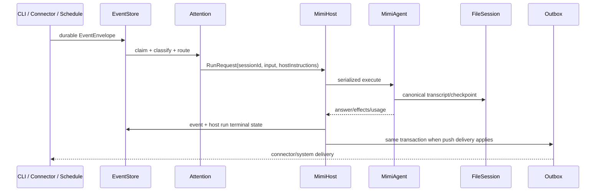

# MimiAgent 统一运行架构实施计划

日期：2026-07-15

状态：已完成

关联调研：`docs/research/20260715-MimiAgent统一运行架构-调研.md`

## 目标

将 main 的完整 CLI 能力与当前工作树中的长期守护、外部事件、主动投递能力合并为同一个 MimiAgent。默认运行形态是一个长期在线 MimiHost；CLI 只是 owner 的本地交互入口，与 IM、邮件、天气、日历和其他 Connector 共享同一 Agent 身份、Session 系统、Memory、工具策略和可靠事件循环。

## 完成标准

1. 产品、包、CLI 和文档以 MimiAgent 为主名称，同时保留必要的 MimiAgent 兼容入口。
2. 默认 CLI 不创建第二个 Agent；Daemon 只创建一个 MimiAgent Runtime。
3. FileSession 是唯一对话真相，CLI 历史、恢复、上下文、模式和模型来自请求的真实 Session。
4. CLI 与远程入口共用同一命令解释和行为，不复制 slash command 分支。
5. Dispatcher Run 和 Runtime mutation 由一个 Host 串行所有者协调。
6. owner CLI 原始输入原样进入 transcript；Host contract 和事件元数据位于可信 instructions。
7. main CLI 的队列、编辑、选择器、流式渲染、输出等级、Session、Goal/Plan、MCP、Skills、Memory、RAG 和取消能力不回归。
8. Mimi 的 Inbox、Attention、Schedule、Digest、lease/retry/dead letter、Outbox、Connector、Webhook、launchd 和 Doctor 能力保留。
9. 认证本机 owner 默认保留 main CLI 的完整执行能力；Plan、显式 workspace/read-only 与外部事件继续由代码边界收窄。
10. 旧 `.mimi-agent`、`~/.mimi-agent`、MIMI.md 和 `MimiAgent` 导出有明确兼容策略，不让已有会话和记忆静默消失；Shell 入口只保留 `mimi`。
11. 本机 MCP、Connector 配置、日志、tmp、实验脚本、大模型文件、私人过程记录和未审核复制 Skills 不进入产品变更。
12. typecheck、全量测试、覆盖率、build、package smoke 和实际 CLI/Daemon 烟测通过。

## 目标架构



### 模块边界

```text
CLI / Connectors / Schedules
        ↓
daemon EventStore + Attention + Routing
        ↓
runtime MimiHost (single serialized owner)
        ↓
runtime MimiAgent + AgentRunService
        ↓
core FileSession / Memory / Goal / Plan / Team
```

- `daemon` 负责事件可靠性，不拥有 transcript。
- `runtime` 负责 Agent 组合、串行运行与控制。
- `core` 负责可持久状态语义。
- CLI 负责输入和渲染，不负责 Run 正确性。
- Connector 负责渠道协议与凭证，不拥有 Agent 状态。

## 分阶段实施

### 阶段 0：保护现场与基线

- [x] 从 main 创建 `codex/mimi-agent-unified`。
- [x] 确认 main、旧 Mimi 分支与新分支基点一致，未提交 Mimi 工作树完整保留。
- [x] 执行当前完整 CI，并记录 324/324 与覆盖率基线。
- [x] 标记本机配置、日志、tmp、实验文件、复制 Skills 和私人过程文档为非产品范围。
- [x] 更新 `.gitignore`，防止已识别的本机运行物继续污染工作树。

### 阶段 1：特征化测试

- [x] CLI 和 Daemon 共享一次 Run 的成功、失败、usage 与 RuntimeEffect 终态语义。
- [x] 请求 Session 的 snapshot/history/context 不依赖当前 mutable Session。
- [x] CLI history 来自 FileSession，并包含完整回答、Tool 协议与 recovery。
- [x] owner CLI 原始输入不被 Daemon contract 改写。
- [x] `chat.invoke` 与 Dispatcher Run 串行，不会交错切 Session。
- [x] `/index`、`/history`、`/status`、`/retry` 在本地与远程 backend 等价。
- [x] local CLI 结果不产生系统 Outbox。
- [x] read-only/workspace/trusted 权限恢复 main 语义。
- [x] Mimi 命名与旧名称兼容迁移行为被测试锁定。

### 阶段 2：唯一 Agent Host 与 Session 真相

- [x] 新增薄 `MimiHost`，拥有一个 `MimiAgent` 与 `AgentRunService`。
- [x] 所有 Run、Session/Model/Mode mutation 经 Host 串行队列。
- [x] 为 Runtime 增加 session-scoped 只读 snapshot API，不切换 current Session。
- [x] `chat.snapshot` 直接读取 FileSession；EventStore 只返回事件活动，不再冒充 transcript。
- [x] 将 Daemon contract、Standing Orders、人物 context 和 playbook 移到 `hostInstructions`。
- [x] local CLI 明确采用本地轮询结果，不走主动 Outbox fallback。

### 阶段 3：统一命令与 CLI

- [x] 抽取 `AgentCommandTarget`/共享 CommandHandler backend 契约。
- [x] 本地 Runtime 与 Mimi RPC client 均实现同一 backend。
- [x] 删除 `chat-client.ts` 中复制的 slash command 分支。
- [x] 恢复 Session transcript/recovery 页面、模型/模式/输出选择器和状态信息。
- [x] Esc 通过 Host 取消当前 owner Event/Run；退出 CLI 只关闭客户端，不停止 MimiHost。
- [x] 保留 FIFO 输入队列、多行编辑、状态栏、Plan 进度和流式输出。

### 阶段 4：权限与外部内容边界

- [x] 默认 owner 权限恢复 `trusted`，普通 General/Ultra 任务直接拥有 Shell。
- [x] `toolsForPermission` 恢复 workspace/read-only/trusted 过滤。
- [x] 显式 workspace/read-only Runtime 禁止 unsandboxed Shell；Team builder 继续受路径约束。
- [x] Event RunPolicy 只能收窄基础权限，未知工具失败关闭。
- [x] 外部 Event 内容使用明确不可信边界，清理常见角色特殊 token。
- [x] Connector action、Outbox 与副作用 ledger 的不确定结果不自动重放。

### 阶段 5：MimiAgent 更名与兼容迁移

- [x] package 名、description、keywords、bin 和帮助改为 MimiAgent。
- [x] 导出 `MimiAgent`，保留 `MimiAgent` deprecated alias。
- [x] Shell 主命令收敛为唯一的 `mimi`；旧名称只保留 API、环境变量和数据目录兼容，不再暴露命令别名。
- [x] 新运行目录 `.mimi-agent`、`~/.mimi-agent`；未显式配置时安全回退旧目录。
- [x] 新 `MIMI_*` 环境变量优先，旧 `MIMI_*`/`AGENT_*` 兼容读取。
- [x] 支持 MIMI.md，继续加载 MIMI.md 作为兼容指导文件。
- [x] 同时保护新旧私有运行目录，避免通用工具读取。
- [x] 公开入口和文档切换 Mimi 命名；稳定 launchd/SQLite/Socket/Tool/plugin 标识保留原地兼容且不形成第二套 Agent。

### 阶段 6：Daemon 能力策展

- [x] 纳入 `src/daemon`、必要 Connector 示例和对应测试。
- [x] 保留 SQLite、Attention、Schedule、Digest、Outbox、Connector、Webhook、Doctor。
- [x] 不纳入 `connectors.json`、本机 `mcp.json` 修改、debug/tmp、视觉实验、二进制模型和复制 Skills。
- [x] 合并重复过程文档，只保留架构、Attention、Connector 与迁移所需正式文档。
- [x] 同步 package files、lockfile、`.env.example`、README、SECURITY、CHANGELOG。

### 阶段 7：验证与评审

- [x] 聚焦测试每个阶段即时通过。
- [x] `npm run check`。
- [x] `npm test`。
- [x] `npm run test:coverage`。
- [x] `npm run build`。
- [x] `npm run test:package`。
- [x] 临时数据目录下运行 help/version/init/doctor/start/status/CLI submit/stop 烟测。
- [x] 并行完成代码复用、代码质量和效率评审。
- [x] 最终 diff 检查秘密、绝对本机路径、生成物和无关文件。

## 关键设计决策

### D1：MimiHost 是进程角色，MimiAgent 是智能身份

Host 负责长期在线、可靠事件和串行所有权；Agent 负责推理、工具、Session 与 Memory。CLI 不再被描述为另一个 Agent。

### D2：FileSession 是唯一 transcript

EventStore 记录事件和执行，不为聊天 UI 重建历史。历史、recovery、context、model、mode、Goal/Plan 都从同一 Session 状态读取。

### D3：Host instructions 不进入 user input

原始消息保留原样；可信 Host metadata、Standing Orders 和执行契约通过独立 instructions 传入。外部正文仍属于 user/external data。

### D4：可靠性优先于并发

首版保持一个 Host Run lane。Agent 内部已有受控 SubAgent/Team 并发；不为多个入口并发驱动同一个可变 Runtime。

### D5：兼容迁移不静默搬动个人数据

新路径优先；旧路径有状态而新路径为空或不存在时原地读取旧路径。两边都有状态时拒绝猜测，只有显式配置才选择数据源，避免启动时破坏或丢失历史。

## 风险与缓解

- 大量未提交文件难以辨别归属：按产品模块白名单纳入，不执行 clean/reset。
- CLI 远程化可能降低交互：共享 CommandHandler 与 session snapshot，并增加 PTY/IPC 回归测试。
- 外部内容拥有过大权限：恢复基础 permission 上限、RunPolicy 只收窄、来源正文分区。
- 重命名导致数据消失：旧路径回退、导出/bin/env aliases 和迁移测试。
- SQLite Outbox 可能重复：继续声明 at-least-once，保留稳定幂等键，不自动重放不确定事务。
- Node SQLite 仍为 experimental：维持单适配模块和 Doctor 检查，不扩散到 Runtime/Core。

## 验证约定

本节曾记录中途工作树的固定测试数量、覆盖率和包体积；后续继续新增微信、MCP、Daemon 升级与可靠性回归后，这些数字已经失效，不能作为最终交付证明。最终状态以交付当次实际运行的 `npm run check`、focused tests、`npm run build`、`npm run test:package` 和（环境允许时）`npm run ci` 输出为准；真实 Provider/微信与 Unix Socket 烟测必须明确区分实机证据和沙箱无法绑定 Socket 的限制。
