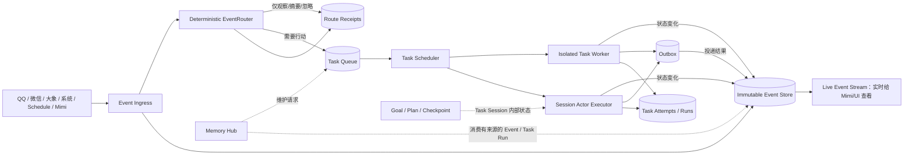
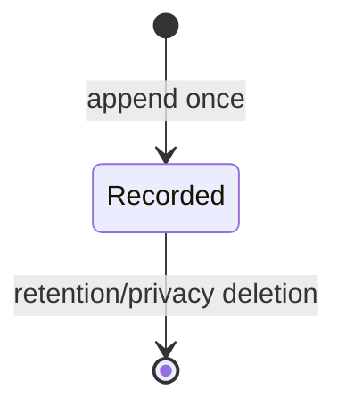
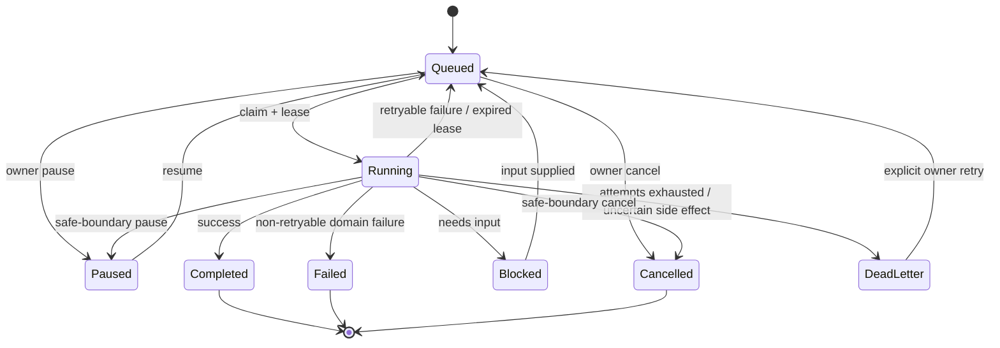
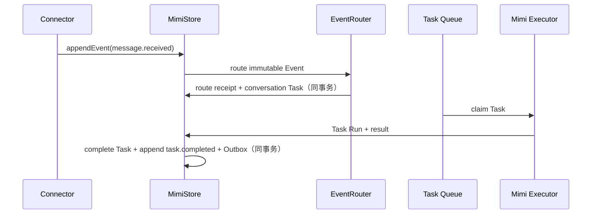

# MimiAgent Event / Task 分层重构设计

日期：2026-07-20

状态：已纳入方案；未实施

关联方案：`docs/plans/20260715-MimiAgent统一MemoryHub-计划.md`

## 结论

当前实现把“已经发生的事实”和“等待执行的工作”同时放进 `events` 表，是领域模型混淆。未来架构应明确拆成两层：

> Event 只记录发生了什么；Task 只记录接下来要做什么。Event 不执行、不重试、不持有 lease；Task 才排队、执行、暂停、重试和结束。

这不是增加第二套工作流系统，而是把现有 `events.execution_lane = 'task'` 和 Event 上的执行字段提升为唯一、正式的 Task 层。Goal、Plan、Checkpoint 仍然是某个 Task/Session 内部的认知与进度状态，不再新建 Todo/DAG/Workflow 概念。

## 1. 当前问题

当前 `StoredEvent` 同时包含两组互相冲突的语义：

- 事件事实：`source`、`kind`、`actor`、`conversation`、`payload`、`occurredAt`、`receivedAt`、`trust`；
- 执行任务：`executionLane`、`status`、`attempts`、`notBefore`、`leaseOwner`、`leaseUntil`、`result`、`error`、`taskControl`。

后台 Task 也通过 `enqueueBackgroundTask()` 写进 `events` 表，`TaskProcessSupervisor` 再用 `getEvent()`、`claimEventById()`、`failEvent()` 操作它。由此产生几个长期问题：

1. “QQ 收到一条消息”本应是不可变事实，却会被更新为 `running/completed/dead_letter`，语义不成立；
2. “后台整理记忆”本应是 Task，却需要伪装成内部 Event；
3. Event 的 `ignored/digested/archived` 与 Task 的 `paused/blocked/running` 混在同一状态机；
4. `parentEventId/rootEventId` 同时承担事件因果、任务父子关系和授权来源，难以审计；
5. Event 列表既像实时信息流，又像任务队列，Mimi 和用户都无法一眼判断“发生了什么”和“还有什么没做”。

## 2. 最终领域边界

| 概念 | 回答的问题 | 是否可变 | 是否有执行状态/重试 |
|---|---|---|---|
| Event | 发生了什么 | 正文不可变；可按保留策略删除 | 否 |
| Event Route Receipt | 系统如何处理这个 Event | 单调写入一次路由结论 | 否 |
| Task | 接下来要完成什么 | 是 | 是 |
| Task Attempt / Run | 这一次具体执行发生了什么 | 终态后不可变 | 单次 attempt，不自行重试 |
| Schedule | 什么时候产生一次工作 | 可启停/更新 | 到期产生 Event + Task |
| Goal / Plan / Checkpoint | 当前 Task 内如何完成目标 | 是，按 Session/run ownership 更新 | 不负责排队和 lease |
| Outbox | 已决定发送的结果如何可靠投递 | 是 | 专用投递重试，不是 Event |
| Memory | 哪些事实和经验值得长期复用 | 编译式演化 | 维护工作由 Task 执行 |

### Event 包含什么

Event 覆盖所有外来或内部已经发生的信息：

- QQ、微信、大象、邮件、Webhook、语音等外部消息；
- 用户指定来源的新增或变化；
- OS/Connector/系统通知；
- Schedule 到期；
- Task 创建、开始、阻塞、完成、失败、取消等状态变化；
- Mimi 自己形成的观察、提醒和告警；
- Connector 投递成功、失败或结果不确定。

Event 不包含 `queued/running/paused/attempts/notBefore/lease/result/error` 等执行队列字段。它可以带 `severity` 或业务时间，但不带执行优先级；优先级是 EventRouter 生成 Task 时做出的处理决策。

### Task 包含什么

Task 是一个明确的、需要执行并产生结果的工作单元，例如：

- 阅读一条新消息并决定回复、静默或摘要；
- 完成用户委派的后台研究/编码任务；
- 执行一次到期 Schedule；
- 生成 briefing；
- 整理一批 Memory observations；
- 对某个系统通知执行检查或修复。

Task 可以排队、延迟、claim、续租、暂停、等待输入、重试、完成、失败或取消。Task 的每次模型/Worker 执行形成一个独立 Attempt/Run。

## 3. 总体架构



事件和任务之间是双向但不循环失控的关系：

- EventRouter 可以从一个 Event 生成 0～N 个 Task；
- Task 状态变化会追加新的 Event；
- `task.*` 生命周期 Event 默认 `observe_only`，不会再次自动生成 Task；
- 只有显式注册的规则才能从某类生命周期 Event 产生后续 Task，并以 route receipt 幂等去重。

## 4. 数据模型

### `events`：不可变事实流

```text
id                    UUID
external_id           来源内稳定去重 ID
source                qq | weixin | daxiang | system | mimi | ...
type                  message.received | schedule.due | task.completed | ...
trust                 owner | trusted | external | public | system
actor_json
conversation_json
payload_json           事件正文/元数据；不是任务目标
subject_type           task | schedule | connector | null
subject_id             对应实体 ID，可空
correlation_id         同一业务链路
causation_event_id     直接导致本事件的 Event，可空
profile_id
reply_route_json       来源回复路由，可空
occurred_at            业务发生时间
received_at            Mimi 接收时间
created_at

UNIQUE(source, external_id)
```

硬约束：

- 除显式隐私删除/保留清理外，Event 正文不更新；
- 没有 status、attempt、lease、not-before、execution lane、result 或 error；
- Task 失败通过新的 `task.failed` Event 表达，不回写旧 Event；
- “已读/已路由/已摘要”属于 receipt/view state，不污染 Event。

### `event_route_receipts`：路由控制账本

```text
event_id
router_version
decision              observe_only | digest | task_created | rejected
task_ids_json          有界 Task ID 列表
reason_code
routed_at

PRIMARY KEY(event_id)
```

它解决两个问题：重启后知道某条 Event 是否已做路由；路由重试不会重复创建 Task。配置或 router version 更新不会自动重放历史 Event；owner 显式要求重新处理时直接创建一个带新幂等键的 Task，并追加新的系统 Event。零 Task 的 `observe_only/digest` 也有明确完成语义。

### `tasks`：唯一执行队列

```text
id                    UUID
type                  conversation | background | scheduled | briefing | memory_maintenance
idempotency_key       全局唯一的逻辑任务键
trigger_event_id      触发本任务的 Event，可空
authority_event_id    决定 trust/权限/回复边界的不可变来源 Event
parent_task_id        Task 委派关系，可空
profile_id
session_key
objective_json        任务目标、完成标准和有界上下文
executor              session_actor | isolated_worker | codex
workspace_access      none | read | write
priority
status                queued | running | paused | blocked | completed | failed | cancelled | dead_letter
not_before
attempt_count
max_attempts
lease_owner
lease_until
control_intent        pause | cancel | null
control_reason
result_json
error
created_at
updated_at

UNIQUE(idempotency_key)
```

EventRouter 使用 `event:<eventId>:<routeKey>` 生成幂等键；同一 Event 的 route key 可以是 `reply`、`notify-owner`、`memory-ingest`。Mimi 自主委派使用 `delegate:<parentTaskId>:<logicalDigest>`，Schedule 使用 `schedule:<scheduleId>:<occurrence>`，Memory 使用 `memory:<profileId>:<batchDigest>`。

### `task_attempts` / `runs`

现有 `runs.event_id` 改为 `task_id`，并增加 `attempt_no`：

```text
id
task_id
attempt_no
session_key
worker_id
status                running | completed | failed | interrupted
started_at
completed_at
answer_json
error
```

Task 表记录当前聚合状态；Run 记录每次真实执行。重试创建新 Run，不覆盖失败轨迹。Execution Ledger 的作用域改为 `taskId + logical operation`，仍保持不确定副作用不自动重放。

## 5. 状态机

### Event 没有执行状态机



`ignored`、`digested` 是路由结论，不是 Event 状态；`archived` 是视图或保留策略，不是执行结果。

### Task 状态机



每次状态变化都在同一事务追加一个 `task.*` Event。Task 状态是调度真相，生命周期 Event 是观察/审计事实；二者职责不同。

## 6. 核心数据流

### 外来消息



Event 一写入即可通过 Live Event Stream 给 Mimi/UI 查看；模型是否立即处理由 Task 的优先级和 Attention route 决定。

### Schedule

Schedule 是规则，不是 Event，也不是执行器。到期时在同一事务中：

1. 追加 `schedule.due` Event，记录“这个 occurrence 已经发生”；
2. 用 `scheduleId + occurrence` 作为幂等键创建 `scheduled` Task；
3. Task Scheduler 执行 Task；
4. 结果追加为 `task.completed/failed` Event。

### Task 状态变化

Task 创建、开始、阻塞、恢复、完成、失败和取消都产生 Event，供 Mimi 实时观察和 Memory Hub 后续筛选。为避免事件风暴：

- `task.started` 等内部高频 Event 默认只进入内部 timeline，短周期后可清理；
- `task.completed/failed/blocked` 保留更久，并可触发通知策略；
- 所有 `task.*` Event 默认不自动派生新 Task；
- 状态通知通过显式 route key 生成通知 Task 或 Outbox，不靠递归 Event 执行。

## 7. Memory Hub 如何接入

Memory 不再创建或执行所谓 `maintenance Event`：

1. 普通 Task 结束时，同一事务追加 `task.completed/failed` Event，并登记只含引用的 `memory_observation`；
2. observation 达到数量/等待时间阈值后，确定性维护器创建一个低优先级 `memory_maintenance` Task；
3. Task Scheduler claim 该 Task，由受限 AgentRunService 编译 Wiki；
4. Task 完成后产生普通 `task.completed` Event；该类维护 Task 的生命周期 Event 默认不再次登记 observation，避免自学习循环。

因此 Event 是 Memory 的证据来源，Task 是 Memory 整理的执行容器，两者不再混用。

## 8. 代码边界调整

```text
src/daemon/
├── event-store.ts        Event append/get/list/stream/retention
├── event-router.ts       Event -> route receipt + 0..N Tasks
├── task-store.ts         Task queue/state/lease/control/retry
├── task-scheduler.ts     领取 Task 并选择 executor
├── task-attempts.ts      Run/Attempt 记录
├── task-supervisor.ts    isolated_worker 生命周期
├── schedule-store.ts     Schedule 规则与 occurrence
├── outbox-store.ts       专用可靠投递与 uncertain 语义
└── store.ts              SQLite 连接、migration 与跨表事务门面
```

保持一个 SQLite WAL 数据库和一个 composition root，不拆微服务、不引入 MQ。可以按模块拆文件，但跨 Event/Task/Run/Outbox 的原子提交仍由 `MimiStore` transaction facade 完成。

核心 API 改为：

```ts
appendEvent(event: EventEnvelope): AppendEventResult;
routeEvent(eventId: string): EventRouteReceipt;
listEvents(query: EventQuery): EventPage;

enqueueTask(task: TaskInput): TaskRecord;
claimTask(owner: string, selector: TaskSelector): TaskRecord | undefined;
completeTask(taskId: string, owner: string, result: unknown): void;
failTask(taskId: string, owner: string, error: unknown): TaskRecord;
pauseTask(taskId: string, reason?: string): TaskRecord;
resumeTask(taskId: string, context?: string): TaskRecord;
cancelTask(taskId: string, reason?: string): TaskRecord;
```

废弃 `claimEvent()`、`completeEvent()`、`failEvent()`、`executionLane` 和“Task 是 Event”的 API。

## 9. Goal / Plan / Checkpoint 的关系

Task 层不是新的 Todo 系统：

- Task：Daemon 可调度、可恢复的工作容器；
- Goal：Task Session 当前要达成的目标；
- Plan：完成 Goal 的步骤；
- Checkpoint：一次 Run 中断后从哪里继续；
- Team/SubAgent：Task 执行期间的有界协作方式。

一个长期 Task 可以绑定一个独立 Session，并在其中维护 Goal/Plan/Checkpoint。Task 结束时由 Completion Gate 验收 Goal，再提交 Task 终态。不得用 Event 保存 Goal，也不得用 Task 表复制 Plan steps。

## 10. CLI 与可观测性

两个视图必须彻底分开：

- `mimi daemon events`：只看“发生了什么”的时间线；支持 source/type/time/subject 过滤；
- `mimi daemon tasks`：只看“还有什么要做、做到哪了”；支持 status/type/priority 过滤；
- `mimi daemon show event <id>`：只展示不可变事件与因果链；
- `mimi daemon show task <id>`：展示目标、状态、attempt、结果和触发 Event；
- `mimi daemon retry task <id>`：只能重试 Task；删除 `retry event`；
- `inspect_mimi_activity` 分别汇总 Event 流量和 Task backlog/dead letter，不再叫 `events.queued/running`。

## 11. 一次性数据转换

当前只有单用户，代码实施时采用一个 schema 版本完成切换，不保留 Event/Task 双写：

1. 备份当前 SQLite、WAL 和 SHM；
2. 创建新 `events_v2`、`tasks`、`event_route_receipts`，并把 `runs/outbox` 外键迁到 `task_id`；
3. 旧 `execution_lane = 'conversation'` 行转换为不可变 Event，并按旧执行状态生成对应 conversation Task/Run；
4. 旧 `execution_lane = 'task'` 行直接转换为 Task，保留 Task ID、状态、attempts、lease、控制意图、结果和错误；其 `parent_event_id/root_event_id` 拆成 `parent_task_id/authority_event_id`；
5. 为迁移后的 Task 追加带 `migration` provenance 的生命周期 Event，保留时间线完整性；
6. 校验 Event 去重、Task 状态计数、Run/Outbox 引用、Schedule authority 和 dead-letter 数量完全一致；
7. 原子切换表名并删除旧执行字段/API，不保留 legacy adapter。

若任何计数或引用校验失败，事务回滚并继续使用旧 schema；不得留下部分切换数据库。

## 12. Review 结论

| Review 项 | 结论 |
|---|---|
| Event 是否只表示事实 | 是；正文不可变，无队列字段 |
| 所有 Agent 工作是否进入 Task | 是；conversation/background/schedule/memory 都统一为 Task |
| 是否新增第二套 Goal/Plan | 否；Task 只是执行容器，复用原 Goal/Plan/Checkpoint |
| 是否保留可靠重试 | 是；lease/retry/dead-letter 从 Event 平移到 Task |
| 是否会由 task event 形成无限循环 | 否；生命周期 Event 默认 observe-only，route receipt 幂等 |
| Mimi 是否能实时看到 Event | 是；Event append 后立即进入 live stream，处理任务异步执行 |
| Schedule 是否继续混作 Event | 否；Schedule 是规则，到期产生 Event + Task |
| Memory maintenance 是否混作 Event | 否；Event 提供证据，Task 执行整理 |
| 是否需要新基础设施 | 否；仍是一个 SQLite WAL 和现有进程模型 |

这项分层应先于或与统一 Memory Hub 在同一个变更集中实施。否则 Memory 方案继续复用“可执行 Event”，会把当前领域混淆固化到新架构中。
