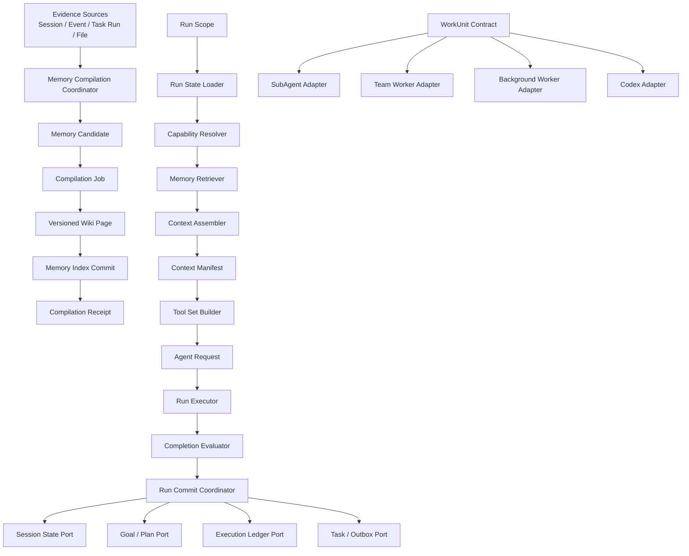

# MimiAgent 上下文、记忆与运行架构改造计划

日期：2026-07-24

状态：实施基线

适用版本：当前 `0.12.0` 工作树及其后续演进

关联文档：

- `AGENTS.md`
- `docs/ARCHITECTURE.md`
- `docs/plans/20260715-MimiAgent统一MemoryHub-计划.md`
- `docs/plans/20260715-MimiAgent统一运行架构-计划.md`
- `docs/plans/20260720-MimiAgent-Event-Task分层设计.md`
- `docs/audits/20260723-MimiAgent-upgrade-readiness-analysis.md`

## 一、结论与实施范围

本轮改造解决三个已经影响系统可信度和继续演进的问题：模型实际看见的上下文无法被统一解释，长期知识存在多条语义不一致的写入路径，`MimiAgent` 组合根承担了过多运行阶段和提交职责。改造采用分阶段迁移，每个阶段都能单独合并、验证和回滚。

本计划包含五条工作线：

1. 统一 Memory Evidence、Candidate、Compilation、Page Revision 和 Receipt。
2. 建立逐请求 Context Manifest，统一 Runtime、TUI 和 `/context` 的统计口径。
3. 将 `MimiAgent.stream()` 拆成阶段化 Run Pipeline。
4. 通过状态端口和提交日志收敛跨 JSON/SQLite 的运行事务边界。
5. 统一 SubAgent、Ultra Team、Background Task 和 Codex Task 的 WorkUnit 结果契约，并建立故障注入测试。

这五条工作线共享数据契约和运行标识，但不要求在一个变更集中完成。Memory 与 Context 两条工作线优先，状态存储迁移最后执行。

## 二、现状和问题定义

### 2.1 MemoryHub 已采用 LLMWiki，但写入生命周期没有统一

当前证据真相、语义知识和检索索引已经分层：

- Session、Event、Task Run 和 workspace 文档保存原始证据。
- private/workspace Markdown Wiki 保存 semantic memory。
- SQLite 保存 FTS5、向量、links、receipt、suppression、decision 和 lint 状态。

问题出在写入路径：

| 入口 | 当前行为 | 缺口 |
|---|---|---|
| `remember` | 直接写 Wiki、索引和 decision event | 不经过完整 CompilationPlan/Receipt |
| `memory_ingest` | 同步建立 CompilationPlan 并编译文档 | 与自动 maintenance 的候选模型不同 |
| `capture` | 同步建立 CompilationPlan 并写 synthesis 页 | Candidate 和 Page Revision 没有稳定表示 |
| `recordEpisode` | 直接索引 private episode | Episode 不具备统一编译状态 |
| Task terminal observation | 延迟创建 maintenance Task | 证据正文依赖 Task/Event 关联重建 |
| stale source | 查询或同步时标记 stale | 没有明确的重编译队列和终态 |

后续实施者无法只通过一个状态机回答以下问题：

- 一条 active Memory 来自哪份证据和哪次判断。
- 编译失败发生在页面写入前、索引前还是 Receipt 提交前。
- owner 明确记忆与自动巩固为什么采用不同提交语义。
- 来源变更后，旧页面什么时候重编译、冲突或失效。

### 2.2 TUI 的“当前上下文”不是模型请求上下文

TUI 状态栏使用 `sessionSnapshot().context.estimatedTokens`。该值来自完整 Session items 的字符估算，因此表示原始 transcript 大小。它没有应用 ContextArchive、microcompact 和 PTL truncation，也没有加入 Instructions、Memory Cards、Goal/Plan、Skill Catalog、Tool Schema 和协议余量。

结果是压缩后的 Session 仍会在状态栏持续增长。用户看到的 `120K/400K` 不能解释模型最近一次请求实际接收了多少 token。

`/context` 已经能展示最近请求估算和 Provider usage，但口径仍未收敛：

- 本地估算使用字符比例，不是模型 tokenizer。
- `inputBudget` 当前只扣除 output reserve，尚未扣除 Tool Schema 和 protocol reserve。
- 一次包含多次模型调用的 Tool Run 同时存在“最近请求”“整轮累计”“下一请求预计”三种数值，界面没有统一命名。
- 估算分项没有保存，无法判断 Memory、工具或历史分别占用多少。

### 2.3 Runtime 组合根已经超过可安全演进的职责范围

`MimiAgent.stream()` 当前负责：

- 建立 Run ownership 和 checkpoint。
- 加载 Session、Archive、Soul、Project Guidance、Memory、Plan、Goal 和 Team。
- 决定权限、事件策略、Computer、MCP、SubAgent 和 Team 工具。
- 计算上下文预算并组装 Instructions。
- 创建 SDK Agent 和 Runner 请求。
- 恢复 Completion Contract。
- 收集 RuntimeAction。
- 完成 Session、Goal、Episode 和 Execution Ledger。

这些步骤共享大量可变成员。新增一种上下文来源、工具权限或完成语义时，需要同时理解整个方法。错误通常表现为旧 Run 写入新 Session、统计口径漂移、权限工具泄漏或完成状态无法收敛。

### 2.4 运行状态跨 JSON 和 SQLite 提交

当前状态分布在：

- Session JSON。
- `plans.json`。
- `teams.json`。
- `execution-ledger.json`。
- Daemon SQLite。
- Memory SQLite。
- Wiki Markdown。

系统已经用 runId CAS、Execution Receipt、RuntimeAction Ledger 和 Task transaction 缩小崩溃窗口。这些机制有效，但新增一类状态就需要再增加补偿逻辑。需要先建立统一状态端口和提交日志，再决定哪些可变状态迁入同一 SQLite 事务。

### 2.5 多 Agent 的执行边界清楚，结果契约分散

SubAgent、Ultra Team、Background Task 和 Codex Task 解决不同问题，隔离方式不应合并。当前缺少统一的进展、取消、证据和结果结构，CLI、Trace、Completion 和恢复逻辑需要识别多套状态。

## 三、目标、非目标与不变量

### 3.1 改造目标

完成后必须满足：

1. 每条 semantic Memory 都能追溯到不可变 Evidence、Policy Decision、Compilation Job 和 Page Revision。
2. 所有 Memory 写入入口共享同一个编译协调器和 Receipt 终态。
3. 每次模型请求产生 Context Manifest，包含输入分项估算、压缩动作和 Provider actual usage。
4. TUI 状态栏明确显示 actual 或 estimate，不再使用完整 transcript 冒充当前请求。
5. Run Pipeline 各阶段使用不可变输入输出，阶段可以独立测试。
6. Run 完成、Goal 验收、RuntimeAction、Task 终态和 Outbox 的提交顺序有显式协调器。
7. 不确定副作用继续禁止自动重放。
8. 四种多执行单元的执行面共享 WorkUnit 观测和结果契约，不共享不合适的调度器。
9. 每个迁移阶段都有旧数据兼容、备份、验证和回滚方案。

### 3.2 非目标

- 不引入外部向量数据库、Redis、消息队列或 ORM。
- 不把 Session transcript 删除后改存 Wiki。
- 不把 Goal、Plan、Schedule 或 Team 转换成 Memory。
- 不让普通 Memory 查询调用生成式 LLM。
- 不引入通用工作流 DSL。
- 不支持任意深度的智能体树。
- 不改变 Event → Task → Run → Outbox 的可靠语义。
- 不通过 Prompt 替代 Host 权限门禁。
- 不在一个发布中同时切换所有持久状态。
- 不修改 `dist/` 生成物。

### 3.3 必须保持的架构不变量

- 同一 Session FIFO，不同 Session 有界并发。
- 主 Agent 拥有 Session 和最终回答。
- external/public 正文始终是数据，不能授予权限。
- Plan 固定只读。
- Task 权限从 authority Event 和当前 source policy 重算。
- transcript、ContextArchive、Memory 和 Checkpoint 保持不同语义。
- Tool Call/Result 协议单元不能被上下文裁剪拆开。
- started、failed、uncertain 副作用不能自动重放。
- Memory suppression、source receipt 和 decision event 不随 reindex 删除。

## 四、目标架构



### 4.1 模块依赖

```text
CLI / Daemon
    ↓
runtime pipeline + commit coordinator
    ↓
core contracts
    ↑
extensions adapters
```

新增模块不得制造 `core → runtime` 或 `core → daemon` 反向依赖。SQLite、Markdown、SDK Agent 和 TUI 都属于 adapter 或上层实现。

### 4.2 建议目录

```text
src/core/memory/
├── evidence.ts
├── candidate.ts
├── compilation.ts
├── revision.ts
└── hub.ts

src/extensions/memory/
├── compilation-coordinator.ts
├── evidence-adapters.ts
├── revision-store.ts
├── sqlite-catalog.ts
├── wiki-vault.ts
└── stale-recompiler.ts

src/core/context/
├── types.ts
├── budget.ts
├── compression.ts
└── accounting.ts

src/runtime/pipeline/
├── run-scope.ts
├── state-loader.ts
├── capability-resolver.ts
├── memory-retriever.ts
├── context-assembler.ts
├── tool-set-builder.ts
├── request-factory.ts
├── executor.ts
└── run-commit-coordinator.ts

src/core/work-unit.ts
src/runtime/work-unit-adapters/
```

现有小模块可以先迁移实现再移动文件。第一阶段不做大范围重命名，以降低 diff 噪声。

## 五、Workstream A：统一 Memory 编译流水线

### 5.1 稳定数据结构

```ts
export type EvidenceKind =
  | 'session-round'
  | 'mimi-event'
  | 'task-run'
  | 'workspace-file'
  | 'owner-explicit'
  | 'memory-revision';

export interface EvidenceRef {
  id: string;
  kind: EvidenceKind;
  profileId: string;
  workspaceId: string;
  digest: string;
  occurredAt: string;
  trust: MemoryTrust;
  locator: {
    sessionId?: string;
    runId?: string;
    eventId?: string;
    taskId?: string;
    relativePath?: string;
    revisionId?: string;
  };
}

export type MemoryCandidateStatus =
  | 'pending'
  | 'accepted'
  | 'rejected'
  | 'conflicted'
  | 'superseded';

export interface MemoryCandidate {
  id: string;
  profileId: string;
  workspaceId: string;
  scope: MemoryScope;
  proposedKind: MemoryKind;
  title: string;
  content: string;
  evidenceRefs: EvidenceRef[];
  confidence: MemoryConfidence;
  status: MemoryCandidateStatus;
  reasonCode?: string;
  createdBy: 'owner' | 'runtime' | 'maintenance';
  createdAt: string;
  updatedAt: string;
}

export type CompilationJobStatus =
  | 'pending'
  | 'applying'
  | 'applied'
  | 'rejected'
  | 'failed'
  | 'uncertain';

export interface CompilationJob {
  id: string;
  candidateId: string;
  operation: 'remember' | 'ingest' | 'capture' | 'refresh' | 'lint-repair';
  compilerVersion: string;
  expectedRevisions: Array<{ pageId: string; revision: number; digest: string }>;
  plannedWrites: Array<{ pageId: string; nextRevision: number }>;
  appliedWrites: Array<{ pageId: string; revisionId: string }>;
  status: CompilationJobStatus;
  error?: string;
  createdAt: string;
  updatedAt: string;
}

export interface MemoryPageRevision {
  revisionId: string;
  pageId: string;
  revision: number;
  scope: MemoryScope;
  profileId: string | null;
  metadata: MemoryPageMetadata;
  bodyDigest: string;
  evidenceRefs: EvidenceRef[];
  compilationJobId: string;
  createdAt: string;
}

export interface CompilationReceiptV2 {
  id: string;
  candidateId: string;
  jobId: string;
  status: 'applied' | 'rejected' | 'failed' | 'uncertain';
  pageRevisions: Array<{ pageId: string; revisionId: string; revision: number }>;
  reasonCode?: string;
  completedAt: string;
}
```

正文可以继续保存在 Markdown。SQLite 保存 Candidate、Job、Revision metadata 和 Receipt，形成可恢复控制面。

### 5.2 状态机

```text
Evidence
  → Candidate.pending
  ├─ policy reject → Candidate.rejected → Receipt.rejected
  ├─ conflict      → Candidate.conflicted
  └─ accept        → Candidate.accepted
                       ↓
                 Job.pending
                       ↓
                 Job.applying
                  ├─ success → Job.applied → Receipt.applied
                  ├─ known failure → Job.failed
                  └─ unknown result → Job.uncertain
```

`Job.applying` 在进程重启后不能直接重做。恢复器先检查 planned page revision 和 body digest：

- 所有页面已经存在且 digest 匹配：补交 index 和 Receipt。
- 页面均不存在：将 Job 恢复为 pending。
- 部分页面存在或 digest 冲突：标记 uncertain，要求 lint/owner 处理。

### 5.3 五类入口的统一行为

#### owner `remember`

owner 明确要求记忆时创建 `owner-explicit` Evidence 和 `accepted` Candidate，立即执行高优先级 Job。它不需要等待 maintenance，但仍产生 Revision 和 Receipt。

模型自主调用 `remember` 时创建 `runtime` Candidate。现有稳定价值、秘密、scope 和 provenance 门禁在 Candidate 接受前执行。

#### workspace `memory_ingest`

读取文件后先固定 EvidenceRef 和 digest。确定性标题切分只负责生成候选单元。每个单元形成 Candidate；同一来源的 Candidates 绑定一个 Job group。任一页面失败时保留已应用 revision，并由 Job 恢复器收敛，不能重新创建不同 page ID。

#### Session Episode

Episode 继续作为 evidence document 索引，不自动产生 active Candidate。以下入口可以引用 Episode：

- owner 手动 `/memory capture`。
- owner 明确要求从历史提炼。
- maintenance Task 已经获得对应 Task observation。

#### Task observation

Task terminal transaction 写入 bounded Evidence snapshot，不能只保存 digest 后依赖可能被 retention 删除的 Task 正文。Evidence snapshot 至少保存：

- objective 摘要。
- result/error 摘要。
- Event/Task/Run locator。
- trust。
- content digest。

大正文继续留在原始 Store，snapshot 上限建议 8KB。

#### stale refresh

workspace source digest 变化时创建 `refresh` Candidate，不直接覆盖旧页。默认策略：

- immutable `knowledge/sources/` 新版本通过 supersedes 明确触发。
- 可变 workspace 文档只标 stale，不在交互查询热路径自动编译。
- maintenance 或 owner `/memory refresh` 领取 stale Candidate。
- 新 revision applied 后，旧 revision 保留审计记录，页面当前指针切换到新 revision。

### 5.4 提交协议

单个 Job 的提交顺序：

```text
1. BEGIN IMMEDIATE
2. 锁定 Candidate 和 Job，验证 expected revisions
3. Job → applying
4. COMMIT
5. 逐页写同目录临时 Markdown并原子 rename
6. BEGIN IMMEDIATE
7. 校验实际 body digest
8. 写 PageRevision 和当前 revision 指针
9. 更新 FTS/vector/links
10. Job → applied，写 Receipt
11. COMMIT
12. 刷新 _index.md / _log.md
```

第 12 步是人类导航派生物，失败只产生 lint issue，不撤销已经 applied 的知识页。

### 5.5 API 收敛

`MemoryHub` 对模型继续保留窄工具面：

```ts
interface MemoryHub {
  search(...): Promise<MemoryHit[]>;
  read(...): Promise<MemoryDocument>;
  links(...): Promise<MemoryLink[]>;
  remember(...): Promise<CompilationReceiptV2>;
  forget(...): Promise<ForgetReceipt>;
  ingest(...): Promise<CompilationReceiptV2>;
  capture(...): Promise<CompilationReceiptV2>;
}
```

内部新增：

```ts
interface MemoryCompilationCoordinator {
  submit(candidate: MemoryCandidateInput, context: RunMemoryContext): Promise<CompilationReceiptV2>;
  recover(jobId: string): Promise<CompilationReceiptV2 | CompilationJob>;
  refreshStale(limit: number, context: RunMemoryContext): Promise<CompilationReceiptV2[]>;
}
```

模型不直接操作 Job、Revision 或索引。

### 5.6 迁移

1. 为现有页面生成 revision 1，`compilationJobId` 使用稳定 migration ID。
2. 将现有 `source_receipts` 转换为 V2 Receipt；无法关联 Candidate 的记录使用 `legacy-import` Candidate。
3. 保留 suppressions、decision_events 和 lint_issues。
4. Episode 不转换成 Wiki Page Revision。
5. 迁移前使用 SQLite Backup API 和 Wiki allowlist 备份。
6. 完成 page count、digest、FTS、link 和 receipt 数量校验后写 cutover marker。
7. 迁移失败整体回滚控制表；已生成但未切换的 Markdown revision 放入 quarantine。

## 六、Workstream B：Context Manifest 与准确计量

### 6.1 统一术语

| 名称 | 含义 |
|---|---|
| Raw Session Tokens | 完整 transcript 的估算大小 |
| Effective History Tokens | Archive/microcompact/truncation 后发送给模型的历史 |
| Request Estimate | 本次请求 Instructions、历史、输入、工具和协议的总估算 |
| Last Request Actual | Provider 返回的最近一次模型请求 input/output |
| Run Actual | 一个 Run 内所有模型请求的累计 usage |
| Context Window | 模型输入与输出共享的总窗口 |
| Available Input Budget | 扣除 output reserve、Tool Schema 和 protocol reserve 后的预算 |

TUI 和文档统一使用这些名称，不再使用含义不明确的“当前上下文”。

### 6.2 数据结构

```ts
export interface ContextSectionUsage {
  id:
    | 'base-instructions'
    | 'session-state'
    | 'soul'
    | 'project-guidance'
    | 'goal-plan-team'
    | 'recovery'
    | 'memory-cards'
    | 'skill-catalog'
    | 'archive'
    | 'recent-history'
    | 'current-input'
    | 'tool-schemas'
    | 'protocol-reserve';
  estimatedTokens: number;
  itemCount?: number;
  truncated: boolean;
}

export interface ContextCompressionRecord {
  strategy: 'microcompact' | 'collapse' | 'full-compact' | 'turn-truncation' | 'input-fit';
  affectedItems: number;
  beforeTokens: number;
  afterTokens: number;
}

export interface ContextManifest {
  requestId: string;
  sessionId: string;
  runId: string;
  provider: 'openai' | 'deepseek';
  model: string;
  estimator: string;
  contextWindow: number;
  outputReserve: number;
  availableInputBudget: number;
  sections: ContextSectionUsage[];
  compression: ContextCompressionRecord[];
  estimatedInputTokens: number;
  actual?: {
    inputTokens: number;
    outputTokens: number;
    totalTokens: number;
    receivedAt: string;
  };
  createdAt: string;
}
```

### 6.3 Context Assembler

`ContextAssembler` 接收已经加载和授权的 `RunStateSnapshot`，返回：

```ts
interface PreparedContext {
  instructions: string;
  modelInput: AgentInputItem[];
  manifest: ContextManifest;
}
```

Assembler 必须在添加每个 section 时记录预算。不能先拼接字符串，再反推各部分占用。

建议继续保留当前轻量字符估算器作为保守基线，并加入 estimator 标识。精确 tokenizer 作为 Provider adapter 的可选能力：

```ts
interface TokenEstimator {
  id: string;
  estimateText(text: string): number;
  estimateItems(items: AgentInputItem[]): number;
  estimateTools(tools: ToolSchema[]): number;
}
```

没有可靠 tokenizer 时不得显示为 actual。

### 6.4 压缩策略

现有确定性压缩语义保留：

1. 较早 Tool Result 先 microcompact。
2. 超过 history limit 或 budget 时生成 ContextArchive。
3. Archive 只作为标明历史数据的 user-level 输入。
4. 剩余历史按完整 user turn 选择。
5. 当前 Tool 协议骨架必须完整。
6. 骨架超预算时显式失败。

改造点：

- `ContextManager` 返回压缩结果和记录，不能只返回 items。
- Archive 合并记录 source range 和摘要 digest。
- 每次 turn truncation 记录被舍弃的完整轮次数。
- `/compact` 返回 full-compact 前后 token 和 covered item 数。
- ContextArchive 不重复计入 Effective History 和 Archive。

建议接口：

```ts
interface EffectiveHistoryResult {
  items: AgentInputItem[];
  archiveInput?: AgentInputItem;
  records: ContextCompressionRecord[];
  rawTokens: number;
  effectiveTokens: number;
}
```

### 6.5 Provider actual usage

`AgentRunService` 在每个 raw response 可获得 usage 时，将 actual 回填到对应 `requestId`。SDK 无法稳定暴露 request boundary 时，至少保存：

- last request actual。
- run cumulative actual。
- manifest estimate。

actual 不反向改写估算算法。后续通过离线样本比较 estimator error：

```text
error = abs(estimatedInput - actualInput) / actualInput
```

P95 error 超过 15% 时，需要调整模型 profile 或 estimator。

### 6.6 TUI 和命令

状态栏规则：

```text
有 Provider usage：上下文 35.9K actual / 400K
只有 Manifest：上下文 ~36.8K est / 400K
尚未运行：历史 ~12.4K raw / 400K
```

压缩后可短暂显示：

```text
上下文 ~31K est / 400K · 已压缩 214K→28K
```

`/context` 至少展示：

- Raw Session。
- Effective History。
- Request Estimate。
- Last Request Actual。
- Run Actual。
- Available Input Budget。
- 各 section 占用前 8 项。
- 压缩记录。
- estimator ID 和误差提示。

`MimiChatSnapshot.contextUsed` 替换为结构化字段，协议升级：

```ts
interface MimiContextStatus {
  value: number;
  source: 'actual' | 'estimate' | 'raw-history';
  contextWindow: number;
  requestId?: string;
  compressedFrom?: number;
}
```

旧客户端在一个兼容周期内读取服务端派生的 `contextUsed`，新客户端优先结构化字段。协议版本和兼容窗口写入 `CHANGELOG.md`。

## 七、Workstream C：阶段化 Run Pipeline

### 7.1 不可变 Run Scope

```ts
export interface RunScope {
  runId: string;
  ownerId: string;
  sessionId: string;
  profileId: string;
  workspaceRoot: string;
  provider: string;
  model: string;
  mode: AgentMode;
  permissionMode: AgentPermissionMode;
  securityProfile: SecurityProfile;
  input: string;
  cause?: RunCause;
  executionKey?: string;
}
```

Run 开始后，不允许从 `MimiAgent` mutable current Session 重新读取 scope。所有延迟回调使用捕获的 `RunScope`。

### 7.2 阶段接口

```ts
interface RunStateLoader {
  load(scope: RunScope): Promise<RunStateSnapshot>;
}

interface CapabilityResolver {
  resolve(scope: RunScope, state: RunStateSnapshot): Promise<ResolvedCapabilities>;
}

interface RunMemoryRetriever {
  retrieve(scope: RunScope, state: RunStateSnapshot, capabilities: ResolvedCapabilities): Promise<RunMemories>;
}

interface ToolSetBuilder {
  build(scope: RunScope, capabilities: ResolvedCapabilities, state: RunStateSnapshot): Promise<PreparedTools>;
}

interface AgentRequestFactory {
  create(
    scope: RunScope,
    state: RunStateSnapshot,
    context: PreparedContext,
    tools: PreparedTools,
  ): PreparedAgentRequest;
}

interface RunCommitCoordinator {
  complete(input: RunCommitInput): Promise<RunCommitResult>;
  fail(input: RunFailureInput): Promise<void>;
  recover(sessionId: string, executionKey: string): Promise<RecoveredRun | undefined>;
}
```

### 7.3 Pipeline 顺序

```text
1. Capture RunScope
2. Repair Session protocol pairs
3. Begin checkpoint
4. Load immutable state snapshot
5. Resolve capabilities
6. Retrieve authorized memories
7. Build tools
8. Assemble context and manifest
9. Create Agent request
10. Execute/stream
11. Evaluate completion
12. Prepare commit plan
13. Commit receipt and durable state
14. Apply RuntimeAction
15. Emit hooks and presentation events
```

Presentation observer、Trace 和 TUI 回调失败不能改变 durable outcome。

### 7.4 从现有代码迁移

迁移采用 extract-and-characterize，不同时改变行为：

1. 为 `MimiAgent.stream()` 当前步骤添加 characterization tests。
2. 提取 `RunScopeFactory` 和 `RunStateLoader`。
3. 将现有 Tool policy 调用移动到 `CapabilityResolver/ToolSetBuilder`。
4. 将 Context 逻辑移动到 `ContextAssembler`。
5. 将 SDK Agent 构造移动到 `AgentRequestFactory`。
6. 将 `completeRun/failRun/completedExecution` 收敛到 `RunCommitCoordinator`。
7. `MimiAgent` 最终只保留 composition、Session actor API 和 pipeline facade。

每次提取后运行 focused tests 和 `npm run check`。禁止在提取阶段同时重命名工具或改变权限。

## 八、Workstream D：运行状态事务收敛

### 8.1 先建立端口，再迁移存储

本计划不直接把全部 JSON 改成 SQLite。第一步定义端口：

```ts
interface SessionStatePort { /* transcript, preferences, checkpoint, archive */ }
interface GoalPlanStatePort { /* goal and plan */ }
interface TeamStatePort { /* team DAG and leases */ }
interface ExecutionLedgerPort { /* calls and completion receipts */ }
interface TaskCommitPort { /* task, run, outbox */ }
```

Runtime 不能再直接构造 `PlanStore`、`TeamTaskStore` 或 `ExecutionLedger` 文件路径。

### 8.2 Run Commit Journal

新增可恢复提交日志：

```ts
type RunCommitPhase =
  | 'prepared'
  | 'receipt_committed'
  | 'session_committed'
  | 'goal_committed'
  | 'task_committed'
  | 'effects_applied'
  | 'finalized';

interface RunCommitJournalEntry {
  id: string;
  sessionId: string;
  runId: string;
  executionKey?: string;
  phase: RunCommitPhase;
  answerDigest: string;
  completionDecision?: CompletionGateDecision['decision'];
  runtimeActions: RuntimeAction[];
  updatedAt: string;
}
```

Journal 不存答案正文和秘密，只存恢复所需 digest、阶段和 action。

恢复规则：

- `prepared`：没有副作用提交，可以重新评估当前持久状态。
- `receipt_committed`：复用完成回执，不调用模型。
- `session_committed`：补 Goal/Task commit。
- `task_committed`：只补 RuntimeAction/finalize。
- `effects_applied`：清理 ledger 并标 finalized。

### 8.3 SQLite 收敛决策门

完成端口和 Journal 后，再评估将 Goal/Plan、Team 和 Execution Ledger 迁入 Daemon SQLite。只有满足以下条件才实施：

- CLI 和后台都已强制通过唯一 Kernel。
- 离线工具不再直接依赖 JSON Store。
- SQLite backup/restore 已覆盖新增表。
- 迁移测试覆盖空文件、旧 schema、损坏文件和并发写。
- public API 不承诺这些 JSON 文件格式。

Session transcript 是否迁入 SQLite 单独决策。本计划默认继续使用 FileSession，避免同时改变 SDK Session adapter 和历史导出。若 Journal 仍无法将关键崩溃窗口收敛，再提交独立 ADR 评估 `SqliteSession`。

### 8.4 禁止双写

任何状态迁移都采用：

```text
停止 owner mutation
→ 备份
→ 离线转换
→ 校验
→ 写 cutover marker
→ 新 Store 单读单写
```

不实现长期 JSON/SQLite 双写。迁移失败继续读取旧 Store。

## 九、Workstream E：WorkUnit 契约

### 9.1 统一观测结构

```ts
export type WorkUnitKind = 'subagent' | 'team-worker' | 'background' | 'codex';
export type WorkUnitStatus =
  | 'pending'
  | 'running'
  | 'blocked'
  | 'completed'
  | 'failed'
  | 'cancelled'
  | 'uncertain';

export interface WorkUnitDescriptor {
  id: string;
  kind: WorkUnitKind;
  parentRunId: string;
  parentWorkUnitId?: string;
  objective: string;
  role?: string;
  dependencies: string[];
  capabilities: ToolCapability[];
  workspaceAccess: 'none' | 'read' | 'write';
  paths: string[];
}

export interface WorkUnitResult {
  id: string;
  status: WorkUnitStatus;
  summary: string;
  artifacts: Array<{ path: string; digest?: string }>;
  evidence: Array<{ type: string; ref: string }>;
  error?: string;
  startedAt: string;
  completedAt?: string;
}
```

### 9.2 保持不同执行器

- SubAgent Adapter：进程内、同步等待、只读、深度 1。
- Team Adapter：进程内波次并行、DAG、builder path ownership。
- Background Adapter：持久 Task、独立 Session、OS worker、Outbox。
- Codex Adapter：detached runner、一次 Attempt、Mimi 不接管验收。

统一契约不改变这些边界。`WorkUnitResult` 用于 Trace、CLI 展示、Completion evidence 和父执行单元整合。

### 9.3 Turn 和时间边界

当前 SubAgent 文档与实现存在 turn limit 漂移。改造时选择一种权威策略：

- 默认不设固定 turn 数，由 context、AbortSignal 和任务终态控制。
- 为 SubAgent 增加 wall-clock timeout 和 context budget。
- 架构文档删除固定 16/12 turns，或代码恢复固定上限；两者必须一致。

推荐采用“无固定 turns + 统一 timeout/context budget”，与主运行当前终态策略一致。

## 十、故障注入与验证体系

### 10.1 必测崩溃点

| 崩溃点 | 恢复后要求 |
|---|---|
| Tool 执行后、Ledger succeeded 前 | 状态 uncertain/started，不能自动重放 |
| Ledger succeeded 后、Session complete 前 | 复用 Tool 输出和完成回执 |
| Session complete 后、Task commit 前 | 不重新调用模型，补 Task/Outbox |
| Task commit 后、Outbox send 前 | 正常领取 pending Outbox |
| 远端发送后、ACK 前 | Outbox dead-letter，不自动重发 |
| Wiki rename 后、Revision commit 前 | 校验 digest 后补交或 uncertain |
| Revision commit 后、FTS 更新前 | 重新构建派生索引 |
| Job applying 时进程退出 | 按 planned writes 恢复，不产生新 page ID |
| Team worker 完成后 lease 变化 | 迟到结果不能覆盖新 claim |
| Context Archive 写入后 Run 失败 | 原 transcript 保留，Archive coverage 有效 |

### 10.2 测试层次

1. 纯函数测试：状态机、预算、权限、Candidate policy。
2. Store 测试：migration、事务、锁、corruption、recovery。
3. Pipeline 测试：各阶段输入输出和旧行为等价。
4. Fault injection：每个持久边界强制抛错并重启。
5. Provider contract：fixture 验证 request shape 和 usage 映射。
6. 可选 canary：OpenAI/DeepSeek 固定任务。
7. TUI 快照测试：actual/est/raw 三种显示。

### 10.3 完成门槛

每个实施阶段至少运行：

```bash
npm run check
node --import tsx --test tests/<focused>.test.ts
```

Memory schema、Runtime、Daemon 或状态迁移阶段运行：

```bash
npm run check:repo
npm run check
npm test
npm run build
```

发布候选运行：

```bash
npm run ci
npm run eval
```

真实 Provider canary 只在提供显式凭证和隔离数据根时运行。

## 十一、分阶段实施

### Phase 0：基线和特征化测试

目标：固定当前行为，不改变生产逻辑。

工作：

- 为 Context status、`/context` 和压缩策略增加快照测试。
- 为五类 Memory 写入入口增加行为矩阵。
- 固定 `MimiAgent.stream()` 阶段顺序和 Tool policy。
- 记录当前 Provider estimate/actual 误差样本。
- 记录 JSON/SQLite 崩溃恢复现状。

涉及文件：

- `tests/core.test.ts`
- `tests/memory-hub.test.ts`
- `tests/commands.test.ts`
- `tests/interactive.test.ts`
- `tests/run-service.test.ts`

验收：

- 当前行为测试全部通过。
- 形成已知偏差 fixture，不以修改断言掩盖问题。

回滚：仅测试和 fixture，可直接删除本阶段新增内容。

### Phase 1：Context Manifest 与 TUI

状态：已完成（2026-07-24）。实现采用 `mimi-char-v1` 保守估算器；Daemon
协议升级为 10，并在一个兼容周期内继续派生 `contextUsed`。聚焦验证覆盖预算、
分项、压缩记录、actual usage 映射和 TUI 三种来源标签。

目标：先让系统准确解释模型上下文。

工作：

- 新增 Context types/accounting。
- `ContextManager` 返回 compression records。
- `ContextAssembler` 生成 Manifest。
- `AgentRunService` 回填 actual usage。
- IPC 增加结构化 context status。
- 更新状态栏、`/context`、README 和协议版本。

涉及文件：

- `src/core/context.ts`，后续拆入 `src/core/context/`
- `src/runtime/mimi-agent.ts`
- `src/runtime/run-service.ts`
- `src/daemon/types.ts`
- `src/daemon/service.ts`
- `src/chat-terminal.ts`
- `src/interactive.ts`
- `src/commands.ts`

验收：

- 压缩后 TUI 数值随 effective request 下降。
- actual 可用时状态栏不用 estimate。
- `/context` 的 available input budget 与 `requestBudget()` 一致。
- Tool-heavy 当前回合仍保持协议骨架。

回滚：服务端继续派生旧 `contextUsed`，客户端可退回旧字段。

### Phase 2：Run Pipeline 提取

状态：已完成（2026-07-24）。已提取并接入冻结 RunScope、StateLoader、
CapabilityResolver、ContextAssembler、ToolSetBuilder、RequestFactory 与
RunCommitCoordinator facade，阶段契约由 `tests/run-pipeline.test.ts` 固定。

目标：不改变行为地拆解组合根。

工作：

- 引入 RunScope、RunStateSnapshot 和 ResolvedCapabilities。
- 依次提取 StateLoader、CapabilityResolver、ContextAssembler、ToolSetBuilder 和 RequestFactory。
- 引入 RunCommitCoordinator facade，内部先调用旧实现。
- 删除 `MimiAgent.stream()` 中已经迁出的重复逻辑。

验收：

- 工具名称和顺序在各 mode/profile/event policy 下不变。
- Session 恢复、Completion Gate 和 RuntimeAction 测试不回归。
- `mimi-agent.ts` 不再直接构造每个阶段的细节对象。

回滚：每个提取提交保持 facade，可逐提交回退。

### Phase 3：Memory V2 控制面

状态：已完成（2026-07-24）。SQLite catalog v2、旧页 revision 1 迁移、
CompilationCoordinator、planned digest 恢复和 uncertain 冲突处理已经接入。

目标：建立 Candidate、Job、Revision 和 Receipt，不切换模型工具。

工作：

- 新增 V2 schema 和迁移。
- 为现有页面生成 revision 1。
- 建立 CompilationCoordinator。
- 让 ingest/capture 先迁入新协调器。
- 增加 Job recovery 和 fault injection。

验收：

- 现有页面、FTS、links、suppression 和 decision 数量一致。
- 任一编译崩溃点恢复后只有一个合法 Receipt。
- reindex 不删除 V2 控制记录。

回滚：cutover marker 前继续使用 V1；marker 后使用备份离线恢复。

### Phase 4：统一全部 Memory 写入

状态：已完成（2026-07-24）。remember/capture/reject/ingest/maintenance 均生成
V2 terminal receipt；Daemon v15 保存 ≤8KB 不可变 Task evidence snapshot，
`/memory refresh` 显式重编译 stale 来源并保留旧 revision。

目标：`remember` 和 maintenance 进入 V2。

工作：

- owner explicit remember 使用高优先级 Candidate。
- autonomous remember 使用 policy decision。
- Task observation 保存 bounded Evidence snapshot。
- maintenance 输出 Candidate/Receipt，不直接写页。
- 增加 stale refresh 队列和 `/memory refresh` 管理入口。

验收：

- 所有 active 页面都有当前 Revision、Candidate 和 Receipt。
- external/public 单观察仍不能直接 active。
- forget suppression 能阻止 maintenance 复活旧内容。
- stale 页面可以显式重编译并保留旧 revision。

回滚：停止创建新 Candidate；不能把已经产生的 V2 revision 降级覆盖回 V1。

### Phase 5：Run Commit Journal 与状态端口

状态：已完成（2026-07-24）。文件 stores 经 state ports 集中装配；Journal
只保存摘要、phase 和 action，completed execution 恢复会核对摘要并复用 receipt。
本轮不迁移 JSON stores，决策与后续 SQLite cutover 门槛记录在
`docs/STATE_STORAGE_DECISION.md`。

目标：收敛跨 Store 完成语义。

工作：

- Runtime 依赖 state ports。
- 增加 Commit Journal。
- 将 completed execution recovery 改为 Journal 驱动。
- 为每个 commit phase 增加重启测试。
- 完成 SQLite 收敛 ADR。

验收：

- 每个 phase 崩溃后不重新调用模型或重复副作用。
- Goal、Task、Outbox 和 RuntimeAction 最终唯一收敛。
- 未启用 SQLite 状态迁移时，现有 JSON Store 行为不变。

回滚：保留旧 receipt recovery adapter，Journal 可以停用但不能删除未 finalized 记录。

### Phase 6：WorkUnit 契约

状态：已完成（2026-07-24）。core WorkUnit types 已由 SubAgent、Team、
Background 与 Codex adapter 使用；统一事件进入 Trace/TUI，Completion Gate
可消费 artifacts/test evidence。SubAgent 文档与实现统一为无固定 turn。

目标：统一观测和结果，不统一调度。

工作：

- 新增 core WorkUnit types。
- 四个 adapter 输出统一结果。
- Trace 和 CLI 使用统一 progress/result。
- Completion evidence 接受 WorkUnit artifacts/evidence。
- 修正文档与 SubAgent turn policy。

验收：

- 原有并发、权限和递归边界不变。
- builder path、后台 authority 和 Codex 单 Attempt 测试不回归。
- 父 Agent 不需要按四种 executor 解析不同结果格式。

### Phase 7：全量验证和文档收口

状态：实现与文档已收口（2026-07-24）。`npm test` 471/471、`npm run build`、
package smoke、retrieval eval 10/10 与容量基准通过。`npm run ci` 的功能测试
全部通过，但既有全仓 line coverage 为 80.36%，低于仓库配置的 85% 门槛；
未通过降低阈值或排除低覆盖旧模块掩盖该债务。

工作：

- 运行 `npm run ci`、retrieval eval 和容量基准。
- 在隔离数据根执行旧状态迁移演练和恢复演练。
- 更新 `ARCHITECTURE.md`、README、CHANGELOG、PUBLIC_API。
- 删除旧 adapter、废弃字段和临时兼容代码。
- 检查 package allowlist，不把迁移备份或本机状态打包。

验收：

- 所有兼容代码都有删除依据。
- 没有 V1/V2 双写。
- 文档描述与实际 timeout、context、Memory 状态一致。

## 十二、文件级任务索引

| 模块 | 主要改造 |
|---|---|
| `src/core/context.ts` | 拆分预算、压缩和计量；返回 Manifest 数据 |
| `src/runtime/mimi-agent.ts` | 收敛为 pipeline facade |
| `src/runtime/run-service.ts` | request usage 和 manifest actual 回填 |
| `src/runtime/components.ts` | 组装 pipeline、coordinator 和 state ports |
| `src/extensions/memory/hub.ts` | 所有写入交给 CompilationCoordinator |
| `src/extensions/memory/wiki-compiler.ts` | 从直接提交改为 Job executor |
| `src/extensions/memory/sqlite-catalog.ts` | Candidate/Job/Revision/Receipt V2 |
| `src/extensions/memory/wiki-vault.ts` | revision-aware 原子页面提交 |
| `src/daemon/store.ts` | Evidence snapshot、maintenance V2、可选 Commit Journal |
| `src/daemon/memory-maintenance-tools.ts` | 输出 Candidate/Receipt |
| `src/daemon/types.ts` | Context status 和 WorkUnit progress 协议 |
| `src/daemon/service.ts` | snapshot、迁移和状态端口装配 |
| `src/chat-terminal.ts` | actual/estimate 状态同步 |
| `src/interactive.ts` | 新上下文状态栏 |
| `src/commands.ts` | `/context`、`/memory refresh` |
| `src/core/team.ts` | WorkUnit adapter，不改变 Team DAG |
| `src/extensions/subagents.ts` | 统一 result/timeout/context budget |
| `src/extensions/team.ts` | 输出 WorkUnitResult |
| `src/daemon/task-supervisor.ts` | Background/Codex adapter |

## 十三、风险与处理

### 13.1 Memory Markdown 与 SQLite 部分提交

风险：文件系统 rename 和 SQLite transaction 不能组成单个原子事务。

处理：Compilation Job 先记录 planned writes，页面内容使用稳定 digest，恢复器按实际文件和 revision metadata 收敛。部分存在时进入 uncertain，不覆盖。

### 13.2 Context Manifest 本身增加上下文

Manifest 不进入模型输入，只供 Host、Trace 和 TUI。持久记录只保存数值、section ID 和 digest，不复制 prompt 正文。

### 13.3 Runtime 提取导致权限回归

Capability Resolver 只移动现有确定性 policy，不重新解释权限。使用精确 Tool allowlist fixture 比较提取前后结果。

### 13.4 状态迁移扩大故障半径

状态端口和 Journal 先落地，SQLite 迁移由独立 ADR 决定。禁止在 Memory V2 同一阶段迁移 Session。

### 13.5 自动重编译污染项目 Wiki

stale refresh 只创建 Candidate。workspace Wiki 写入仍要求 owner/system 文件 provenance，并经过 revision conflict 检查。交互查询不自动写文件。

### 13.6 迁移期间工作树存在用户修改

实施者每次开始前检查 `git status`，只修改当前 Phase 的文件。遇到重叠未提交修改时停止并报告，不格式化或清理无关内容。

## 十四、实施约定

后续实施者必须遵守：

1. 一次只实施一个 Phase 或其中一个可独立验证的子包。
2. 开始前阅读本计划、`AGENTS.md`、相关源代码和测试。
3. 先补 characterization/regression test，再修改行为。
4. 不把计划中的建议接口机械照搬；若当前代码已变化，保持语义并记录偏差。
5. 不新增依赖，除非该 Phase 明确需要并获得用户批准。
6. 不修改 `dist/`。
7. 不清理或覆盖用户未提交改动。
8. 不长期双写新旧 Store。
9. 不用 Prompt 代替权限或状态门禁。
10. 不因测试难写而放宽路径、安全、provenance 或 at-most-once 规则。
11. 完成时列出实际文件、实际测试、迁移影响和剩余风险。
12. 只有验收标准全部有证据时，才更新本文对应 Phase 状态。

## 十五、最终完成标准

整个计划完成需要同时满足：

- TUI 显示的上下文数值具有明确 actual/estimate/raw 来源。
- `/context` 能解释请求各部分和压缩前后差异。
- 所有 Memory active 页都有 Evidence、Candidate、Job、Revision 和 Receipt。
- stale 来源存在可恢复的显式重编译流程。
- `MimiAgent.stream()` 已成为可读的 pipeline facade。
- 每个 Run commit phase 都有崩溃恢复测试。
- 四种 WorkUnit 使用统一结果和观测契约。
- 没有外部内容权限扩大、私有 Memory 泄漏或副作用自动重放回归。
- 旧数据迁移、备份和恢复演练通过。
- `npm run ci`、retrieval eval、容量基准和 package smoke 通过。
- `ARCHITECTURE.md`、README、CHANGELOG 和运行时代码描述一致。
