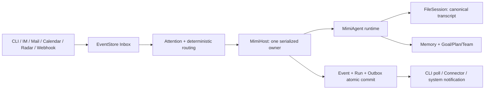
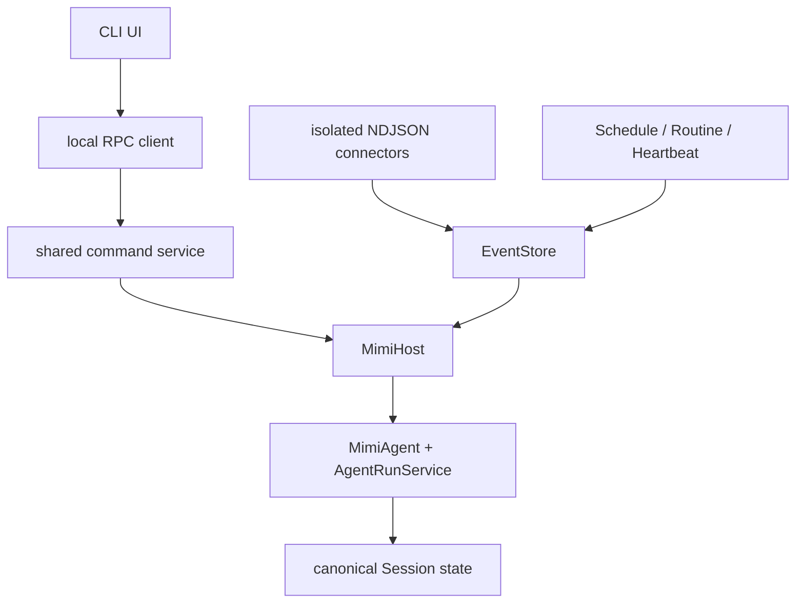

# MimiAgent 统一运行架构调研

日期：2026-07-15

状态：已完成，作为统一架构设计依据

## 目标

把当前 MimiAgent CLI 与未提交的 Mimi 常驻能力重构为同一个 MimiAgent：一个长期在线的本地个人代理，通过 CLI、IM、邮件、日历、天气、文件和其他 Connector 接收事件，在同一运行内核、会话、记忆与权限体系内处理并按需主动投递结果。

本轮只借鉴成熟系统已经验证的边界，不复制 OpenClaw 的平台规模、插件层级或工作流产品。

## 调研来源

- [OpenClaw README](https://github.com/openclaw/openclaw/blob/main/README.md)
- [OpenClaw Gateway](https://docs.openclaw.ai/cli/gateway)
- [OpenClaw Session management](https://docs.openclaw.ai/sessions)
- [OpenClaw Session management deep dive](https://docs.openclaw.ai/reference/session-management-compaction)
- [OpenClaw Automation](https://docs.openclaw.ai/automation)
- [OpenClaw Scheduled tasks](https://docs.openclaw.ai/automation/cron-jobs)
- [OpenClaw Background tasks](https://docs.openclaw.ai/automation/tasks)
- [OpenClaw Hooks](https://docs.openclaw.ai/automation/hooks)
- [OpenClaw Security](https://docs.openclaw.ai/security)
- [OpenClaw Channel routing](https://docs.openclaw.ai/provider-routing)
- [Home Assistant Core architecture](https://developers.home-assistant.io/docs/architecture/core/)
- [Letta stateful agents](https://docs.letta.com/guides/get-started/intro)

## 外部系统的共同结论

### 1. 常驻 Host 是唯一控制面

OpenClaw 由一个长期运行的 Gateway 统一拥有 channels、sessions、hooks 和后台任务；UI/TUI 是 Gateway 客户端，不在前台进程另建一套 Agent。Gateway 还负责本地监听、鉴权、状态查询和生命周期。

MimiAgent 应采用同一原则：默认 CLI 连接或拉起 MimiHost；只有测试和兼容场景允许显式 standalone。Host 是唯一 Runtime composition root，也是 Session 变更与 Agent Run 的串行所有者。

### 2. 一个 Agent 身份不等于一个 transcript

OpenClaw 按消息来源确定性路由 Session：直接消息可共享主 Session，群组、房间、Cron 和 Webhook 可隔离。Session key 是路由选择器，不是授权令牌；所有权威 Session 状态由 Gateway 保存，客户端只查询。

MimiAgent 应保持“一个 Mimi、多个隔离 Session”：owner 默认会话提供连续性，显式专题会话、外部人物和外部群组保持隔离。不能把所有来源塞进同一 transcript，也不能让 SQLite Event 投影成为第二份聊天历史。

### 3. 精确任务、周期感知和运行记录是三件事

OpenClaw 区分：

- Cron：精确时间、一次或周期任务；
- Heartbeat：近似周期、批量检查、复用主会话上下文；
- Background Task：只记录后台工作，不负责调度；
- Hook：响应明确生命周期事件；
- Standing Orders：稳定行为和授权上下文。

当前 Mimi 的 Schedule、Routine、Digest、Run 记录已经覆盖大部分语义，应继续复用普通 Event，不新增工作流 DSL。MimiAgent 只需明确命名和边界：Schedule 决定何时唤醒，Attention 决定是否运行，Goal/Plan/Checkpoint 保存长任务状态，Run 只记录发生过什么。

### 4. 事件总线应小而稳定

Home Assistant 的核心由 Event Bus、State Machine、Service Registry 和 Timer 组成。它说明大量外部集成并不要求重量级消息平台：稳定事件协议、状态投影、动作注册和时间源已经足够。

MimiAgent 可继续使用单进程 SQLite Inbox/Run/Outbox 与隔离 Connector，不引入 Kafka、Redis、ORM 或通用工作流引擎。

### 5. 持久 Agent 需要分层状态

OpenClaw 把可变 Session 行与 append-only transcript 分层，Letta 把 Agent 身份和持久 Memory 与单次消息调用分离。共同点是：Agent 身份、对话历史、长期记忆和后台任务记录不能混成一份状态。

MimiAgent 继续保留现有分层：

- FileSession：权威 transcript、checkpoint、context archive 和会话偏好；
- Memory：跨会话稳定事实与偏好；
- Goal/Plan/Team：当前任务状态；
- SQLite EventStore：Inbox、Run、Outbox、Schedule、Digest、Audit；
- Connector：外部渠道协议与凭证边界。

### 6. 外部内容始终是不可信数据

OpenClaw 明确指出：即使只有 owner 能发消息，网页、邮件、附件、文档和粘贴日志仍可能携带 prompt injection。Session 隔离也不是工具授权边界。它建议最小权限、外部内容包裹、严格工具策略和独立信任边界。

MimiAgent 不把“本机 owner 默认 trusted”误解为“对所有事件开放全部工具”。认证本机 owner 保留 main CLI 原有的完整执行能力；Plan 与非 `owner/system` 外部事件再由独立 RunPolicy 强制收窄，外部正文与可信 Host instructions 分区，来源元数据不允许从 payload 自我声明。`workspace/read-only` 作为用户显式选择的受限部署档位保留，而不是普通任务的默认障碍。

## 当前项目证据

### 已有优势

- main 已有成熟 CLI、Session、Checkpoint、Context、Memory、Skills、MCP、RAG、Goal/Plan、SubAgent 和 Ultra Team。
- 未提交 Mimi 层已有 SQLite WAL、去重、lease/retry/dead letter、事务 Outbox、Attention、Schedule、Connector、IPC、launchd、Doctor 和大量测试。
- `AgentRunService` 已抽取 CLI/Daemon 共用的 Run 终态协议。
- 当前完整 CI 通过：324 个测试；覆盖率 lines 87.22%、branches 80.37%、functions 85.11%；build 与 package smoke 通过。

### 关键架构错误

1. `src/daemon/service.ts` 的 `chat.snapshot` 从 SQLite Event/Run 重建 turns，而模型上下文来自 FileSession，形成两份对话真相。
2. `src/daemon/chat-client.ts` 手工复制 `CommandHandler`，`/history`、`/index`、`/status`、`/retry` 和 Esc 语义已经漂移。
3. Daemon policy 把执行契约、人物上下文和 playbook 拼进 user input，污染原始 transcript。
4. IPC `chat.invoke` 与 Dispatcher 可交错切换 MimiAgent 的可变 current Session。
5. local CLI 没有显式禁止主动 Outbox，结果可能同时显示在终端和系统通知。
6. 权限实验曾把“owner 默认完整执行”和“workspace/read-only 仍受限”混为一件事；最终设计只恢复认证本机 owner 的默认 Shell，显式受限档位与外部事件隔离继续生效。
7. 27 个 tracked 修改与 339 个 untracked 文件混合了必要 Daemon、过程文档、本机配置、复制 Skills、日志和无关视觉实验，尚不可直接提交。

## 适合 MimiAgent 的最小架构

## 明确不借鉴的部分

- 不实现 OpenClaw 规模的多租户 Gateway、远程 Node、插件 SDK 或 Task Flow。
- 不为每种来源建立 Agent，也不为 CLI 建立第二个 Runtime。
- 不增加外部 MQ、Redis、向量数据库或 ORM。
- 不把 Session key 当授权令牌。
- 不把 trust 标签直接等同于权限；真实授权来自本机配置与基础 permission mode。
- 不新增第二套长期任务/Todo 状态；继续使用 Goal/Plan/Checkpoint。

## 最终判断

当前代码无需推倒重写。正确路径是保留 main Runtime 与 Mimi 可靠事件层，删除二者之间重复的 Chat/Command/Session 投影，通过一个薄 MimiHost 串行门面统一运行与控制，再完成名称、数据目录、环境变量和公开 API 的兼容迁移。
