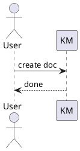

# KM Extended Markdown Formats

Extended formats supported by `km create --file`, beyond standard Markdown.

## Todo List

- `- [ ]` unchecked, `- [x]` checked

- [ ] Confirm target space/parent
- [x] Create backup strategy
- [ ] Add owner and update cadence

## LaTeX Formula

- Inline: `$formula$`
- Block: `$$formula$$`

Inline: $E = mc^2$

$$
\frac{\partial f}{\partial x} = \lim_{h \to 0}\frac{f(x+h)-f(x)}{h}
$$

## PlantUML

- Fenced code block with language `plantuml`

## DrawIO / SVG (Local File Reference)

- Generate with `kmdrawio` skill first, then reference the local file

## Image (Local File Reference)

- Supported: `.png` `.jpg` `.jpeg` `.gif` `.webp`

## Constraints

- **Local paths only** (relative, absolute, `~/`, `file://`). Remote `http(s)://` URLs are **not** uploaded — they render as an error placeholder.
- **Inline HTML**: only `<u>`, ``, `` tags are rendered; all other HTML is escaped.
